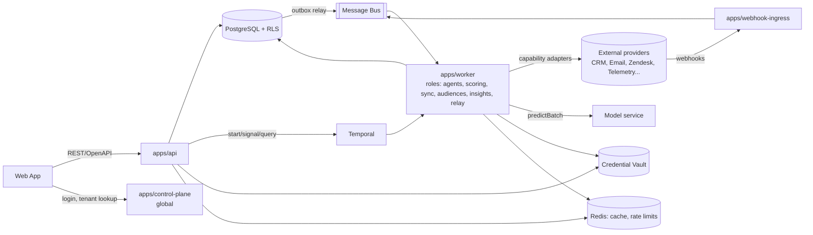
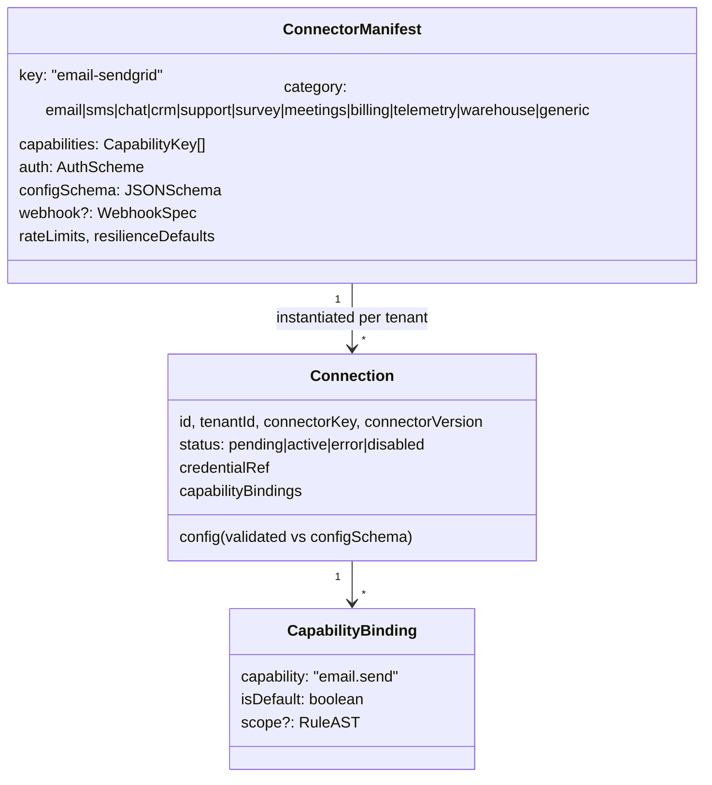
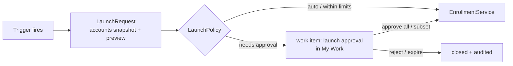
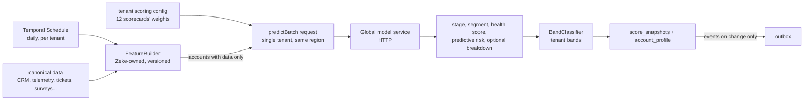
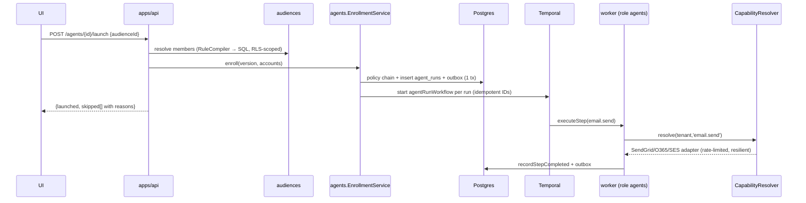
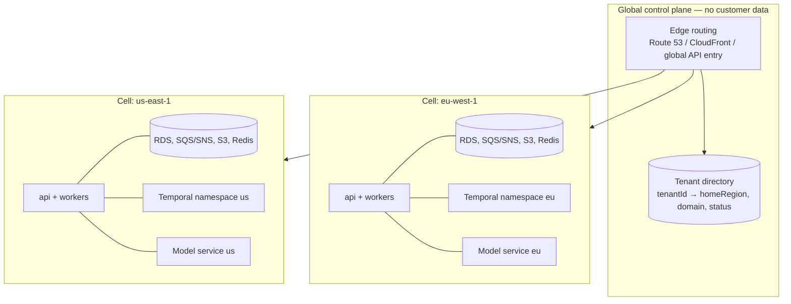

# Zeke AI — Backend Architecture (v0.1 draft)

> Scope: backend only. Stack: **TypeScript · NestJS · Nx monorepo · PostgreSQL (MikroORM) + RLS · Temporal · every infrastructure dependency behind a port — **AWS adapters implemented in v1**, Azure adapters planned, self-hosted adapters stubbed as `TODO(self-hosted)` (§13) · Docker images for all deployables**.
> Structural inspiration: `sip-ptl`, used for its **ideas**, not its folder layout: separate contracts, ports vs implementations, a shared platform layer, `Result<T>`, handler + behaviour pipelines, options validated on start, app initializers, and L0/L1/E2E test tiers. The folder and module structure (§2, §4) is designed for NestJS + Nx and for this product's modules.

---

## 1. Guiding principles

| # | Principle | What it means here |
|---|---|---|
| P1 | **Ports & adapters everywhere a vendor or variant exists** | Email/SMS/CRM/telemetry/vault/bus/LLM/ORM-specific code lives only in adapter libs. Domain + application code depends on interfaces. |
| P2 | **Open sets are registries, closed sets are enums** | Step types, connectors, operators, fields, prediction-model bindings, insight generators, trigger sources → plugin registries discovered at boot. Workflow *execution kinds* (activity/timer/human/branch) → closed enum (Temporal determinism). |
| P3 | **Definitions are data, execution is code** | Agents, audiences, scorecards, rules, risk/expansion types are versioned JSON documents validated by schemas. One generic engine executes them. |
| P4 | **Tenant is ambient but never implicit at boundaries** | `TenantContext` flows via AsyncLocalStorage inside a process; it is *explicitly* serialized across process boundaries (Temporal headers, bus message headers, outbox rows). |
| P5 | **Module isolation enforced by tooling** | Nx tags between libs + `eslint-plugin-boundaries` between layers inside a lib (§4.7). Modules talk via `contracts` libs or domain events, never via another module's internals or tables. |
| P6 | **Failures are values** | `Result<T, E>` for expected failures (mirrors sip-ptl `Result<T>`); exceptions only for bugs/infrastructure. Mapped to RFC 7807 at the API edge. |
| P7 | **Everything important is an event** | Transactional outbox → bus. Feeds audit log, analytics projections, audience triggers, notifications. |
| P8 | **Deployment-profile agnostic** | The same build runs on managed cloud services (Azure / AWS) or fully self-hosted containers. Each infra service (bus, Temporal, DB, cache, vault, KMS, object storage, identity, LLM, telemetry) is a port; the adapter is chosen by config, never by code change (§13). |
| P9 | **Safe by default, configurable by the customer** | Behaviour that can surprise a customer (auto-launching agents, auto-deciding branches) defaults to the conservative option and is relaxed only by tenant policy. |

---

## 2. What we take from sip-ptl — and what we change

### 2.1 How sip-ptl is organised

```
src/
├─ Backend/
│  ├─ <Service>/{src, tests, pkg/docker, pkg/EV2, spec}    # one folder per deployable (LogIngestionAPI, StoreWorker, ...)
│  └─ Library/src/<Capability>.{Model, Contracts, Repositories, Processing, Infrastructure.X, Client}
├─ Shared/        # platform: observability, DI helpers, hosting, auth, auditing, Result/HTTP helpers, FlowForge
├─ Public/        # Contract + Client for external consumers
├─ Aspire/        # local composition of services
└─ Testing/       # E2E + load tests
```
The unit of enforcement is the **.NET project**. Each capability is split into 4–6 projects (Model / Contracts / Repositories = interfaces / Processing / Infrastructure.X), each with its own `.Tests.L0/.L1` project.

### 2.2 Keep vs. change

| sip-ptl idea | Zeke decision | Why |
|---|---|---|
| Separate **Contracts** per capability | **Keep:** every module has a `contracts` lib | Other modules, Temporal workflows and (later) the frontend and public SDK need types without pulling in implementation. |
| **Interfaces (Repositories/Abstractions) separate from Infrastructure** | **Keep the idea, change the unit:** folders inside one module lib (`application/ports` vs `infrastructure/`), enforced by lint | In TS, a lib per layer × 12 modules ≈ 70+ libs, with slow tooling, path-alias sprawl, and a Nest module split across packages. ESLint rules give the same guarantee inside one lib. |
| **Model / Processing / Infrastructure** as separate projects | **Change:** `domain/`, `application/`, `infrastructure/`, `interface/` folders in one lib | Same reasoning; one Nest module per business area stays cohesive. |
| One folder per **deployable** with its own `pkg/docker`, `spec` | **Adapt:** thin `apps/*` + one shared Dockerfile and deployment in `deploy/`; the OpenAPI spec is generated into `apps/api/openapi/` and diffed in CI | Every app is built the same way; per-app Docker duplication adds nothing. |
| Many small services (Ingestion API, Query API, Store worker, …) | **Change:** few deployables: `api`, one `worker` image with **roles**, `webhook-ingress`, `control-plane`, `migrator` | This is one product with shared data; roles give independent scaling without the overhead of more services. |
| **Shared/** platform libs | **Keep, consolidated:** `libs/platform/*` (6 libs instead of about 15) | Fewer, cohesive libs; subpaths (`@zeke/platform/config`) keep imports precise. |
| `Infrastructure.<Tech>` per capability | **Change:** infra adapters **grouped by provider** (`libs/infra/aws`, `azure` [planned], `self-hosted` [TODO]) | Matches deployment profiles (§13); one SDK family per lib; each adapter is a subpath entry, so mixed (hybrid) profiles still load only what they use. |
| `Public/` Contract + Client | **Keep as a placeholder:** `libs/public/*` only if a public API is confirmed (Q14) | Avoid building it too early. |
| Aspire local composition | **Adapt:** `deploy/local/docker-compose.yml` + a mock model service | Node/TS equivalent. |
| Separate `*.Tests.L0/L1` projects | **Change:** tests sit next to the code (`*.spec.ts` = L0, `*.int-spec.ts` = L1); `tests/e2e`, `tests/load` at the top level | Idiomatic in TS; Nx runs `test` and `test-int` targets per lib. |

### 2.3 Pattern mapping

| sip-ptl (.NET) | Zeke (NestJS/TS) |
|---|---|
| `ServiceCollectionExtensions.AddXxx()` | Nest `DynamicModule` (`forRoot()/forFeature()/registerAsync()`), plus per-deployable modules `XxxHttpModule` / `XxxWorkerModule` |
| Options pattern + `ValidateOnStart()` | `@zeke/platform/config`: **zod** schemas validated at bootstrap (fail fast) |
| `Result<T>` + HTTP-aware extensions | `@zeke/platform-kernel` `Result<T,E>` + `DomainError` → ProblemDetails mapper in `@zeke/platform/http` |
| `IStateHandler` + `TransitionTo<>` | Agent **step executors** + interpreter graph edges (`next`, `yes`, `no`, `timeout`) |
| `IFlowBehavior` (metrics/log-scope behaviours) | Temporal **interceptors** (workflow + activity) and Nest interceptors |
| FlowForge checkpointing | Temporal event history (native durability) |
| Compensation flows | Saga compensation list in the interpreter (optional per-step `compensate` executor) |
| `IAppInitializer` + `RunAppInitializersAsync` | `AppInitializer` + `runAppInitializers(app)` before `listen()` |
| Visitor over `PtlEvent` subtypes | Typed domain-event handlers (`@OnDomainEvent(AccountScoreChanged)`) |
| Named `HttpClient` + Polly | Connector HTTP client factory + **cockatiel** (retry, circuit breaker, timeout, bulkhead) |
| `IAuditLogger` | `@zeke/platform/audit` `AuditLogger` + `@Audited()` interceptor |
| DLQ + `IDlqMetrics` | Bus dead-letter handling + `dlq_messages` table + metrics |
| Observability.Extensions (OTel) | `@zeke/platform/observability` (OpenTelemetry SDK, pino, trace/tenant correlation) |
| L0 / L1 / L2 / E2E | `*.spec.ts` / `*.int-spec.ts` (Testcontainers + Temporal test env) / `tests/e2e` / `tests/load` |

---

## 3. System context



### Deployables (`apps/`)

| App | Responsibility | Scope |
|---|---|---|
| `api` | Tenant-facing REST API (OpenAPI), authn/authz, CRUD on definitions, starts/signals Temporal workflows, queries read models. Stateless. | per region cell |
| `worker` | **One image, several roles** chosen by `WORKER_ROLES` (for example `agents`, or `scoring,audiences`). Each role registers its Temporal task queue(s), activities and bus consumers. Deployed as separate k8s Deployments per role, so each scales independently. The `relay` role runs the outbox relay. | per region cell |
| `webhook-ingress` | Public endpoint for provider webhooks; per-connector signature verification; normalizes → publishes to bus. Isolated for security & scaling. | per region cell |
| `control-plane` | Global tenant directory (tenant → home region, domain), tenant provisioning, edge routing lookups (§13.6). Holds **no customer data**. | global |
| `migrator` | One-shot job: MikroORM migrations for every module, RLS policies, seed system definitions (step types, operators, default templates), Temporal namespace/search attributes. | per region cell |

Worker roles and what they load:

| Role | Task queues / consumers | Modules loaded (`*WorkerModule`) |
|---|---|---|
| `agents` | `agents` (interpreter + step activities), trigger schedules | agents, work-queue, communications, integrations |
| `scoring` | `scoring` (daily scoring, re-score) | scoring, customer-data |
| `sync` | `sync` (connection sync), provider-event consumers | integrations, customer-data |
| `audiences` | `audiences` (materialization) | audiences, customer-data |
| `insights` | `insights` (generation) | insights, scoring |
| `relay` | outbox → bus | platform/persistence only |

All apps are thin: `main.ts` + a composition-root `AppModule` that imports the modules it needs (`XxxHttpModule` for `api`, `XxxWorkerModule` for `worker`). No business logic in `apps/`.

---

## 4. Repository structure

### 4.1 Top level

```
zeke/
├─ apps/                        # deployables (thin composition roots)
│  ├─ api/                      #   src/, openapi/ (generated spec, diffed in CI)
│  ├─ worker/                   #   src/roles/*.ts, src/workflows.ts (bundles all module workflows)
│  ├─ webhook-ingress/
│  ├─ control-plane/
│  └─ migrator/
├─ libs/
│  ├─ platform/                 # no business knowledge (§4.2)
│  ├─ engines/                  # generic engines, reused by several modules (§4.3)
│  ├─ modules/                  # business modules (§4.4, §6)
│  ├─ infra/                    # infrastructure adapters, grouped by provider (§4.5)
│  ├─ connectors/               # tenant-facing vendor connectors (§4.6, §7)
│  └─ public/                   # [placeholder] public API contract + SDK, only if Q14 = yes
├─ tests/
│  ├─ e2e/                      # API → Temporal → workers → fakes (docker-compose profile)
│  ├─ load/                     # k6 scenarios (daily scoring run, bulk launch)
│  └─ contracts/                # shared fixtures with the model team (§10.1)
├─ deploy/
│  ├─ docker/Dockerfile         # one multi-stage Dockerfile, ARG APP=<name>
│  ├─ helm/zeke/                # one chart; values per app/role/region
│  ├─ terraform/aws/            # per-region cell module + global control-plane module
│  ├─ terraform/azure/          # TODO(azure)
│  └─ local/docker-compose.yml  # Postgres, Temporal dev, Redis, LocalStack, mock model service, MailHog, WireMock
├─ tools/
│  ├─ generators/               # local Nx plugin @zeke/tools: nx g @zeke/tools:module | :connector | :lib
│  ├─ eslint-presets/           # per-lib-type ESLint presets (feature layers, workflow sandbox, infra); `eslint-rules` is reserved by Nx
│  └─ mock-model-service/       # dev-only HTTP mock that honours the §10.1 contract
└─ docs/
   ├─ backend-architecture.md
   └─ adr/                      # one file per key decision (§15)
```

### 4.2 Platform libs (`libs/platform`)

| Lib (import path) | Contents | Depends on |
|---|---|---|
| `@zeke/platform-kernel` | `Result`, `DomainError`, branded `Id<T>`, `Clock`, `Page`, `Money`, `assertNever`. **Pure TS, no Node APIs** (safe inside Temporal workflows). | nothing |
| `@zeke/platform-ports` | Interfaces only for every infra service: `MessageBus`, `CredentialVault`, `KeyManagement`, `ObjectStorage`, `Cache`, `DistributedLock`, `RateLimiter`, `IdentityProvider`, `LlmProvider`, `ModelServing`, `SystemMailer`. | kernel |
| `@zeke/platform` (subpaths `/config`, `/tenancy`, `/observability`, `/http`, `/security`, `/audit`, `/plugin`, `/resilience`, `/lifecycle`, `/infra`) | Nest-side cross-cutting code: zod config, `TenantContext` (ALS) + guards, OTel + pino, ProblemDetails + health, OIDC authn + CASL authz, `@Audited`, the plugin `Registry`, cockatiel policies, app initializers, and `InfraModule.forProfile()` (binds adapters from the catalog passed in by the app). | kernel, ports |
| `@zeke/platform-persistence` | MikroORM setup, RLS transaction hook, `BaseRepository`, outbox/inbox, migration runner that aggregates every module's migrations. | kernel, platform |
| `@zeke/platform-temporal` (subpath `/workflow` is sandbox-safe) | Client factory (Cloud / self-hosted), worker bootstrap in a Nest context, `@Activity()` discovery, tenant/OTel/log/metrics interceptors. | kernel, platform |
| `@zeke/platform-testing` | In-memory adapters for every port, builders, Testcontainers fixtures, Temporal `TestWorkflowEnvironment` helpers, **port conformance suites**. | all platform libs |

### 4.3 Engines (`libs/engines`)

Generic, reusable engines with no knowledge of business modules. Modules plug their fields, operators or helpers into them.

| Lib | Contents | Used by |
|---|---|---|
| `@zeke/engine-rules` | Rule AST, field/operator registries, validator, in-memory evaluator, SQL compiler, conformance suite (§8). | audiences, agents (conditions, enrollment), insights, scoring (data sufficiency), identity (RBAC data scopes), integrations (binding scopes) |
| `@zeke/engine-templating` | Sandboxed Liquid renderer, merge-field registry, template validation. | communications, agents (step config previews) |

### 4.4 Business modules (`libs/modules/<module>`)

Every module has the **same three-part shape**:

```
libs/modules/agents/
├─ contracts/                  @zeke/agents-contracts     (Nx lib)
│  └─ src/                     DTO zod schemas, domain-event types, TriggerSpec/graph types,
│                              ports other modules may call (e.g. AgentLaunchApi). Pure TS.
├─ feature/                    @zeke/agents               (Nx lib, the Nest module)
│  └─ src/
│     ├─ domain/               entities, value objects, invariants (graph validation, enrollment rules). Pure TS.
│     ├─ application/
│     │  ├─ commands/          LaunchAgent, PublishAgentVersion, ...
│     │  ├─ queries/           GetRunState, ListAgents, ...
│     │  └─ ports/             module-internal ports (AgentRepository, WorkflowStarter, ...)
│     ├─ infrastructure/
│     │  ├─ persistence/       MikroORM EntitySchemas, repositories, migrations/ (Postgres schema `agents`)
│     │  └─ adapters/          implementations of application/ports (Temporal starter, ...)
│     ├─ interface/
│     │  ├─ http/              controllers + request/response mapping      → AgentsHttpModule
│     │  └─ worker/            Temporal activities, bus consumers, schedules → AgentsWorkerModule
│     ├─ plugins/              built-in plugins this module registers (step types for agents)
│     ├─ agents.module.ts      AgentsModule: core providers (imported by both deployable modules)
│     └─ index.ts              exports ONLY AgentsModule, AgentsHttpModule, AgentsWorkerModule
└─ workflows/                  @zeke/agents-workflows     (Nx lib, only for modules with Temporal workflows)
   └─ src/                     deterministic workflow code; imports contracts + platform-kernel + @temporalio/workflow only
```

- **Each module owns its own Postgres schema** (`agents.*`, `scoring.*`, …). Only that module's `infrastructure/persistence` may touch it; other modules use its `contracts` ports or events. RLS still applies to every tenant table.
- `interface/http` and `interface/worker` are separate Nest modules, so `api` never loads Temporal activities and `worker` never loads controllers.
- Modules with a `workflows` lib: agents (interpreter), scoring (daily scoring / re-score), integrations (connection sync), audiences (materialization), insights (generation). `apps/worker/src/workflows.ts` re-exports them for the Temporal bundler.

### 4.5 Infrastructure adapters (`libs/infra`) — grouped by provider

```
libs/infra/
├─ aws/            @zeke/infra-aws           v1   implemented: /sns-sqs /secrets-manager /kms /s3 · pending TODO(v1): cognito, bedrock, ses · PLANNED: sagemaker
├─ common/         @zeke/infra-common        v1   /in-memory (local profile + tests) /redis /http-model-serving · pending TODO(v1): /oidc-generic
├─ azure/          @zeke/infra-azure         [PLANNED] stubs: service-bus, key-vault, blob, entra, openai, azure-ml, acs
├─ self-hosted/    @zeke/infra-self-hosted   [TODO]    stubs: rabbitmq, nats, vault, vault-transit, minio, keycloak, ollama, vllm, smtp
└─ catalog/        @zeke/infra-catalog       all adapter descriptors; imported only by apps and passed to InfraModule.forProfile()
```
- Each adapter is described by an `AdapterDescriptor { service, provider, status, create }`. `create()` lazily `import()`s the adapter, so unused provider SDKs never load, and a **hybrid** profile (for example AWS bus + Temporal Cloud + an HTTP model service) picks adapters individually.
- `status` is `implemented`, `pending` (v1 not built yet), `planned` (Azure) or `todo` (self-hosted); anything but `implemented` makes the app refuse to start with the marker in the error.
- The `local` profile uses the in-memory adapters, so apps boot on a laptop without any cloud services.
- Grouping by provider keeps one SDK family per lib and mirrors the deployment profiles in §13.

### 4.6 Connectors (`libs/connectors`) — one lib per vendor

```
libs/connectors/
├─ sdk/                 @zeke/connector-sdk   base classes, manifest helpers, HTTP client factory, contract test kit
├─ email/{smtp, sendgrid, ses, o365, gmail}
├─ messaging/{twilio-sms, slack, teams}
├─ crm/{salesforce, hubspot}
├─ support/{zendesk, freshdesk}
├─ survey/delighted     meetings/gong     billing/{chargebee, stripe}
├─ telemetry/{segment, mixpanel}          warehouse/snowflake
└─ generic/{rest, webhook}
```
- One lib per vendor (unlike infra): vendors are chosen **per tenant**, change on independent schedules, and each carries its own SDK and recorded-HTTP contract tests.
- Connectors depend only on `@zeke/connector-sdk` and `@zeke/integrations-contracts`.

### 4.7 Boundary rules

**Between libs (Nx tags, `@nx/enforce-module-boundaries`):**

| Tag | May depend on |
|---|---|
| `type:kernel` | nothing |
| `type:ports` | kernel |
| `type:platform` | kernel, ports, other platform libs |
| `type:engine` | kernel, platform |
| `type:contracts` | kernel, other `contracts` |
| `type:feature` | own contracts, other modules' **contracts**, engines, platform, ports |
| `type:workflow` | contracts, kernel, `platform-temporal/workflow` only (no Node APIs, DB, or Nest; custom ESLint rule) |
| `type:infra` | ports, kernel, platform (`/config`, `/observability`); **never imported by modules**, only by `InfraModule` |
| `type:connector` | connector-sdk, integrations-contracts, kernel |
| `type:app` | anything except another app |

**Inside a feature lib (`eslint-plugin-boundaries`, by folder):**

| Folder | May import |
|---|---|
| `domain/` | kernel, own contracts. No Nest, MikroORM, or I/O. |
| `application/` | domain, contracts, engines, ports, `platform` (tenancy, audit, plugin) |
| `infrastructure/` | application (ports), domain, platform, platform-persistence |
| `interface/` | application (commands/queries), contracts, platform (http, security) |
| `plugins/` | application ports, contracts, engines |

Also enforced: no `@aws-sdk/*` / `@azure/*` imports outside `libs/infra/*` (§13.2), and the `index.ts` of a feature lib may only export its three Nest modules.

---

## 5. Platform concepts (`libs/platform`)

### 5.1 Kernel

```ts
export type Result<T, E extends DomainError = DomainError> =
  | { ok: true; value: T }
  | { ok: false; error: E };

export class DomainError {
  constructor(
    readonly code: ErrorCode,          // 'rules.field_unknown', 'agents.enrollment_conflict', ...
    readonly message: string,
    readonly kind: 'validation' | 'not_found' | 'conflict' | 'forbidden' | 'unavailable' | 'rate_limited',
    readonly details?: Record<string, unknown>,
  ) {}
}
export type Id<Brand extends string> = string & { __brand: Brand };   // TenantId, AccountId, AgentId...
export interface Clock { now(): Date }                                 // injectable; Temporal workflows use workflow time
```
`@zeke/platform/http` maps `DomainError.kind` → HTTP status + RFC 7807 body (analogue of sip-ptl `ResultHttpStatus`).

### 5.2 Configuration
- Each module exports `XxxConfigSchema` (zod) + `registerAs('xxx', …)`. The composition root validates all at boot; invalid config = process exits (sip-ptl `ValidateOnStart`).
- Layers: defaults → env file → env vars → secrets mount (Docker secrets). **No per-tenant config here** (that's `tenancy` module data).

### 5.3 Tenancy

```ts
export interface TenantContext {
  tenantId: TenantId;
  homeRegion: AwsRegion;             // cell pinning, §13.6
  actor: { type: 'user' | 'service' | 'system' | 'workflow'; id: string };
  permissions?: PermissionSet;       // resolved lazily
  traceId?: string;
}
export abstract class TenantContextAccessor {       // backed by AsyncLocalStorage (nestjs-cls)
  abstract get(): TenantContext;                    // throws if absent — no silent "no tenant"
  abstract run<T>(ctx: TenantContext, fn: () => Promise<T>): Promise<T>;
}
```
Propagation:

| Boundary | Mechanism |
|---|---|
| HTTP → app | `TenantGuard` resolves tenant from JWT `org` claim (+ optional `X-Tenant` for multi-tenant users) |
| app → Postgres | `SET LOCAL app.tenant_id = $1` at start of every transaction (MikroORM transaction hook) |
| app → Temporal | Workflow **input** carries `tenantId`; client/workflow/activity **interceptors** copy it to headers and re-hydrate `TenantContext` inside activities |
| outbox → bus | `tenant_id` column → message header `x-tenant-id`; consumer middleware opens `TenantContext.run()` |
| webhook ingress | tenant resolved from connection-specific URL token (`/hooks/{connectorKey}/{connectionId}`) + signature |

### 5.4 Persistence & tenant isolation (Postgres RLS)

- Every tenant-owned table: `tenant_id uuid not null`, composite PKs/indices lead with `tenant_id`.
- RLS policy per table: `USING (tenant_id = current_setting('app.tenant_id')::uuid)`; `FORCE ROW LEVEL SECURITY`.
- App connects as a role **without** `BYPASSRLS`. `migrator` and `control-plane` use separate roles.
- Defense in depth: MikroORM global filter `tenant` on all tenant entities (catches bugs before RLS does; RLS catches everything else).
- PgBouncer in **transaction** mode is compatible because `SET LOCAL` is transaction-scoped.
- `BaseRepository<T>` exposes only tenant-scoped operations; cross-tenant queries require the `SystemRepository`, available only to `migrator` and platform-internal jobs.

**Outbox/Inbox** (in `@zeke/platform-persistence`):
- `outbox(id, tenant_id, type, payload, headers, occurred_at, published_at)` written in the same transaction as the aggregate change.
- Relay (`worker` role `relay`) publishes via `MessageBus`; consumers record `inbox(message_id)` for idempotency.

### 5.5 Messaging

```ts
export interface MessageBus {
  publish<E extends IntegrationEvent>(topic: TopicName, event: E, opts?: { key?: string; delaySec?: number }): Promise<void>;
  subscribe<E>(topic: TopicName, subscription: string, handler: (e: E, meta: MessageMeta) => Promise<AckResult>): Disposable;
}
```
Adapters (in `libs/infra/*`): `aws/sns-sqs` (**implemented, v1**); `azure/service-bus` (**planned**); `self-hosted/rabbitmq`, `self-hosted/nats` (**`TODO(self-hosted)` stubs**); in-memory (`@zeke/platform-testing`). Selected by `infra.bus.provider`.

The providers differ in semantics, so the port is defined at the **common denominator** and each adapter declares what it supports natively:

| Concern | Port contract | Azure Service Bus | SNS + SQS | RabbitMQ | NATS JetStream |
|---|---|---|---|---|---|
| Fan-out | topic → N named subscriptions | topics/subscriptions | SNS topic → SQS queue per subscription | topic exchange → queue per subscription | subject → durable consumer per subscription |
| Ordering | optional `key`; per-key order guaranteed | sessions | FIFO + `MessageGroupId` | single-active-consumer / consistent-hash exchange | subject partition by key |
| Delay | `delaySec` | scheduled messages | ≤ 900 s natively; longer → Temporal timer | delayed-message plugin | delayed via Temporal timer |
| Dead-letter | after `maxDeliveries` → DLQ topic | native DLQ | redrive policy | DLX | max-deliver + advisory → DLQ stream |
| Payload size | ≤ 200 KB inline, larger → **claim-check** via `ObjectStorage` | 256 KB (std) | 256 KB | configurable | configurable |
| Delivery | at-least-once; consumers idempotent via inbox table | ✓ | ✓ | ✓ | ✓ |

Long delays and anything needing durable timers go through Temporal, never the bus, so no feature depends on one provider's delay support. A shared **bus conformance test suite** runs against every adapter (Testcontainers for RabbitMQ/NATS, emulators/LocalStack for Service Bus/SQS).

### 5.6 Temporal platform lib (`@zeke/platform-temporal`)
- `TemporalModule.forRoot(config)` → `WorkflowClient` provider. Connection options are a discriminated union so Temporal Cloud and self-hosted differ only in config:
  ```ts
  type TemporalConnection =
    | { mode: 'cloud'; address: string; namespace: string; auth: { type: 'mtls'; certRef: string; keyRef: string } | { type: 'api_key'; keyRef: string } }
    | { mode: 'self_hosted'; address: string; namespace: string; tls?: { caRef?: string; certRef?: string; keyRef?: string } };
  ```
- Code must work on both: no dependence on Cloud-only features; visibility queries limited to what SQL-based advanced visibility (Postgres) supports so self-hosted installs don't need Elasticsearch. Namespace provisioning is behind a `TemporalNamespaceProvisioner` port (Cloud: ops API / Terraform; self-hosted: `operatorService`).
- `TemporalWorkerModule.register({ taskQueue, workflowsPath })`: boots a Worker inside a Nest application context; discovers `@Activity()`-decorated provider methods via `DiscoveryService` so activities get full DI.
- Interceptors: `TenantPropagationInterceptor`, `OtelInterceptor`, `ActivityLogScopeInterceptor` (analogue of sip-ptl `WriteLogEventLogScopeBehavior`), `ActivityMetricsInterceptor`.
- Namespace strategy: **one namespace per environment**, tenants separated by workflow-ID prefix + search attributes (`TenantId`, `AgentId`, `AccountId`). Dedicated task queues per tier can be added later for noisy-neighbour isolation.

### 5.7 Resilience & rate limiting
- `ResiliencePolicyFactory.for(connectorKey, connectionId)` → cockatiel `wrap(timeout, retry(backoff), circuitBreaker, bulkhead)`; configured from connector manifest defaults, overridable per tenant connection.
- `RateLimiter` port (Redis token bucket) keyed by `connectionId` — respects provider limits (e.g. Salesforce API calls/day, SendGrid rps) **across all workers**.
- Temporal activity retries handle transient failures; connector adapters classify errors as `retryable | non_retryable | rate_limited(retryAfter)` so activities throw `ApplicationFailure.nonRetryable` correctly.

### 5.8 Security
- **AuthN**: OIDC resource server (JWT). `IdentityProviderAdapter` port so self-hosted Keycloak, Entra ID, Auth0, or per-tenant SSO can plug in. API keys for machine clients (hashed, scoped).
- **AuthZ**: RBAC + attribute scopes via CASL. Permission = `action:subject` (`agents:launch`, `scorecards:edit`, `emails:approve`). **Data scope** = a rule AST on `Account` (e.g. `segment in [SMB, Mid-Market]`) → compiled by the rule engine into the SQL `WHERE` of every account query (reuses §8).
- **CredentialVault** port: `put(ref, secret)`, `get(ref)`, `rotate(ref)`. Adapters: HashiCorp Vault (self-hosted), Azure Key Vault, AWS Secrets Manager, `pg-envelope` (AES-256-GCM with KEK from env/KMS). DB stores only `credential_ref`.

### 5.9 Audit & observability
- `@Audited('agent.launched')` on application command handlers + `AuditLogger` port → append-only `audit_log` (tenant-scoped, RLS) and also emitted as event (for SIEM export).
- Every log line carries `traceId`, `tenantId`, `actor`. Metrics labelled by `tenant_tier`, never raw tenantId (cardinality).

### 5.10 Plugin registry (`@zeke/platform/plugin`) — backbone of extensibility

```ts
export interface PluginDefinition { readonly key: string; readonly version: number }
export class Registry<D extends PluginDefinition> {
  register(def: D): void;                 // duplicate key+version → boot failure
  get(key: string, version?: number): Result<D>;
  list(filter?: (d: D) => boolean): D[];
}
// Each registry is populated at boot by DiscoveryService scanning decorators:
//   @ConnectorPlugin(manifest)  @StepType(def)  @RuleOperator(def)  @RuleField(def)
//   @InsightGenerator(def)  @TriggerSource(def)  @MergeField(def)  @PredictionModelBinding(def)
// An AppInitializer validates every registry (schemas compile, no dangling references) before the app serves traffic.
```

---

## 6. Business modules

12 modules, each built from the three-part shape in §4.4. They were grouped by **what changes together**, which consolidates the earlier finer-grained list (signals → customer-data, templates + notifications → communications, forecasting → insights, rules → engine).

| Module (schema) | Responsibility | Owns (tables) | Publishes events | Key ports (in `contracts`) | Workflows |
|---|---|---|---|---|---|
| `tenancy` | Tenants, plans/entitlements, tenant settings store (typed per module), feature flags, home region | tenants, plans, entitlements, tenant_settings, feature_flags | `TenantProvisioned`, `EntitlementChanged`, `TenantSettingChanged` | `EntitlementChecker`, `TenantSettings<T>` | — |
| `identity` | Users, roles/permissions, RBAC data scopes, account teams, API keys | users, roles, role_permissions, account_team_members, api_keys | `UserInvited`, `RoleChanged` | `AssigneeResolver`, `PermissionChecker` | — |
| `integrations` | Connector framework, connections, capability bindings, OAuth, sync, webhooks, field mappings | connections, capability_bindings, sync_cursors, field_mappings, webhook_endpoints | `ConnectionConnected/Disconnected`, `SyncCompleted`, `ProviderEventReceived` | capability ports (§7), `CapabilityResolver` | `connectionSyncWorkflow` |
| `customer-data` | **Canonical CS data model** + time series + `account_profile` read model | accounts, contacts, activities, opportunities, subscriptions, tickets, survey_responses, meetings, usage_series, account_profile | `AccountUpserted`, `ContactUpserted` | `AccountQuery`, `ContactQuery`, canonical record types | — |
| `scoring` | Scorecards, weights, bands, source bindings, feature building, model integration, snapshots | scorecards, scoring_config_versions, band_sets, source_bindings, model_runs, score_snapshots | `AccountScoreChanged`, `AccountBandChanged`, `LifecycleStageChanged`, `SegmentChanged`, `PredictiveRiskChanged` | `AccountHealthModel`, `FeatureBuilder`, `DataSufficiencyPolicy`, `BandClassifier` | `dailyScoringWorkflow`, `rescoreWorkflow` |
| `audiences` | Audience definitions (rule AST), live/static, materialization | audiences, audience_versions, audience_members | `AudienceMemberEntered/Exited` | `AudienceResolver` | `audienceMaterializationWorkflow` |
| `agents` | Agent definitions/versions, triggers, launch governance, enrollment, runs, step types, run analytics | agent_definitions, agent_versions, launch_requests, agent_runs, run_step_log | `AgentRunStarted/StepCompleted/Completed/Failed`, `LaunchRequested/Approved/Rejected` | `StepExecutor`, `EnrollmentPolicy`, `TriggerSource`, `LaunchPolicy`, `AgentLaunchApi` | `agentRunWorkflow` (interpreter) |
| `work-queue` | Human work items: tasks, email approvals, decisions, launch approvals; assignment | work_items | `WorkItemCreated/Completed` | `WorkItemApi` | — |
| `communications` | Templates + versions, merge fields, recipient resolution, consent/unsubscribe, delivery tracking, internal notifications (bell, Slack/Teams alerts) | templates, template_versions, deliveries, consents, notifications, notification_prefs | `MessageDelivered/Bounced/Opened`, `NotificationCreated` | `MessageSender`, `RecipientResolver`, `NotificationChannel` | — |
| `insights` | Drive Outcome (risk/expansion types, recommendations, dismissals) + renewal forecast | insight_type_definitions, insights, dismissals, forecast_snapshots | `InsightRaised` | `InsightGenerator`, `RootCauseExplainer`, `WinProbabilityModel` | `insightGenerationWorkflow` |
| `assistant` | "Ask Zeke": NL → rule AST, NL → agent graph, explanations (scope pending Q11) | prompt_templates, ai_invocations | — | `NlRuleParser`, `NlAgentBuilder` | — |
| `audit` | Audit log read side, user activity analytics, exports | audit_log, user_activity | — | `AuditQuery` | — |

- The **canonical data model** in `customer-data` is the main decoupling layer: connectors map vendor data *into* canonical entities, and every other module (scoring features, rules, audiences, agents) reads only canonical data. Adding a new CRM never touches scoring or audiences.
- Audit **writing** is platform (`@zeke/platform/audit`), so every module can audit without depending on the `audit` module, which is read-only.
- Typical dependency direction (via contracts only): `agents → audiences, work-queue, communications, integrations, customer-data`; `scoring → customer-data`; `insights → scoring, agents`; `audiences → customer-data, engine-rules`. There are no cycles; the Nx graph check runs in CI.

---

## 7. Integration framework (`libs/modules/integrations` + `libs/connectors/*`)

### 7.1 Concepts



- **Connector** = vendor adapter code + manifest (global, versioned).
- **Connection** = a tenant's installed instance of a connector (config + credentials).
- **Capability** = a vendor-neutral port a connector implements. Business code asks for a **capability**, never a vendor.
- **CapabilityBinding** = which connection serves which capability for a tenant (e.g. tenant A: `email.send` → SendGrid; tenant B: `email.send` → O365; tenant C: `email.send` → SES for segment=SMB, O365 otherwise via `scope` rule).

### 7.2 Capability ports (`integrations/contracts`)

```ts
export interface EmailSender {                          // capability 'email.send'
  send(msg: OutboundEmail, ctx: ConnectorCallContext): Promise<Result<ProviderMessageRef>>;
}
export interface SmsSender { send(msg: OutboundSms, ctx): Promise<Result<ProviderMessageRef>> }       // 'sms.send'
export interface ChatNotifier { post(msg: ChatMessage, ctx): Promise<Result<ProviderMessageRef>> }     // 'chat.post'
export interface CalendarScheduler { createLink(...); }                                               // 'calendar.schedule'

// Source capabilities (pull + push), all emit canonical records:
export interface RecordSource<C extends CanonicalRecord> {                // 'crm.accounts.read', 'support.tickets.read', ...
  readonly entity: CanonicalEntityType;
  pull(cursor: SyncCursor | null, ctx): AsyncIterable<SourceBatch<C>>;   // incremental, resumable
}
export interface WebhookHandler {                                         // optional per connector
  verify(req: RawWebhookRequest, secret: Secret): Result<void>;
  parse(req: RawWebhookRequest): Result<ProviderEvent[]>;
}
export interface RecordWriter<C> { upsert(record: Partial<C>, ctx): Promise<Result<void>> }  // 'crm.accounts.write' (write-back)
export interface GenericHttpInvoker { invoke(req: HttpRequestSpec, ctx): Promise<Result<HttpResponse>> } // for API step

export interface ConnectorCallContext {
  tenantId: TenantId; connectionId: ConnectionId;
  credentials: ResolvedCredentials;       // resolved by framework, never by caller
  idempotencyKey: string;                 // e.g. `${runId}:${nodeId}` for agent steps
  config: unknown;                        // connection config (validated)
}
```

### 7.3 Resolution & call path

```ts
export interface CapabilityResolver {
  resolve<K extends CapabilityKey>(tenantId: TenantId, capability: K, hint?: { connectionId?: ConnectionId; account?: AccountRef })
    : Promise<Result<BoundCapability<CapabilityMap[K]>>>;
}
```
`BoundCapability` wraps the adapter with, in order: **entitlement check → rate limiter → resilience policy → credential injection (with OAuth refresh) → telemetry span → error classification**. Adapters stay tiny and pure: "translate canonical ↔ vendor API".

### 7.4 Adding a connector (the only steps)
1. `nx g @zeke/tools:connector email-postmark` → lib with manifest + adapter skeleton + contract tests.
2. Implement capability interfaces (+ optional `WebhookHandler`, `FieldMappingDefaults`).
3. Decorate: `@ConnectorPlugin(manifest)`; import the lib into the connectors barrel module.
4. Shared **connector contract test suite** (`@zeke/connector-sdk/testing`) runs against every connector (recorded HTTP fixtures) — same idea as sip-ptl L1 tests against emulators.

No changes to agents, scoring, audiences, or API.

### 7.5 Auth schemes
`oauth2_authorization_code` (with PKCE, refresh), `oauth2_client_credentials`, `api_key` (header/query), `basic`, `service_account_jwt`, `smtp_credentials`. `OAuthFlowService` handles install/callback/refresh generically from the manifest; tokens stored via `CredentialVault`.

### 7.6 Data sync
- Code-defined Temporal workflow `connectionSyncWorkflow(connectionId)` per connection, driven by a **Temporal Schedule** (frequency from tenant plan) + on-demand trigger + webhook-triggered partial sync.
- Pipeline: `pull batch (activity) → map via FieldMapping → upsert canonical (customer-data) → emit SignalUpdated/AccountUpserted → persist cursor`. Cursor persisted per batch → resumable.
- **FieldMapping** is tenant-configurable data (`source path → canonical field`, with transforms), with connector-provided defaults. Custom fields land in `account_profile.custom jsonb` and are auto-registered as rule fields.

---

## 8. Rule engine (`libs/engines/rules`)

Used by: audiences, agent Condition steps, event-trigger filters, enrollment policies, lifecycle-stage/segment resolution rules, insight-type definitions, capability-binding scopes, RBAC data scopes, launch policies.

### 8.1 AST (versioned, JSON-serializable)

```ts
export type RuleNode =
  | { kind: 'group'; op: 'and' | 'or'; children: RuleNode[] }
  | { kind: 'not'; child: RuleNode }
  | { kind: 'condition'; field: FieldKey; operator: OperatorKey; value?: RuleValue }
  | { kind: 'ref'; ruleId: SavedRuleId };                       // reuse saved rules / audiences

export type RuleValue =
  | { type: 'literal'; value: string | number | boolean | string[] | number[] }
  | { type: 'relative_date'; amount: number; unit: 'days' | 'hours'; direction: 'ago' | 'from_now' }
  | { type: 'field'; field: FieldKey }                          // compare two fields
  | { type: 'param'; name: string };                            // bound at evaluation (e.g. {{run.accountId}})

export interface Rule { schemaVersion: 1; entity: 'account' | 'contact' | 'event'; root: RuleNode }
```
The UI's "groups joined by OR, conditions inside joined by AND" is just one shape of this tree. Nesting deeper doesn't change the engine.

### 8.2 Registries

```ts
@RuleField({ key: 'account.health.band', entity: 'account', type: 'enum',
  options: (ctx) => ctx.bandKeys, sql: { column: 'p.band' }, resolve: (acc) => acc.profile.band })

@RuleOperator({ key: 'lt', appliesTo: ['number', 'date'],
  evaluate: (l, r) => l < r, sql: (col, param) => sql`${col} < ${param}` })
```
- **Fields**: system fields (code), custom fields (tenant data, auto-registered from field mappings), computed fields (`resolve` function; `sql` optional — if a field has no SQL form the planner falls back to in-memory post-filter).
- **Operators**: `is`, `is_not`, `in`, `not_in`, `lt`, `lte`, `gt`, `gte`, `between`, `contains`, `starts_with`, `is_empty`, `changed_by` (delta), `within_last` (relative date)… extensible.

### 8.3 Two back-ends, one semantics
- `RuleEvaluator.evaluate(rule, subject, params)` — in-memory (single account; agent condition steps; event filters).
- `RuleCompiler.toQuery(rule, qb, params)` — compiles to SQL against the **`account_profile` read model** (one wide row per account: lifecycle, segment, score, band, predictive_risk, last_login_at, last_meeting_at, open_tickets, nps, renewal_date, arr, owner_id, custom jsonb). Used for audiences over thousands of accounts.
- A shared **conformance test suite** asserts evaluator and compiler return identical results for every operator × type (property-based tests with fast-check).
- Store timestamps (`last_login_at`), not "days ago" numbers; relative values compile to `now() - interval`.

### 8.4 Validation & NL
- `RuleValidator` checks fields/operators/value types against registries for the tenant → returns path-addressed errors for the UI.
- "Ask Zeke" → `NlRuleParser` port (in the `assistant` module) returns a **candidate AST**, which always passes through `RuleValidator` before use. LLM never produces SQL.

---

## 9. Agents = workflow engine on Temporal (`libs/modules/agents`)

### 9.1 Definition model (data)

```ts
export interface AgentVersion {                 // immutable once published; runs pin a version
  agentId: AgentId; version: number; schemaVersion: 1;
  trigger: TriggerSpec;
  enrollment: EnrollmentPolicySpec[];           // conflicts, cooldown, frequency caps, quiet hours, consent
  targetMetric?: SignalKey;                     // for analytics lift
  graph: { entry: NodeId; nodes: Record<NodeId, AgentNode> };
}
export interface AgentNode {
  id: NodeId;
  type: StepTypeKey;                            // 'email.send', 'task.create', 'wait', 'condition', 'api.call', 'crm.update', ...
  config: unknown;                              // validated by step type's zod schema
  next: Partial<Record<EdgeLabel, NodeId>>;     // 'default' | 'yes' | 'no' | 'timeout' | 'rejected' | 'error' | custom
  timeout?: Duration;                           // for human steps → follows 'timeout' edge
  onError?: 'fail_run' | 'follow_error_edge' | 'skip';
}
export type TriggerSpec =
  | { type: 'manual' }                                                    // v1
  | { type: 'schedule'; cron: string; timezone: string; audienceId: AudienceId }  // v1
  | { type: 'audience_entered'; audienceId: AudienceId }                  // TODO(event-catalog)
  | { type: 'event'; eventType: DomainEventType; filter?: Rule }          // TODO(event-catalog)
  | { type: 'relative_date'; field: FieldKey; offset: Duration };       // TODO(event-catalog) — "120 days before renewal"
```
The wireframe's nested Yes/No branches are a special case of this graph; a graph also supports merges, loops (re-check after wait), multi-way branches and parallel paths later without a model change.

### 9.2 Step type plugin — split between *kind* (closed) and *type* (open)

```ts
export type StepKind = 'activity' | 'human' | 'timer' | 'branch' | 'end';  // closed: the interpreter knows these

@StepType({
  key: 'email.send', version: 1,
  kind: 'activity',                            // fixed kind, or a function of config: (cfg) => StepKind
  configSchema: EmailStepConfig,               // zod → also JSON Schema for the builder UI
  requiresCapabilities: ['email.send'],
  edges: ['default', 'error'],
  ui: { label: 'Email', icon: 'mail', category: 'Engage' },
})
export class EmailSendStep implements StepExecutor<EmailStepConfig> {
  constructor(private caps: CapabilityResolver, private templates: TemplateRenderer, private contacts: ContactQuery) {}
  async execute(cfg: EmailStepConfig, ctx: StepContext): Promise<StepOutcome> {
    // resolve recipients → render template with merge fields → caps.resolve('email.send') → send with idempotencyKey
    return { edge: 'default', output: { providerMessageId } };
  }
}
```

| StepKind | Interpreter behaviour (deterministic) | Examples of open-ended step types |
|---|---|---|
| `activity` | `await executeStep(...)` activity → follow returned edge | email.send, sms.send, chat.post, api.call, crm.update_field, webhook.post, ai.draft_email, score.recalculate |
| `human` | activity creates work item → `await condition(signalReceived, node.timeout)` → edge from signal (`default`/`rejected`/`yes`/`no`) or `timeout` | task.create, email.approve, decision.manual |
| `timer` | `await sleep(duration)` (or `sleepUntil` business-hours calc done in activity) | wait, wait_until_date, wait_for_business_hours |
| `branch` | activity evaluates rule against fresh data → `yes`/`no`/custom edge | condition (auto), split.percent (A/B), switch |
| `end` | complete run | end, goto_agent (starts child workflow) |

A step type may declare its kind as a **function of its config**. The kind is resolved when a version is published and stored on each node (`node.kind`), so replay never depends on registry code.

#### Condition step — evaluation mode is configurable per node

```ts
export const ConditionStepConfig = z.discriminatedUnion('evaluation', [
  z.object({ evaluation: z.literal('auto'), rule: RuleSchema }),                                   // → kind 'branch'
  z.object({ evaluation: z.literal('manual'), question: z.string(), assignee: AssigneeSpec,
             options: z.array(z.object({ label: z.string(), edge: EdgeLabel })).min(2) }),          // → kind 'human'
  z.object({ evaluation: z.literal('auto_with_manual_fallback'), rule: RuleSchema,
             question: z.string(), assignee: AssigneeSpec }),                                       // → kind 'branch'
]);
```
- `auto`: the rule is evaluated against the account's current data; follows `yes` / `no`.
- `manual`: creates a decision work item in My Work; follows the chosen option's edge (supports more than Yes/No).
- `auto_with_manual_fallback`: evaluates automatically; if a referenced field has no data (for example, the integration is disconnected), the branch activity returns `needs_human` and the interpreter escalates to a decision work item. The interpreter handles this `needs_human` escalation for any `branch` node, so it needs no special-case code.
- A tenant setting `agents.conditions.allowedModes` can restrict which modes authors may use (for example, a tenant can forbid unattended decisions).

**Adding a new step type = new `@StepType` class in a lib + registry import.** The interpreter workflow code does not change, so there is no Temporal versioning risk. Only adding a new *kind* changes workflow code (rare; guarded with `patched()`).

### 9.3 Interpreter workflow (in `@zeke/agents-workflows`, sandbox-safe)

```ts
export async function agentRunWorkflow(input: AgentRunInput): Promise<AgentRunResult> {
  const def = await acts.loadAgentVersion(input.agentVersionId);    // snapshot once → deterministic replay
  const signals = new HumanSignalBuffer();                           // setHandler(completeWorkItem, ...)
  setHandler(cancelRunSignal, () => (cancelled = true));
  setHandler(getRunStateQuery, () => state);                         // powers My Work / drawer "step X of N"

  let nodeId: NodeId | undefined = def.graph.entry;
  while (nodeId && !cancelled) {
    const node = def.graph.nodes[nodeId];
    const edge = await runNode(node.kind, node, input, signals);     // kind frozen at publish; branch may escalate to human
    await acts.recordStepCompleted({ runId: input.runId, nodeId, edge });  // → run_step_log + outbox event
    nodeId = node.next[edge] ?? node.next.default;
    if (workflowInfo().historyLength > HISTORY_LIMIT) await continueAsNew<typeof agentRunWorkflow>({ ...input, resumeAt: nodeId });
  }
  return acts.completeRun(input.runId, cancelled ? 'cancelled' : 'completed');
}
```
- Workflow ID: `agent-run:{tenantId}:{agentId}:{accountId}:{enrollmentSeq}` → idempotent launches.
- Activities called generically: `executeStep({ stepType, version, config, context })` → worker-side `StepExecutorRegistry` dispatch with full Nest DI.
- Retry policy per step type (manifest default) + overridable per node.
- Search attributes (`TenantId`, `AgentId`, `AccountId`, `RunStatus`, `CurrentStepType`) allow ops visibility; **product UI reads Postgres projections**, not Temporal visibility.

### 9.4 Enrollment & orchestration (suppression)

```ts
export interface EnrollmentPolicy {                  // chain-of-responsibility; each pluggable
  readonly key: string;                              // 'no_concurrent_same_agent' | 'conflicts_with' | 'cooldown' | 'frequency_cap' | 'consent' | 'quiet_hours' | 'entitlement'
  check(req: EnrollmentRequest, spec: unknown): Promise<Result<void, EnrollmentRejected>>;
}
```
`EnrollmentService.enroll(agentVersion, accounts[], source)` runs the policy chain (inside one DB transaction with an advisory lock per account to prevent races between two simultaneous launches), writes `agent_runs` rows, then starts workflows. Rejections are returned per account (the "N skipped (orchestration rules)" UI) and audited.

### 9.5 Triggers

```ts
export interface TriggerSource { readonly type: TriggerSpec['type']; activate(v: AgentVersion): Promise<void>; deactivate(v: AgentVersion): Promise<void> }
```
**v1 ships two trigger types: `manual` and `schedule` (cron).** The event catalog isn't defined yet, so the other trigger types are declared in the `TriggerSpec` union and registry but not registered. Publishing an agent that uses one fails validation with `trigger type not available yet`.

- `manual` → API (from the agent, an audience, or Drive Outcome).
- `schedule` → a **Temporal Schedule** per active agent version (`agent-schedule:{tenantId}:{agentId}`), created on publish and deleted on unpublish/archive. Each tick resolves the attached audience **at that moment** and creates a `LaunchRequest` (so approval and enrollment policies apply as usual). Overlap policy is `SKIP`, so a slow tick never runs twice at once; missed ticks during an outage use catch-up window = 1.
- Until the event catalog exists, "event-like" agents from the wireframe are modelled as **cron + audience rule + cooldown**. For example, *Handover CTA* ("start date + 30 days") becomes a daily schedule on the audience `account.start_date between 30 and 31 days ago`; *Renewal CTA* becomes a daily schedule on `renewal_date within next 120 days`, with a 90-day cooldown to prevent re-enrollment.
- `audience_entered`, `event` and `relative_date` → `TODO(event-catalog)`. The `TriggerSource` interface, outbox events and bus subscriptions already exist, so adding them later means registering new `TriggerSource` plugins, with no changes to the interpreter or launch governance.

### 9.5a Launch governance (approval required by default, configurable per customer)

No trigger enrolls accounts directly. Every trigger, including manual launches, Drive Outcome approvals and audience/event/schedule triggers, produces a **`LaunchRequest`**. A `LaunchPolicy` decides whether that request needs approval.

```ts
export interface LaunchPolicySettings {                 // tenant_settings.agents.launch — default shown
  mode: 'require_approval' | 'auto' | 'auto_within_limits';          // default 'require_approval'
  limits?: { maxAccountsPerLaunch?: number; maxArrPerLaunch?: number; channels?: ChannelKey[] }; // for auto_within_limits
  approverPermission: 'agents:approve_launch';                      // v1: anyone holding this permission may approve
  approverResolver?: ApproverResolverKey;                           // future: 'account_owner_manager' | 'named_per_agent' | 'multi_step'
  allowAgentOverride: boolean;                                      // may an agent be stricter/looser than tenant default?
  requestExpiry: Duration;                                          // unapproved requests expire (default 7d)
}
export interface AgentLaunchOverride { mode?: LaunchPolicySettings['mode']; approverRole?: RoleKey }  // on agent version
```

Resolution order: **tenant policy → agent override (only if `allowAgentOverride`, and never looser than a tenant "hard floor" if one is set) → trigger type** (a tenant may, for example, allow `manual` to auto-launch while `event` still requires approval).


- Approval supports **approve all, approve a subset, or reject**; enrollment policies (conflict, cooldown) run *again* at approval time because data may have changed.
- Audience triggers in approval mode **batch** entries (for example, one request per agent per hour) so approvers aren't flooded.
- Every request, decision and policy change is audited; the `LaunchPolicy` itself is a pluggable strategy, so richer rules (for example, "auto for SMB, approval for Enterprise") can be a rule-AST-based policy later.

### 9.6 Human-in-the-loop (`work-queue`)
- `human` step activity creates `work_items(id, tenant_id, run_id, node_id, type, assignee_id, due_at, payload)` and returns; the workflow waits on a signal.
- API `POST /work-items/{id}/complete` → validates permission → updates row → `workflowHandle.signal(completeWorkItem, {nodeId, edge, data})`. Signal is idempotent by `workItemId`.
- `AssigneeResolver` maps role placeholders (`CSM`, `AM`, `DSM`, `manager_of:CSM`) → concrete user via `account_team_members`, with fallback queue.

### 9.7 Analytics
Run events (`AgentRunStarted` with `metricAtLaunch`, `StepCompleted`, `AgentRunCompleted`) → projection tables (`agent_run_facts`) → lift computed at query time against current `account_profile` and score snapshots. Matches the wireframe's "lift computed live" semantics.

---

## 10. Scoring (`libs/modules/scoring`)

**Scoring is done by one global ML model.** Zeke does not compute sub-scores, health scores, lifecycle stages, segments or predictive risk. Zeke owns:
1. **Features:** Zeke builds the feature vectors from canonical data (Zeke owns the feature definitions).
2. **Tenant scoring configuration:** the scorecard weights each tenant sets in the UI, sent to the model with every request.
3. **Orchestration:** the daily schedule, chunking, retries, tenant isolation and region pinning.
4. **Results:** versioned snapshots, band classification (see M1), `account_profile` updates and change events.


- **Fixed product layout: 4 lifecycle stages × 3 ARR segments × 7 sources.** These are closed enums defined once in `scoring/contracts` and used everywhere (rules field options, API schemas, UI, model request schema):
  ```ts
  export const LIFECYCLE_STAGES = ['onboarding', 'adoption', 'growth', 'renewal'] as const;
  export const ARR_SEGMENTS = ['enterprise', 'mid_market', 'smb'] as const;
  export const SCORE_SOURCES = ['telemetry', 'survey', 'meetings', 'tickets', 'renewal', 'crm', 'hygiene'] as const;
  export type ScorecardKey = `${LifecycleStage}:${ArrSegment}`;          // exactly 12
  ```
  Scorecards are created automatically when a tenant is provisioned (12 rows, seeded from the default weight profile per lifecycle stage). Tenants cannot add or remove scorecards; they edit **weights (sum = 100) per scorecard** and **band thresholds**. Every save creates a new immutable `scoring_config_version`.
- **The model decides everything account-level** (stage, segment, health score, predictive risk). All of these are read-only in the product; there is no CSM override.
- **Why all 12 weight profiles go in every request:** the model decides stage and segment, so Zeke can't know in advance which scorecard applies to an account. Zeke sends the tenant's full config (12 × 7 weights, about 1 KB) once per request, and the model applies the profile that matches its own classification.
- **No data → no request.** Accounts without enough data are never sent to the model (§10.1 step 3).

### 10.1 Model integration (v1: one global model, HTTP service, daily)

> **Provisional:** the model hasn't been built yet. The contract below is Zeke's proposed side of it, and every open point is tracked in **§16.3 Open questions related to Models** (M1–M11). All of it is behind the `PredictionModel` / `ModelServing` ports, so changes stay inside `scoring` + the `ModelServing` adapters in `libs/infra`.

The generic port stays, so later models (for example forecast or expansion) are new bindings, not new plumbing. v1 has exactly **one** binding: `account_health`.

```ts
export interface PredictionModel<I, O> {                        // scoring/contracts
  readonly modelKey: ModelKey;                                  // v1: 'account_health'
  readonly featureContract: FeatureContractId;                  // Zeke-owned feature schema version
  predictBatch(req: PredictBatchRequest<I>, ctx: ModelCallContext): Promise<Result<PredictBatchResponse<O>>>;
}
export interface PredictBatchRequest<I> {
  tenantId: TenantId;                                           // exactly one tenant per request, always
  scoringConfig: { version: number; weights: Record<ScorecardKey, Record<ScoreSource, number>> };
  items: Array<{ accountId: AccountId; features: I }>;
}
export interface AccountHealthOutput {
  stage: LifecycleStage;
  segment: ArrSegment;
  healthScore: number;                                          // 0..100, final
  predictiveRisk: number;                                       // 0..100
  band?: BandKey;                                               // only if the model owns banding (M1)
  breakdown?: Partial<Record<ScoreSource, number>>;             // optional, for the drawer's "score breakdown" (M2)
  contributions?: FeatureContribution[];                        // optional explanation, feeds Drive Outcome root cause
}
export type AccountHealthModel = PredictionModel<AccountFeatures, AccountHealthOutput>;
```

**`ModelServing` infra port, v1 adapter = `http`.** The HTTP contract is owned by Zeke and versioned, so the model team can change internals freely:

```http
POST {regionalEndpoint}/v1/models/account_health:predictBatch
Authorization: <API key or SigV4 — credentials via secret:// ref>
X-Tenant-Id: {tenantId}
Idempotency-Key: {tenantId}:{modelRunId}:{chunkNo}
traceparent: {w3c trace}
{ "featureContract": "account-features@3", "tenantId": "...",
  "scoringConfig": { "version": 7, "weights": { "adoption:enterprise": { "telemetry": 30, ... }, ... } },
  "items": [ { "accountId": "...", "features": { ... } } ] }
→ 200 { "modelVersion": "2026.09.1", "results": [ { "accountId": "...", "output": { ... } } ] }
```

**Tenant isolation and residency (both required):**
- A request **never contains more than one tenant**: chunks are built per tenant, and `tenantId` appears in the body, a header and the idempotency key. The adapter asserts that every item belongs to `ctx.tenantId` before sending.
- The model service is called **only in the tenant's home region** (the endpoint is resolved from the region config, §13.6). Features and results never cross regions.
- Per-tenant concurrency limit (Temporal activity concurrency + `RateLimiter`), so one large tenant can't starve the others.
- Request and response bodies are not logged; only counts, durations and model version.

Other details:
- Chunked (configurable, for example 500 accounts per request), with per-chunk timeout, retries (Temporal activity retry policy) and a circuit breaker.
- SageMaker and Azure ML adapters are `[PLANNED]` behind the same port (`@zeke/infra-aws/sagemaker`, `@zeke/infra-azure/azure-ml`); v1 uses `@zeke/infra-common/http-model-serving`. Nothing outside those adapters changes.
- A **contract test** (recorded request/response fixtures shared with the model team) runs in CI on both sides. Zeke publishes the feature contract as a versioned JSON Schema.

**Daily pipeline** — `dailyScoringWorkflow(tenantId)` on a Temporal Schedule per tenant, in the tenant's home region (run time configurable in the tenant's timezone; overlap `SKIP`):

| Step (activity) | Detail |
|---|---|
| 1. `openModelRun` | Inserts `model_runs(id, tenant_id, scoring_config_version, started_at, status)`. All outputs link to this ID. |
| 2. `buildFeatures` | `FeatureBuilder` for the current `featureContract` reads **canonical** tables (never vendor fields), in pages. |
| 3. `filterSufficientData` | `DataSufficiencyPolicy` decides per account whether there is enough data to score (for example, at least one bound source with data in the lookback window; see M3). Accounts that fail **are not sent**; they get `score_status = insufficient_data`. |
| 4. `predict` | `AccountHealthModel.predictBatch` in single-tenant chunks. |
| 5. `persistResults` | `score_snapshots(account_id, stage, segment, health_score, predictive_risk, breakdown, model_version, scoring_config_version, model_run_id)`. Band from the model if provided, otherwise from the tenant's band set. Then `account_profile` is updated. |
| 6. `publishChanges` | Outbox events **only for changes** (`LifecycleStageChanged`, `SegmentChanged`, `AccountScoreChanged`, `AccountBandChanged`, `PredictiveRiskChanged`). |
| 7. `closeModelRun` | Status, counts (scored / insufficient data / failed), durations. Then audience materialization and insight generation run (child workflows). |

**When the scores change outside the daily run:**

| Change | What happens | Model call? |
|---|---|---|
| Tenant edits **weights** on a scorecard | New `scoring_config_version` → debounced (for example 2 min, so several slider edits batch into one run) `rescoreWorkflow(tenantId, scope: accounts currently in that scorecard)`. The UI shows "recalculating…" until it finishes. | Yes (scoped) |
| Tenant edits **band thresholds** | Re-band the stored health scores immediately (unless the model owns banding, M1). | No |
| Dashboard **"Recalculate"** / admin re-run | `rescoreWorkflow(tenantId, scope: all)`, rate-limited per tenant (for example once per hour). | Yes |

`score_status` values:

| Status | Meaning | UI | Rules/audiences |
|---|---|---|---|
| `scored` | normal | score + band | normal |
| `stale` | model run failed; previous values kept (`stale_since`) | score + "stale" marker; in-app notice after 48 h | normal |
| `insufficient_data` | never sent to the model | "Not enough data", no score | `health.score` is empty (`is_empty` operator); excluded from averages and KPIs |

Stage and segment are never reset to a default: a stale account keeps its last model-assigned values, and an account that never had enough data has `stage/segment = null` and is shown in an "Unclassified" bucket.

### 10.2 Source bindings (tenant-configurable, one connector per source)

```ts
export interface SourceBinding {                             // unique (tenant_id, source); versioned
  source: ScoreSource;                                       // one of the fixed 7
  connectionId: ConnectionId;                                // exactly one connector feeds a source (v1)
  capability: CapabilityKey;                                 // must be in SOURCE_ACCEPTS[source]
  signalMappingId: SignalMappingId;                          // how provider data becomes canonical data/features
}
export const SOURCE_ACCEPTS: Record<ScoreSource, CapabilityKey[]> = {
  telemetry: ['telemetry.events.read', 'warehouse.query'],
  meetings:  ['meetings.read', 'calendar.events.read'],
  // ...
};
```
- The UI can only offer connections whose connector implements an accepted capability; the backend validates the same rule again.
- Changing a binding creates a new binding version and triggers a re-sync; the next daily run scores from the new data. Snapshots record `bindingVersion`.
- A source with no binding sends `null` features for that source. If **no** source has usable data, the account isn't sent at all (`DataSufficiencyPolicy`, §10.1 step 3).

---

## 11. Audiences, insights, communications (brief)

- **Audiences**: `definition = Rule` + `mode: live | static`. Live audiences are materialized into `audience_members` by a Temporal workflow on schedule or on relevant events; the diff emits `AudienceMemberEntered/Exited` (feeds audience triggers). Static = frozen member list at save time.
- **Insights (Drive Outcome)**: `InsightTypeDefinition = { key, label, rule | generatorKey, recommendedAgentId, priority }`. `InsightGenerator` plugins (`weakest_driver` — uses the model's optional `breakdown`/`contributions`, M2; `risk_divergence` — health score vs the model's predictive risk; `expansion_ready`) produce `insights` rows; `RootCauseExplainer` port (template-based default, LLM adapter optional). Approve → `EnrollmentService` (same path as any launch).
- **Communications (templates)**: versioned, per channel (email/sms/chat). Rendering and merge fields come from `@zeke/engine-templating` (sandboxed Liquid, no code execution); modules register merge fields (`{{contact.first_name}}`, `{{csm.name}}`, `{{scheduling_link}}`, `{{account.renewal_date}}`). Missing merge fields → validation error at publish time, not send time. Recipient resolution, consent and delivery tracking live in the same module.
- **Insights (forecast)**: `WinProbabilityModel` port — `band_table` default (tenant-configurable probabilities), CRM-stage adapter when billing/CRM connected.

---

## 12. Cross-cutting flows

### 12.1 Launch agent for an audience


### 12.2 Provider webhook
`webhook-ingress` → resolve connection from URL → `WebhookHandler.verify` → `parse` → publish `ProviderEventReceived` → `worker` (role `sync`) maps to canonical updates / delivery status (bounces, opens) → events → scoring / triggers.

---

## 13. Deployment profiles: cloud-native now, self-hosted later

**v1 scope: AWS only.** Azure adapters are planned next. Self-hosted installs will be operated by tenants themselves in the future. For that reason every infrastructure service is already a port, and each not-yet-built adapter exists as a **stub lib** (the class implements the port and every method throws `NotImplementedError`, with a `// TODO(azure)` or `// TODO(self-hosted)` marker). No application code changes are needed when those adapters are built.

### 13.1 Infrastructure port matrix

| Port (`@zeke/platform-ports`) | **AWS (v1)** | Azure (planned) | Self-hosted — `TODO(self-hosted)` | Notes |
|---|---|---|---|---|
| `MessageBus` | SNS + SQS | Service Bus | RabbitMQ · NATS JetStream | semantics table in §5.5 |
| Workflow engine (`@zeke/platform-temporal`) | Temporal Cloud (AWS region) | Temporal Cloud | Temporal server (Postgres persistence + SQL visibility) | same SDK; connection config only |
| Relational DB (MikroORM) | RDS / Aurora PostgreSQL | Azure Database for PostgreSQL | PostgreSQL + PgBouncer | RLS works on all; requires PG ≥ 14; RDS Proxy in place of PgBouncer on AWS |
| `Cache` / `DistributedLock` / `RateLimiter` | ElastiCache (Redis/Valkey) | Azure Cache for Redis | Redis / Valkey | one Redis-protocol adapter |
| `CredentialVault` | Secrets Manager | Key Vault (secrets) | HashiCorp Vault | DB stores refs only |
| `KeyManagement` (envelope KEKs, signing) | KMS | Key Vault keys | Vault Transit | |
| `ObjectStorage` | S3 | Blob Storage | MinIO | exports, attachments, claim-check, feature staging |
| `IdentityProvider` | Cognito | Entra ID | Keycloak (generic OIDC adapter already works) | plus per-tenant SSO federation |
| `LlmProvider` | Bedrock | Azure OpenAI | Ollama · vLLM | tenant may disable AI entirely |
| `ModelServing` (classification + scoring models) | **HTTP service (v1)** · SageMaker endpoint (planned) | Azure ML endpoint | model container | `http` adapter works everywhere |
| Telemetry | CloudWatch / X-Ray (via OTel collector / ADOT) | Azure Monitor (via collector) | Grafana · Tempo · Loki · Prometheus | app only speaks OTLP |
| Email relay for system mail (invites, resets) | SES | Azure Communication Services | SMTP | *separate* from tenant email connectors |

Tenant-facing integrations (SendGrid, O365, Salesforce…) are **connectors (§7)**, chosen per tenant. Infra adapters are chosen per **deployment**. The two mechanisms stay separate.

### 13.2 Keeping self-hosted possible (guardrails enforced from day one)

In v1 these rules stop cloud-specific assumptions from creeping into the codebase:
1. **Cloud SDK imports only inside `libs/infra/*`** — ESLint `no-restricted-imports` bans `@azure/*`, `@aws-sdk/*` everywhere else.
2. **Ports expose only common-denominator semantics.** A provider feature not in the port contract (for example, Service Bus sessions beyond per-key ordering) may be used inside an adapter as an optimisation, never relied on by callers.
3. **Portable references.** Secrets, keys and blobs are referenced by logical URIs (`secret://connections/{id}`, `blob://exports/{id}`); adapters translate them to Key Vault URIs, ARNs, and so on. No provider identifiers are stored in the database.
4. **Standard protocols at the edges:** OIDC claims only (no Entra/Cognito-specific claims in business code), OTLP only for telemetry, plain PostgreSQL (no Azure- or AWS-only extensions), no Temporal Cloud-only features.
5. **Port conformance suites** are written now against the in-memory and cloud adapters; a self-hosted adapter is "done" when it passes the same suite.
6. **Stubs fail at boot, not at runtime:** selecting a `TODO` adapter makes the profile loader refuse to start (`infra.<service>.provider "rabbitmq" is not implemented yet`).

### 13.3 Profile selection

```yaml
# config/infra.<profile>.yaml — validated by zod at boot
infra:
  profile: aws                    # aws (v1) | azure (planned) | hybrid | self_hosted (TODO)
  bus:       { provider: aws_sns_sqs, region: ${AWS_REGION}, topicPrefix: zeke-prod- }
  temporal:  { mode: cloud, address: ${TEMPORAL_ADDRESS}, namespace: zeke-prod, auth: { type: api_key, keyRef: secret://temporal/api-key } }
  vault:     { provider: aws_secretsmanager, region: ${AWS_REGION} }
  kms:       { provider: aws_kms, keyAlias: alias/zeke-prod }
  storage:   { provider: s3, bucket: ${S3_BUCKET} }
  cache:     { provider: redis, url: ${REDIS_URL} }
  identity:  { provider: cognito, userPoolId: ..., issuer: ... }
  llm:       { provider: bedrock, modelId: ..., enabled: true }
  modelServing: { provider: http, baseUrl: ${MODEL_SERVICE_URL}, auth: { type: api_key, keyRef: secret://model-service/api-key } }
```
- `profile` only supplies defaults; each service can be overridden individually (`hybrid`).
- `InfraModule.forProfile(config)` in each app imports only the selected adapter libs (dynamic `import()` behind the provider switch), so images don't load SDKs they don't use.
- An `AppInitializer` runs **connectivity + capability checks** for each selected adapter at boot and fails fast with a clear message.

### 13.4 Deployment topologies (same code, same images)

| Topology | Who operates | Tenancy | Profile | Status |
|---|---|---|---|---|
| Zeke SaaS (multi-tenant) | Zeke | many tenants per deployment | `aws` | v1 |
| Dedicated cloud instance | Zeke, in customer's or Zeke's cloud account | 1 tenant (or a few) | `aws` (v1) / `azure` (planned) / `hybrid` | v1-capable on AWS |
| Customer self-hosted | **The tenant** (Zeke ships images, Helm chart, docs) | 1 tenant (the multi-tenant code simply runs with one tenant) | `self_hosted` | `TODO(self-hosted)` |

Single-tenant installs keep RLS and tenant propagation on, so there is one code path and no "single-tenant mode" branches.

### 13.5 Packaging
- One multi-stage Dockerfile shared by all apps (`nx build <app>` → distroless Node image).
- Terraform modules for the AWS managed dependencies (VPC, RDS, ElastiCache, SNS/SQS, S3, KMS, Secrets Manager, Cognito, EKS or ECS); Helm chart for EKS with values per profile. Azure Terraform is `TODO(azure)`.
- `docker-compose` for **local development only** (Postgres, Temporal dev server, Redis, LocalStack for SNS/SQS/S3/Secrets Manager/KMS, a mock model service, MailHog, WireMock). A `selfhosted` compose/Helm profile is `TODO(self-hosted)`.
- `migrator` runs as an init job before the apps start (migrations, RLS policies, seeding step types/operators/default templates, Temporal namespace + search attributes via `TemporalNamespaceProvisioner`).
- CI runs the **adapter conformance suites** against every implemented adapter.

### 13.6 Regional cells (tenant data stays in its AWS region)

Each tenant has a **home region**, fixed at provisioning. All of its data and processing stay in that region.


- A **cell** is one complete deployment of the stack (same images, same Terraform module) in one AWS region, with its own Temporal namespace, database, bus, storage and model-service endpoint. v1 can run a single cell; adding a region means deploying another cell. No code changes.
- The global **tenant directory** holds only routing metadata (tenant ID, home region, login domain, status). Edge routing sends every request, login and webhook to the tenant's cell. Webhook URLs include the region (`https://hooks.{region}.zeke.ai/...`) so providers call the right cell directly.
- **Nothing that contains customer data crosses regions.** That covers DB replication, bus topics, S3 buckets, Temporal namespaces, model calls, logs and traces (each cell exports telemetry to in-region CloudWatch; only aggregated, tenant-free metrics go to a global dashboard).
- `TenantContext` gains `homeRegion`. A guard rejects any request whose tenant's home region isn't the current cell's region, as a defence against routing bugs.
- Moving a tenant between regions is an explicit, audited, offline migration job (`TODO`); it is never automatic.

---

## 14. Testing strategy (mirrors sip-ptl L0/L1/E2E)

| Level | Scope | Tools |
|---|---|---|
| L0 | domain, application handlers, step executors, rule evaluator, feature builders, band classifier | Jest/Vitest, in-memory adapters from `@zeke/platform-testing` |
| L0 workflow | interpreter over graph fixtures, signals, timeouts, continue-as-new | `@temporalio/testing` `TestWorkflowEnvironment` (time-skipping) with mocked activities |
| L1 | repositories + RLS (tenant A cannot read B), SQL compiler vs evaluator conformance, outbox relay, connector contract tests (recorded HTTP) | Testcontainers (Postgres, Redis), nock/Polly.js recordings |
| E2E | API → Temporal → workers → fake providers (MailHog for SMTP, WireMock for REST vendors) | docker-compose profile `e2e` |
| Arch tests | module boundary rules, "no Node imports in workflow libs", every registry entry has schema + tests | Nx lint + custom ESLint rules |

Mandatory cross-tenant isolation test for every new tenant-owned table (generated by the `:module` generator).

---

## 15. Key decisions (ADR candidates)

1. MikroORM (vs TypeORM): Unit of Work + identity map, `EntitySchema` keeps domain decorator-free, global filters for tenant defense-in-depth, better maintained. *(Chosen option was "TypeORM/MikroORM" — recommending MikroORM.)*
2. Single generic interpreter workflow for agents; code workflows only for system processes (sync, scoring, audience materialization, schedules).
3. Closed `StepKind` / open `StepType` split to keep Temporal determinism while allowing unlimited step types.
4. Rule AST with dual back-ends (in-memory + SQL) and a conformance suite; `account_profile` read model as the SQL target.
5. Capability-based integrations with per-tenant bindings; business code never names a vendor.
6. Shared DB + RLS + ORM filter; tenant explicitly serialized across every process boundary.
7. Transactional outbox; bus behind `MessageBus` port with common-denominator semantics + claim-check; durable delays only via Temporal.
8. Every infra dependency is a port selected by deployment profile. v1 implements **AWS** adapters; Azure adapters are planned; self-hosted adapters are `TODO(self-hosted)` stubs. The §13.2 guardrails keep both future options open. One image and one code path for every topology.
9. Launch approval required by default; `LaunchPolicy` configurable per tenant, with an optional per-agent override and per-trigger-type rules. v1 approver = anyone with `agents:approve_launch`; approver routing is a pluggable resolver for later.
10. Condition evaluation mode (`auto` / `manual` / `auto_with_manual_fallback`) configurable per node; kind frozen on the published version.
11. Scoring layout fixed at 4 × 3 × 7 (closed enums in one contracts file). **One global ML model** (HTTP, daily, generic `PredictionModel` + `ModelServing` ports) returns stage, segment, final health score and predictive risk. Zeke owns the features, sends the tenant's weights for all 12 scorecards with every request, never mixes tenants in a request, never sends accounts without data, and never calls a model outside the tenant's home region. No manual override. Exactly one connector feeds each source.
12. v1 agent triggers are `manual` + `schedule` (cron via Temporal Schedules). Event-based triggers are declared but unregistered (`TODO(event-catalog)`); event-like agents are modelled as cron + audience rule + cooldown.
13. Regional cells: a tenant is pinned to a home AWS region, and all its data and processing stay in that region's cell. A global directory holds routing metadata only.
14. Repository structure is **inspired by sip-ptl, not copied**: 12 business modules, each = `contracts` lib + one `feature` lib with lint-enforced layers + optional `workflows` lib; consolidated `platform` libs; generic `engines`; infra adapters grouped by provider; one lib per connector; few deployables (`worker` with roles); each module owns its own Postgres schema.

---

## 16. Decisions log & open questions

### 16.1 Answered

| # | Decision | Where |
|---|---|---|
| Q1/Q2 | Every infra service is a port. **v1 = cloud-native (AWS) adapters only**; Azure planned; self-hosted adapters are `TODO(self-hosted)` stubs for the future. | §5.5, §5.6, §13 |
| Q3 | Launches **require approval** by default; configurable by each customer (tenant policy, optional per-agent override, per-trigger-type). | §9.5a |
| Q4 | Condition evaluation is **configurable** per node: auto / manual / auto with manual fallback. | §9.2 |
| Q5 | Scoring layout is **fixed 4 × 3 × 7**. | §10 |
| Q15 | Self-hosted installs will be **operated by tenants**. Out of scope for v1 (`TODO(self-hosted)`), but the abstractions must allow it. | §13 |
| Q16 | Lifecycle stage is decided by a **model on CRM data** (being built by your team). | §10.1 |
| Q17 | Tenants **can** choose which connector feeds each of the 7 sources. | §10.2 |
| Q18 | v1: **anyone with the approve permission** can approve a launch. | §9.5a |
| Sub-scores | Scoring is done by an **ML model** that uses CS data; there are no configurable scoring rules in Zeke. | §10, §10.1 |
| Triggers | Event catalog not defined yet: v1 triggers are **manual + cron schedule**; event-based triggers are `TODO(event-catalog)`. | §9.1, §9.5 |
| Q19 | **AWS** first; Azure planned; self-hosted TODO. | §13 |
| Q20 | Models run as an **HTTP service**, on a **daily schedule**. **No CSM override.** | §10.1 |
| Q21 | ARR segment is **decided by the model** too. | §10, §10.1 |
| Q22 | **Exactly one connector** per source. | §10.2 |
| Q23 | The model returns the **final result** (health score), not sub-scores for Zeke to combine. | §10, §10.1 |
| Q24 | **One global model**; each tenant's scorecard **weights are configured in the UI** and sent with every request. | §10.1 |
| Q25 | **Predictive risk** comes from the model service too. | §10.1 |
| Q26 | **Zeke builds the features** and sends them in the request. | §10.1 |
| Q27 | **Yes**: requests never mix tenants, and tenant data stays in its AWS region. | §10.1, §13.6 |
| Q6 | **No data → Zeke doesn't send the account to the model** (`insufficient_data` status). | §10.1 |

### 16.2 Open — general

| # | Question | Why it matters |
|---|---|---|
| Q32 | **Regions** for v1: which AWS regions, and does each tenant choose its region at sign-up? | Number of cells, provisioning flow. |
| Q7 | Identity providers are covered by §13. Do **tenants** also need their own SSO (SAML/OIDC federation) and SCIM user provisioning? | `@zeke/platform/security` federation + tenancy module. |
| Q8 | Can one user belong to multiple tenants (e.g. agencies/partners)? Is there a Zeke-internal super-admin with impersonation? | Token model, `control-plane` (super-admin tooling). |
| Q9 | Sends from agents: which contact(s) receive customer-facing email/SMS (champion, role-based, all)? Consent/unsubscribe handling required (CAN-SPAM/GDPR/TCPA)? | Recipient resolver + `consent` enrollment policy. |
| Q10 | Can tenants add **custom connectors** (generic REST/webhook configured in UI) or only Zeke-built ones? Any customer-hosted/on-prem data sources (needs an agent/relay)? | Generic connector design, security review. |
| Q11 | AI scope for v1: real LLM for natural-language audience/agent building and root-cause explanations, or rules-based first? LLM providers are covered by §13. Can a tenant opt out, or force a self-hosted model so its data never leaves the deployment? | `assistant` module, per-tenant AI policy. |
| Q12 | Scale targets: tenants, accounts per tenant, contacts, events/day, concurrent agent runs? | Partitioning of `signal_values`, task-queue sharding, audience materialization cadence. |
| Q13 | Region pinning is decided (§13.6). Still open: other compliance requirements (SOC 2, GDPR data-subject requests, retention periods)? | Deletion/export jobs, retention policies, audit scope. |
| Q14 | API consumers: only your web app, or also public API / SDK for tenants (like sip-ptl `Public/Contract` + `Client`)? | Whether `contracts` libs are published as an npm package + versioning policy. |

### 16.3 Open questions related to Models

> **The model is not built yet.** Everything in §10.1 about the model (request/response shape, output fields, data-sufficiency rule, re-score behaviour) is a **provisional contract** written from Zeke's side. It sits entirely behind the `PredictionModel` / `ModelServing` ports, so these answers can change without touching modules outside `scoring` and the `ModelServing` adapters. Until they are answered, development uses the **current assumption** column and a **mock model service** (local compose + contract fixtures).

| # | Question | Current assumption (until answered) | Why it matters |
|---|---|---|---|
| M1 (was Q28) | Does the model also return the **health band** (Thriving/Stable/At Risk/Critical), or does Zeke apply the tenant's band thresholds to the returned score? | Zeke applies tenant bands; `band` is an optional output field. | Whether band edits are instant (Zeke) or need a re-score (model). |
| M2 (was Q29) | Does the model return a **per-source breakdown and/or feature contributions**? The customer drawer shows a 7-source breakdown, and Drive Outcome groups risks by the "weakest driver". | Optional `breakdown` + `contributions`; the UI hides the breakdown and the `weakest_driver` insight is disabled when they're absent. | `AccountHealthOutput`, insight generators, drawer UI. |
| M3 (was Q30) | What counts as **"no data"**: nothing from any source, or a required source missing? Are *partial*-data accounts sent with `null` features for the missing sources? | Not sent if no bound source has data in the lookback window; partial accounts sent with `null`s. | `DataSufficiencyPolicy`. |
| M4 (was Q31) | When a tenant changes **weights**, is a scoped re-score via the model within minutes acceptable, or should it wait for the next daily run? | Debounced scoped re-score. | `rescoreWorkflow` vs. daily-only; model service load. |
| M5 | Is the model service **deployed per AWS region** (needed for data residency, §13.6), and who operates it? | One endpoint per region, operated by the model team. | Regional endpoint config, on-call ownership. |
| M6 | **Feature contract:** which features does the model need (per source, lookback windows, aggregations), and at what granularity (per account, per contact, time series)? | Per-account aggregated feature vector, versioned JSON Schema owned by Zeke. | `FeatureBuilder` design and canonical data model coverage. |
| M7 | **API contract & SLA:** batch size limit, expected latency per batch, throughput, auth method (API key / SigV4 / mTLS), sync vs. async (submit job + poll/callback) for large tenants? | Synchronous `predictBatch`, 500 accounts per chunk, API key via Secrets Manager. | Chunking, timeouts, Temporal activity design (sync call vs. async job + signal). |
| M8 | **Model versioning & rollout:** how are new model versions released (shadow scoring, canary per tenant, instant switch)? Must Zeke be able to pin a tenant to a model version or re-score history? | Model returns `modelVersion`; Zeke stores it and doesn't pin. | Whether `model_bindings` need a version pin per tenant; backfill jobs. |
| M9 | **Output semantics:** ranges and meaning of `healthScore` and `predictiveRisk` (0–100? higher = safer?), and are confidence scores returned for stage/segment? | Both 0–100, higher = healthier/safer; confidence optional. | UI display, band logic, insight rules (e.g. risk divergence). |
| M10 | How does the model **consume the tenant's weights** (applied after prediction, or as model input)? Can every weight combination be honoured, or are there constraints? | Weights applied by the model to its per-source signals; any combination summing to 100 is valid. | Validation rules in the Scorecards UI. |
| M11 | **Failure behaviour:** can the model return per-account errors (partial success) in a batch, and are errors retryable or not? | Per-account `output: null` + error code; whole-request 5xx retryable, 4xx not. | Retry policy, `stale` handling. |
