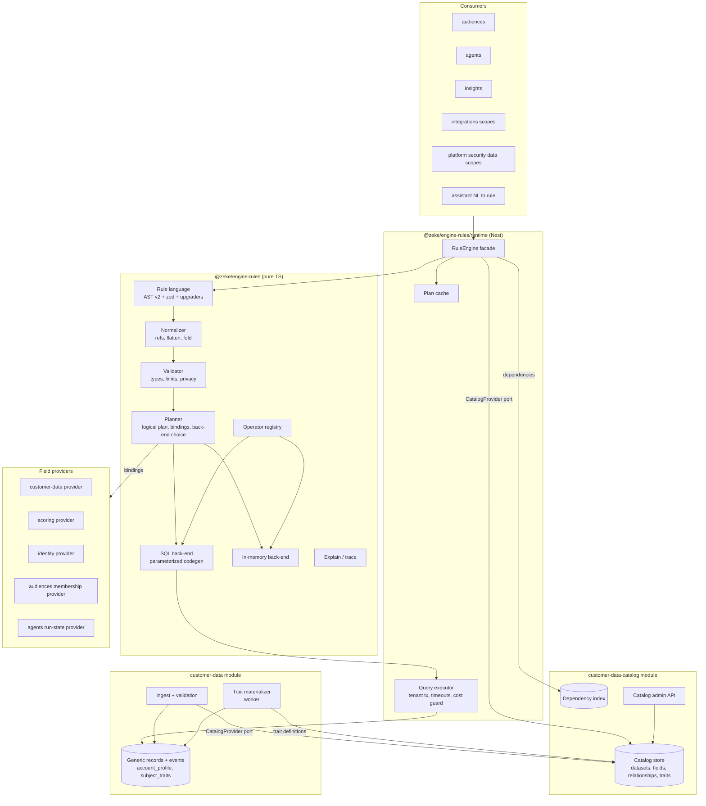
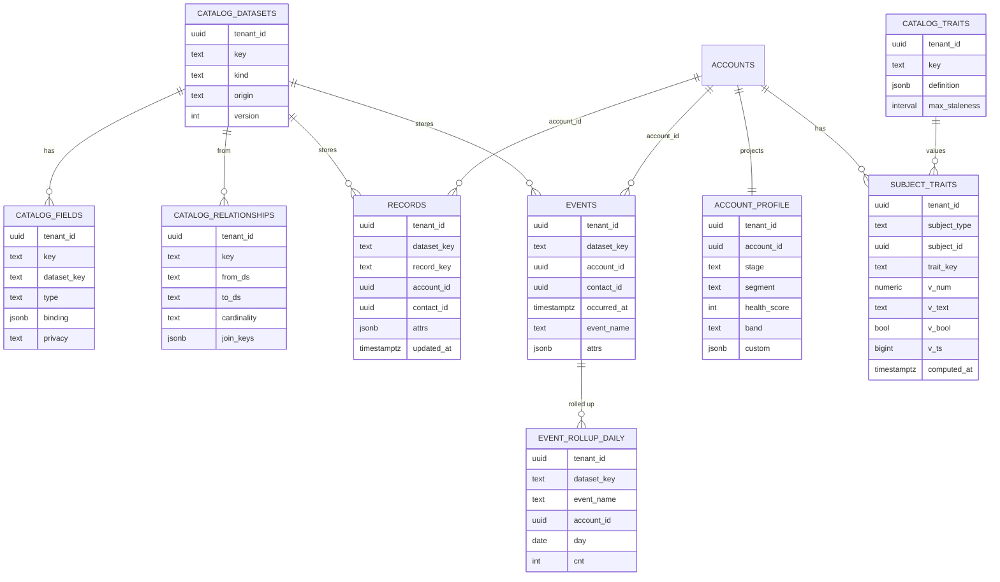
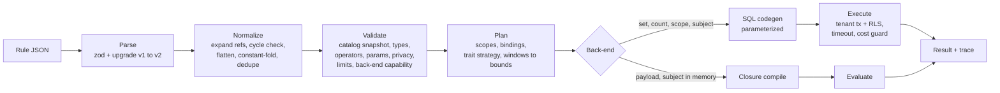
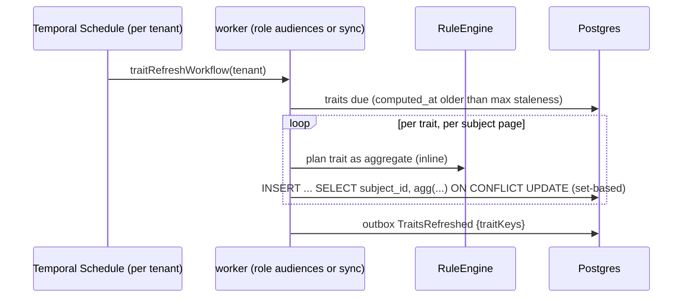

# Zeke AI — Rule Engine Architecture (v0.1 draft)

> Companion to [backend-architecture.md](../backend-architecture.md) (§4.3 Engines, §5.4 RLS, §5.8 data scopes, §6 modules, §8 Rule engine, §9.2 condition steps, §11 audiences).
> This document replaces §8 of the backend architecture as the detailed design. The step-by-step build is in [rule-engine-implementation-plan.md](rule-engine-implementation-plan.md).

---

## 1. Summary

The rule engine decides **which subjects (accounts, contacts, …) match a set of conditions** over tenant data. It powers the Audience Creator, agent condition steps, enrollment and launch policies, Drive Outcome risk/expansion types, trigger filters, capability-binding scopes and RBAC data scopes.

The hard requirement is that it must be **generic**: a customer can bring *any* dataset (a CRM custom object, product events pushed through the ingest API, later a warehouse table), pick *any* key in it, and filter on it with no code change in Zeke. The design comes down to six statements:

1. **A tenant-configurable data catalog (semantic layer) sits between data and rules.** Datasets, fields, relationships and computed traits are *data* in a versioned catalog. Rules reference catalog keys, never tables or columns. This is the model used by Hightouch Customer Studio, Segment Unify and Cube (§3).
2. **One rule language, many back-ends.** A versioned JSON AST (conditions, AND/OR/NOT groups, relation quantifiers, event windows, inline aggregates, segment references) is validated against the catalog, planned, then compiled to **parameterized Postgres SQL** (set evaluation) or an **in-memory evaluator** (payloads and single subjects). A conformance suite proves both back-ends agree.
3. **Schema-on-write, query-generic storage.** Tenant-defined datasets live in a small number of generic, RLS-protected tables (`jsonb` attributes + typed system columns), validated and type-normalised at ingest. No runtime DDL, no tenant-authored SQL.
4. **Modules own their SQL.** Each module contributes *field bindings* (the SQL fragment for its own fields over its own schema). The engine composes fragments and never hard-codes another module's tables.
5. **Traits turn behaviour into attributes.** Counts, sums, first/last, "days since" over related records and events are declared once as traits, materialised by workers, and used in rules like any field.
6. **Every evaluation is explainable, bounded and tenant-safe.** Per-condition traces and counts, hard limits on rule size and cost, statement timeouts, tenant predicates plus RLS, and values bound only as parameters.

---

## 2. Requirements

### 2.1 Consumers

| Consumer | Module | Question asked | Mode | Volume |
|---|---|---|---|---|
| Audience Creator (live/static) | audiences | Which accounts match? How many? Why 0? | set, count, breakdown | all accounts of a tenant |
| Audience materialization | audiences (workflow) | Who entered/exited since last run? | set + diff | all accounts, scheduled |
| Agent condition step (`auto`, `auto_with_manual_fallback`) | agents | Does *this* account match now? Is data missing? | single subject + trace | one account per step |
| Enrollment / launch policy rules | agents | Is this account allowed / auto-approved? | single subject or set | per launch |
| Schedule trigger + audience | agents | Resolve the attached audience at tick time | set | all accounts |
| Event trigger filter (`TODO(event-catalog)`) | agents | Does this incoming event payload match? | payload | per event |
| Drive Outcome risk / expansion types | insights | Which accounts belong to each insight type? | set | all accounts, daily |
| Capability-binding scope | integrations | Which connection serves this account? | single subject | per send |
| RBAC data scope | identity / platform security | Which accounts may this user see? | SQL fragment injected into every account query | every request |
| Ask Zeke (NL → rule) | assistant | Is the generated candidate rule valid? | validate only | interactive |

### 2.2 Functional requirements

| # | Requirement |
|---|---|
| F1 | Filter on **any field of any dataset** the tenant has connected or defined, including custom fields and nested JSON keys. |
| F2 | Datasets come from connectors (with their field mappings) and the ingest API in the MVP; CSV upload and a tenant warehouse come later. New datasets and fields become filterable **without a deploy**. |
| F3 | Unlimited conditions (within safety limits), arbitrary nesting of AND / OR / NOT. The Audience Creator's "groups joined by OR, conditions inside joined by AND" is one shape of the tree. |
| F4 | Conditions on **related records** with quantifiers: *any / none / at least N / at most N / exactly N / all* records matching a nested condition (e.g. "has ≥ 3 open tickets with priority = urgent"). Nesting up to 3 levels. |
| F5 | Conditions on **events** with frequency and time window (rolling, calendar, between) and property filters (e.g. "logged in fewer than 2 times in the last 30 days"). |
| F6 | **Computed traits** (count, sum, avg, min, max, count distinct, first, last, most frequent, exists, days since) reusable across rules and inline in a single rule. |
| F7 | Compare a field to a literal, a list (including an uploaded list), a relative date, another field, or a runtime parameter. |
| F8 | Reference **saved rules / audiences** (membership) with cycle detection. |
| F9 | Type-aware operators per field type; consistent null, case and timezone semantics. |
| F10 | Validation with **path-addressed errors** for the UI and for NL-generated rules. |
| F11 | Preview: count, sample members, **per-condition match counts** ("which condition removed everyone?"), and a single-subject trace with actual values. |
| F12 | Field metadata for the builder UI: labels, descriptions, groups, operators per type, value suggestions for low-cardinality fields, privacy level. |
| F13 | Catalog changes (rename, type change, delete) never silently break rules: stable keys, dependency tracking, broken-rule detection. |

### 2.3 Non-functional requirements

| Area | Requirement |
|---|---|
| Isolation | A rule can never read another tenant's data: tenant predicate in every generated query **and** Postgres RLS (§14). |
| Safety | No tenant-authored SQL or code runs in the shared database. Values are always bound parameters; identifiers come only from code-registered bindings. |
| Determinism | Given the same rule, catalog version, data and `asOf` time, results are identical. `now` is injected (`Clock`), never read inside the compiler. |
| Performance (provisional, see Q-RE5) | Preview count ≤ 2 s p95 on 50k accounts / 10M event rows per tenant; single-subject evaluation ≤ 50 ms p95; full materialization of 100 live audiences per tenant within the nightly window. |
| Explainability | Every match decision can be traced to conditions, values and catalog version. |
| Evolvability | AST, operators, field sources and back-ends are versioned and pluggable. A new data source or operator needs no change in consumer modules. |
| Portability | Plain PostgreSQL ≥ 14 only (no vendor extensions), so AWS, Azure and self-hosted profiles behave the same (backend-architecture §13.2). |

### 2.4 Scope

**In v1 (MVP):** account and contact subjects; catalog of system + tenant datasets (subject, related, event, lookup); custom fields on canonical entities; data from **connectors** (field mappings) and the **ingest API**; all node types in §9 except sequences; traits (scheduled + on-demand materialization, and inline); audiences evaluated **on a schedule and on demand**; SQL and in-memory back-ends; explain/trace/breakdown; dependency tracking; data scopes.

**Not in the MVP:**

- **CSV upload** of datasets. The ingest pipeline (§8.4) is source-agnostic, so CSV becomes one more front-end to it later.
- **Customer-defined subject types** (e.g. a tenant's "workspaces" as audience members). The MVP supports `account` and `contact` only; the design keeps subject types open so this needs no rework (§7.1).
- **Real-time audience membership** (updates within minutes of a data change). The MVP recomputes on a schedule and on demand; the incremental design is kept for a later phase (§12.3).

**Later:** CSV upload; customer-defined subject types (next phase); real-time incremental audiences and dirty-subject trait refresh (§12.3); sequential/funnel event conditions (`then did / did not`); warehouse-native execution against a tenant's Snowflake (`DataSource` port, §17); percentile operators; decision tables (§17); tenant expression language for formula fields beyond the v1 arithmetic subset.

---

## 3. Research: how other products build this

### 3.1 Products studied

| Product | Category | How "any data" is handled | Rule / filter model | Notable ideas |
|---|---|---|---|---|
| **Hightouch Customer Studio** | Composable CDP (warehouse-native) | Admin defines a **schema**: one *parent model* (one row per audience member, stable primary key), *related models* (1:1, 1:many, many:1, through relationships), *event models* (timestamp column + join key). Columns can be aliased, hidden, described, given privacy levels and value suggestions. | Filters on properties, relations (*has N records where …*, nested AND/OR inside the relation, up to 3 levels), events (frequency + rolling/calendar window + property filters + "then did/did not"), audience/journey membership, traits, column-to-column comparison, JSON dot-paths with an explicit type. | **Traits** (aggregation, count, occurrence first/last/most frequent, list, SQL formula) with *input filters* separate from audience filters; **trait templates** (30/90/365-day variants); workspace-level **null behaviour** setting; value suggestions only for < 100 distinct values; **usage/dependency tab** before changing schema; warning that recreating a relationship changes its ID and breaks references. |
| **Segment (Twilio) Engage / Unify** | Event-stream CDP | Profiles with custom traits (identify calls), computed traits from events, SQL traits imported from a warehouse. | Audiences from events (with property filters, `within` / `in between` windows, `and not who`), traits, computed traits, audience membership. Account-level audiences use *any / all / none of the users*. | Computed-trait types: **event counter, aggregation, most frequent, first, last, unique list, unique list count**; builder decides **real-time vs batch** from the conditions used; **cycle detection** between audiences; dynamic property references (compare an event property to a trait); rich date operators (`within last`, `within next`, `before last`, `after next`). |
| **Gainsight Rules Engine (Bionic Rules)** | Customer Success (direct competitor) | Admin builds a rule pipeline: *fetch* data sets from several objects, *merge* (join) them, *transform* (formula / case fields), *pivot*, *aggregate*. | Criteria on the resulting data set, then **actions** (create CTA, load to object, set score, send email), scheduled or chained. | Very powerful but admin-heavy: each rule re-implements joins and aggregations. Zeke keeps joins/aggregations in the **catalog** (defined once) and actions in **agents** (§4 D9). |
| **Other CS platforms (Totango, ChurnZero, Planhat)** | Customer Success | Account + custom attributes + usage, mostly flattened onto the account. | Segment builders with AND/OR over account attributes and usage metrics, segments driving plays/journeys. | Confirms the account-centric parent model and "segment → playbook" pattern Zeke already uses. |
| **Salesforce / HubSpot** | CRM | Metadata-driven multi-tenancy: tenant objects/fields are rows in a dictionary; data lives in shared generic tables (Salesforce's flex "value" columns plus pivot index tables). | List/report filters across **associations** ("companies with an associated deal where …"). | Shared generic storage + metadata dictionary scales to millions of tenant-defined fields **without DDL** — the model for §8. |
| **Cube / dbt semantic layer** | Semantic layer | Cubes (datasets) with dimensions and measures, `joins` with `one_to_one` / `one_to_many` / `many_to_one`, a **primary key per cube**. | Queries name members, the engine builds joins (transitive, shortest path). | **Fan/chasm-trap handling** (dedupe by primary key before aggregating across 1:many), always LEFT JOIN, explicit cardinality drives correct aggregation; security context for multi-tenancy. |
| **json-rules-engine** | OSS rules library | *Facts* are resolved by code (sync/async), optionally with `params` and a JSON `path`. | `all` / `any` / `not` trees, named **condition references**, fact-to-fact comparison, **operator decorators** (`everyFact`, `someFact`, `not`, `swap`). | **Rule results**: every condition annotated with `result` and `factResult` → explanations for free. Facts are deliberately not persisted (code), rules are. |
| **JsonLogic** | OSS rule format | Data passed as an object; `var` reads dotted paths. | `{"op": [args]}` AST, no loops, no side effects, deterministic time. | Same rule runs in browser and server; "safe because it never `eval`s". |
| **DMN / GoRules ZEN** | Decision modelling | Inputs are typed facts. | **Decision tables** with hit policies (first, collect, unique). | Good fit for *policies* (launch auto-approval tiers, band mapping), not for segmentation. Kept as an extension point (§17). |

### 3.2 Patterns that recur

| # | Pattern | Seen in |
|---|---|---|
| R1 | **Semantic layer between data and rules.** Users pick business fields; admins map them to storage once. | Hightouch, Segment, Cube, Salesforce |
| R2 | **One parent ("subject") per rule**, related data reached through declared relationships with **explicit cardinality**. | Hightouch, Cube, HubSpot |
| R3 | **Quantified relation filters** (*has at least N … where*) instead of raw joins — avoids row multiplication. | Hightouch, Segment (account audiences), Cube (fan traps) |
| R4 | **Events are special**: timestamp + windows + frequency. | Hightouch, Segment |
| R5 | **Traits/computed fields** convert behaviour into per-subject attributes, reusable and materialisable. | Hightouch, Segment, Gainsight |
| R6 | **Typed operators**; value suggestions for low-cardinality fields; explicit type for JSON paths. | Hightouch, Segment |
| R7 | **Rules are data, facts are code/config**; rule JSON is versioned and portable. | json-rules-engine, JsonLogic |
| R8 | **Explainability**: per-condition results and values. | json-rules-engine, Hightouch insights |
| R9 | **Dependency tracking & cycle detection** between rules, traits and schema. | Hightouch, Segment |
| R10 | **Batch vs real-time decided by the engine** from the conditions used. | Segment |
| R11 | **Generic shared storage + metadata dictionary** for tenant-defined fields. | Salesforce |

### 3.3 What Zeke adopts and what it avoids

| Adopt | Avoid (and why) |
|---|---|
| R1–R11 above. | **Tenant-authored SQL** (Hightouch SQL traits, Segment SQL traits). Those products run SQL in the *customer's own* warehouse. Zeke runs a shared Postgres; tenant SQL would be an isolation and DoS risk. Tenant SQL is only possible later against the tenant's own warehouse connector. |
| Stable keys separate from display labels. | **IDs that change on re-create** (Hightouch relationship IDs) — Zeke keys are immutable slugs. |
| Gainsight-style power (joins, aggregates) but defined **once** in the catalog. | **Per-rule data pipelines** (Bionic Rules) — hard to maintain, slow, every rule re-implements joins. |
| Explicit null semantics. | Undefined three-valued SQL logic leaking to users. |
| Decision tables as a future policy tool. | A general-purpose Rete/forward-chaining engine (Drools-style). Zeke's problem is *segmentation and predicates over stored data*, not inference chains; Rete adds complexity with no benefit here. |

---

## 4. Key decisions

| # | Decision | Why | Consequence |
|---|---|---|---|
| D1 | A **tenant data catalog** (semantic layer) is the only thing rules reference. | Customers must link any dataset/key without code changes (F1, F2). | Catalog is versioned data in the new **`customer-data-catalog`** module (§6.3); system entries come from code. Rules store catalog keys. |
| D2 | **Subject-centric rules**: every rule has exactly one subject type (`account`, `contact`, …). Related data is reached through declared relationships with cardinality. | Matches every consumer ("which accounts…"), prevents fan-out errors (Cube fan traps). | No free-form joins in rules. Relation and event nodes compile to correlated `EXISTS` / `COUNT` subqueries keyed by the subject. |
| D3 | **One versioned JSON AST** (`schemaVersion: 2`), validated with zod at every boundary. | Rules are stored, sent to the UI, produced by the LLM and evaluated in workflows. | v1 rules (current scaffold) are upgraded on read by a pure upgrader. |
| D4 | **SQL is the primary back-end; in-memory is the secondary**, restricted to fields available in memory. A conformance suite proves equal results. | Set evaluation over thousands of accounts must run in the database. Payload filters and fast single checks need memory. | Planner marks each node's back-end capability; unsupported combinations are rejected at validation, not at run time. |
| D5 | **Schema-on-write**: ingest validates and normalises values to the catalog type; storage is generic `jsonb` + typed system columns. No runtime DDL. | Arbitrary datasets without migrations per tenant; casts in generated SQL become safe; indexes can use immutable expressions. | Field type change = versioned catalog migration with a backfill job (§13.2). |
| D6 | **Modules contribute field bindings** (SQL fragment + in-memory resolver for their fields). The engine composes them. | Keeps the backend-architecture rule "only the owning module touches its schema" while allowing one query across modules in the same cell. | Scoring, identity, audiences, agents register `FieldProvider`s; the engine has no table names except through providers. |
| D7 | **Two-valued logic**: every leaf predicate compiles to `coalesce(<pred>, false)`. A missing value never matches a comparison, including negative ones (`is_not`, `not_in`, `not_contains`); use `is_empty` to target missing data. | Users read "country is not USA" as "has a country, and it isn't USA"; SQL `NULL` and JS `undefined` otherwise diverge, and `NOT` over `NULL` surprises users. | Changes the current scaffold (`is_not` uses `is distinct from`). A tenant setting for Hightouch-style "null matches negatives" is a later option (Q-RE3). |
| D8 | **Traits are first-class fields**, materialised by workers, with inline (non-materialised) evaluation allowed for previews. | Behavioural conditions on large event tables must not scan raw events on every evaluation. | `subject_traits` store; planner chooses materialised value when fresh enough, else an inline subquery. |
| D9 | **The engine decides, it never acts.** No "rule → action" layer inside the engine. | Actions already exist with governance: agents (launch approval, enrollment policies), insights, notifications. | "When X then do Y" = agent with schedule trigger + audience (backend-architecture §9.5). |
| D10 | **No tenant-authored SQL or code** in the shared database. Formula fields use a small, typed expression AST compiled by Zeke. | Isolation, injection and DoS safety. | SQL traits are only offered against the tenant's own warehouse (later). |
| D11 | **Stable, immutable keys** for datasets, fields, relationships, traits and saved rules; labels are editable. | Renames must not break rules (Hightouch pitfall). | Deleting a referenced entry is blocked or marks dependants `broken` (§13). |
| D12 | **Explain is a first-class output** for every mode. | Users must trust audiences and agent branches; support must debug "why". | Trace and breakdown APIs; agent run logs store the trace of each condition step. |

---

## 5. Concepts

| Term | Meaning | Example |
|---|---|---|
| **Subject type** | What a rule selects. One row per member, stable primary key. | `account`, `contact` |
| **Dataset** | A named, typed collection of records in the catalog. | `accounts`, `tickets`, `product_events`, tenant's `license_usage` |
| **Dataset kind** | `subject` (the members), `related` (records linked to a subject, e.g. tickets), `event` (timestamped, append-only, e.g. logins), `lookup` (shared reference rows, many:1, e.g. plans). | — |
| **Field** | A typed attribute of a dataset with a stable key and a storage binding. | `account.arr`, `tickets.priority`, `account.custom.contract_tier` |
| **Relationship** | Declared link between datasets with cardinality and join keys. | `account → tickets` (1:n on `account_id`) |
| **Trait** | Per-subject value computed from related/event records (aggregation + filter + window). Behaves as a field. | `account.trait.logins_30d`, `account.trait.days_since_last_meeting` |
| **Catalog** | System entries (code) + tenant entries (data), merged into an immutable **catalog snapshot** per tenant and version. | `catalog@tenantA:v42` |
| **Field binding** | How a field is read: SQL fragment and/or in-memory resolver, contributed by a **field provider**. | scoring provider binds `account.health.score` to `p.health_score` |
| **Rule** | JSON AST over one subject type. | "Enterprise AND score < 60 AND no meeting in 30 days" |
| **Saved rule** | A named, versioned rule other rules can reference (`ref`). Audiences are the main kind. | "Renewals in next 90 days" |
| **Operator** | Typed comparison registered in the operator registry, with SQL and in-memory implementations. | `lt`, `within_last`, `contains_any` |
| **Evaluation mode** | `set`, `count`, `breakdown`, `subject` (single), `payload`, `scope` (SQL fragment). | — |
| **Trace** | Per-node result, values seen, missing fields and catalog version for one evaluation. | used by agent condition steps |

---

## 6. Architecture overview

### 6.1 Components



### 6.2 Where things live

| Piece | Location | Notes |
|---|---|---|
| AST, schemas, upgraders, operator registry, normalizer, validator, planner, SQL codegen, in-memory evaluator, trace | `@zeke/engine-rules` (`type:engine`, pure TS, already scaffolded) | No Nest, no DB. Usable in the browser for client-side validation previews. |
| Catalog **types** (`DatasetDef`, `FieldDef`, …), `CatalogProvider`, `FieldProvider`, `RuleRefResolver` ports | `@zeke/engine-rules` | Engine depends only on ports. |
| `RuleEngine` facade, query executor, plan cache | `@zeke/engine-rules/runtime` subpath (depends on `@zeke/platform`, `@zeke/platform-persistence`) | Allowed by the `type:engine` tag (kernel + platform). |
| Catalog **storage** (datasets, fields, relationships, trait definitions, subject types), catalog admin API, `CatalogProvider` implementation, dependency index, `FieldMappingChanged` consumer | **`customer-data-catalog`** module (new, feature + contracts) | Owns the *description* of tenant data. See §6.3. |
| Ingest + validation, generic record/event storage, `account_profile`, trait materialization | `customer-data` module | Owns the tenant data itself; reads the catalog through `@zeke/customer-data-catalog-contracts`. |
| Saved rules / audiences, `RuleRefResolver` implementation | `audiences` module | Membership provider exposes `audience.member_of`. |
| Field providers | Each owning module's `plugins/` folder | Registered with `@RuleFieldProvider()` and discovered at boot (backend-architecture §5.10). |

### 6.3 Module split: `customer-data-catalog` and `customer-data`

The catalog gets its own business module (a 13th module next to the 12 in backend-architecture §6), created with `nx g @zeke/tools:module customer-data-catalog`.

| | `customer-data-catalog` | `customer-data` |
|---|---|---|
| Responsibility | **Metadata**: what datasets, fields, relationships, traits and subject types exist for a tenant, their types, labels, privacy, versions and who uses them | **Data**: the records, events, profiles and materialised trait values |
| Libs | `@zeke/customer-data-catalog-contracts`, `@zeke/customer-data-catalog` | `@zeke/customer-data-contracts`, `@zeke/customer-data` |
| Postgres schema | `customer_data_catalog` | `customer_data` |
| Tables | `catalog_datasets`, `catalog_fields`, `catalog_relationships`, `catalog_traits`, `catalog_versions`, `rule_dependencies` | `account_profile`, canonical entities, `records`, `events`, `event_rollup_daily`, `subject_traits` |
| Publishes | `CatalogChanged`, `FieldDeprecated`, `FieldDeleted` | `RecordsChanged`, `TraitsRefreshed`, `AccountUpserted`, `ContactUpserted` |
| Ports (contracts) | `CatalogProvider` (snapshot per tenant/version), `CatalogAdminApi` (propose/register fields, used by ingest and integrations), `RuleDependencyRegistry` | `AccountQuery`, `ContactQuery`, `RecordIngestApi` |
| Consumes | `FieldMappingChanged` (integrations) | `CatalogChanged` (invalidate ingest validators), connector sync batches |
| HTTP | `/data-model/*` (Admin → Data model) | `/datasets/{key}/records` (ingest API) |

Why separate: the catalog changes rarely and is read by almost every module (engine, ingest, audiences, agents, assistant), while data changes constantly and is large. Splitting them keeps the catalog small, cacheable and independently versioned, and lets other modules depend on catalog *contracts* without depending on the data module. There are **no cross-schema foreign keys**: `records.dataset_key` refers to a catalog key logically, and ingest validates it against the snapshot.

---

## 7. The data catalog (semantic layer)

The **catalog** is Zeke's per-tenant *description of the data*, not the data itself. It answers, for each tenant: which datasets exist (accounts, tickets, the tenant's own `license_usage`…), which fields each has and their types, how datasets link to each other, and which computed values (traits) are defined. The rule builder reads the catalog to show fields and operators, the validator checks rules against it, and the planner uses it to find where each field is stored. The records themselves live in the storage described in §8.

It has two parts, merged per tenant at run time:

- **System catalog** — defined in code by Zeke's modules (health score, band, stage, segment, ARR, owner…). Same for every tenant.
- **Tenant catalog** — rows in the database, created when a tenant maps connector fields, pushes data through the ingest API, or edits the data model in Admin. Different for every tenant.

### 7.1 Subjects

A **subject type** is *what a rule selects* — the kind of thing that ends up in an audience. It is **not** the same as a table: there are many datasets (tables/collections), but only a few of them are subjects. Accounts are a subject ("which accounts match?"); tickets, opportunities and login events are not subjects, they are **related datasets** used to decide which accounts match ("accounts with ≥ 3 urgent tickets"). Each subject type points to exactly one subject dataset with one row per member and a stable ID.

```ts
export interface SubjectTypeDef {
  readonly key: SubjectType;               // open string; MVP: 'account' | 'contact' (code), later tenant-defined
  readonly datasetKey: DatasetKey;         // the subject dataset ('accounts')
  readonly primaryKey: FieldKey;           // 'account.id'
  readonly label: string;
  readonly displayFields: readonly FieldKey[]; // preview columns (name, owner, ...)
}
```

**MVP:** the subject types are `account` and `contact`, **code-registered**. Tenants extend them with custom fields and related/event datasets.

**Next phase — customer-defined subject types (not in MVP):** a tenant can promote one of its own datasets to a subject (e.g. "workspaces" or "licences" as audience members). The MVP design already allows this without rework:

- `SubjectType` is an open string and `SubjectTypeDef` lives in the catalog, so a tenant row can define one;
- the subject base can be a generic `records` dataset (`dataset_key = …`) instead of a typed table such as `account_profile`;
- `subject_traits` and relationships are already keyed by `subject_type`;
- the planner compiles the root query from the subject's binding, not from a hard-coded table.

What the next phase must add: catalog admin UI/API to declare a subject (primary key, display fields), subject-reference resolution at ingest for the new subject, audience storage keyed by subject type, and a decision on which consumers support custom subjects (audiences and insights first; agent enrollment stays account/contact-based until agents are generalised).

### 7.2 Datasets

```ts
export type DatasetKind = 'subject' | 'related' | 'event' | 'lookup';
export type DatasetOrigin = 'system' | 'connector' | 'api' | 'csv' | 'warehouse';

export interface DatasetDef {
  readonly key: DatasetKey;                // immutable slug: 'tickets', 'ds_license_usage'
  readonly kind: DatasetKind;
  readonly origin: DatasetOrigin;
  readonly label: string;
  readonly description?: string;           // also fed to Ask Zeke for NL grounding
  readonly primaryKey: FieldKey;
  readonly timestampField?: FieldKey;      // required for kind 'event'
  readonly storage: DatasetStorage;        // system table via provider, or generic records store
  readonly status: 'active' | 'deprecated' | 'deleted';
}
```

| Kind | Required | Used by nodes | Examples |
|---|---|---|---|
| `subject` | primary key | `condition` | accounts, contacts |
| `related` | primary key, relationship to a subject | `relation`, `aggregate`, traits | opportunities, subscriptions, tickets, custom objects |
| `event` | timestamp, relationship to a subject | `event`, `aggregate`, traits | logins, feature usage, emails opened, survey responses |
| `lookup` | primary key, many:1 from a subject/related dataset | `condition` through a path (merged field) | plans, regions, product catalogue |

### 7.3 Fields and the type system

```ts
export type FieldType =
  | 'string' | 'text'            // text = long, not suggestable, only contains/is_empty
  | 'integer' | 'decimal' | 'money'
  | 'boolean'
  | 'date' | 'timestamp'
  | 'enum'                       // closed option set (system or tenant-defined)
  | 'string_list' | 'number_list'
  | 'id';                        // opaque identifier, equality and lists only

export interface FieldDef {
  readonly key: FieldKey;                  // 'account.arr', 'tickets.priority', 'account.custom.contract_tier'
  readonly datasetKey: DatasetKey;
  readonly label: string;
  readonly description?: string;
  readonly group?: string;                 // builder grouping: 'Health', 'Commercial', 'Usage'
  readonly type: FieldType;
  readonly semantic?: 'currency' | 'percent' | 'email' | 'url' | 'duration' | 'score';
  readonly options?: OptionSource;         // static list, catalog-defined list, or provider callback
  readonly caseSensitive?: boolean;        // default false
  readonly filterable: boolean;
  readonly privacy: 'visible' | 'redacted' | 'hidden';  // redacted = filterable, values masked in previews
  readonly suggest: boolean;               // value suggestions (only low cardinality)
  readonly binding: FieldBindingRef;       // resolved by a FieldProvider or the generic store
  readonly origin: 'system' | 'mapping' | 'tenant';
  readonly status: 'active' | 'deprecated' | 'deleted';
}
```

Type rules:

| Type | Stored (generic store) | Notes |
|---|---|---|
| `string` | jsonb string, trimmed, NFC-normalised | max length enforced at ingest |
| `integer` / `decimal` | jsonb number | decimals as numbers within safe range; `money` stored in **minor units** (integer) with a currency field |
| `boolean` | jsonb boolean | |
| `date` | jsonb number, **days since epoch** | immutable numeric casts → indexable; interpreted in tenant timezone |
| `timestamp` | jsonb number, **UTC epoch ms** | same reason; display layer formats |
| `enum` | jsonb string (option key) | unknown options rejected at ingest (or auto-added if the field allows it) |
| lists | jsonb array | `contains_any/all`, `is_empty`, length |
| JSON blobs | not a field type | a JSON column is exposed by declaring **typed fields with a path** (`payload.plan.tier` as `string`), as Hightouch requires an explicit type for JSON paths |

### 7.4 Relationships

```ts
export interface RelationshipDef {
  readonly key: RelationshipKey;           // 'account.tickets'
  readonly from: DatasetKey;               // 'accounts'
  readonly to: DatasetKey;                 // 'tickets'
  readonly cardinality: '1:1' | '1:n' | 'n:1';
  readonly join: readonly { fromField: FieldKey; toField: FieldKey }[]; // multi-key allowed
  readonly through?: readonly RelationshipKey[];                         // many-to-many via a link dataset
  readonly label: string;                  // 'Tickets'
}
```

- `1:n` relationships are only usable through quantified nodes (`relation`, `event`, `aggregate`, traits) — never flattened. This removes fan-out by construction.
- `n:1` and `1:1` relationships expose **path fields** (`account.plan.tier`, Hightouch "merge columns") that behave like subject fields.
- Join key types must match; this is checked when the relationship is saved, not at query time.
- For the generic store the standard join is on the subject reference columns (`account_id`, `contact_id`) populated at ingest, so most tenant relationships need no custom join keys.

### 7.5 Traits

```ts
export type TraitMethod =
  | 'count' | 'count_distinct' | 'sum' | 'avg' | 'min' | 'max'
  | 'first' | 'last' | 'most_frequent' | 'exists' | 'days_since_last' | 'list_distinct';

export interface TraitDef {
  readonly key: FieldKey;                  // 'account.trait.logins_30d' — traits ARE fields
  readonly subjectType: SubjectType;
  readonly method: TraitMethod;
  readonly source: {
    readonly relationship: RelationshipKey;    // 'account.product_events'
    readonly where?: RuleNode;                 // input filter on source records (e.g. event_name = 'login')
    readonly window?: TimeWindow;              // rolling 30 days, calendar quarter, ...
    readonly field?: FieldKey;                 // for sum/avg/min/max/first/last/most_frequent
    readonly orderBy?: FieldKey;               // for first/last (default: dataset timestamp)
  };
  readonly resultType: FieldType;
  readonly materialization: { readonly mode: 'scheduled' | 'inline_only'; readonly maxStaleness: Duration };
  readonly templateKey?: string;           // trait templates: 30/90/365-day variants share one definition
}
```

- **Trait filters vs rule filters:** a trait's `where` selects which records contribute; a rule compares the resulting value (same split as Hightouch).
- Materialised values land in `subject_traits` (§8.3). The planner uses them when `computed_at` is within `maxStaleness`; otherwise it compiles the trait inline (preview/accuracy) or fails (materialization jobs) — configurable per evaluation.
- System traits ship by default for the wireframe's fields: `days_since_last_login`, `days_since_last_meeting`, `open_tickets`, `logins_30d`, `nps_latest`.

### 7.6 Where catalog entries come from

| Source | Creates | Mechanism |
|---|---|---|
| Code (system) | Subject types, canonical datasets, system fields (stage, segment, health score, band, predictive risk, owner, renewal date, ARR …), system traits, operators | `@RuleFieldProvider()` classes in each module, registered at boot. Versioned with the release. |
| Connector field mappings (integrations §7.6) | Custom fields on canonical datasets (`account.custom.*`), custom datasets for custom objects | When a tenant maps `Salesforce.Account.Tier__c → account.custom.tier`, integrations publishes `FieldMappingChanged`; customer-data-catalog registers the field (type from the connector's describe metadata). |
| Admin "Data model" UI / API | Datasets, fields, relationships, traits, labels, privacy | Catalog admin API (permission `datamodel:manage`). |
| Ingest API | Records into existing datasets; optionally auto-declare fields (`mode: strict | additive`) | `POST /datasets/{key}/records` (batch, idempotent by primary key). Additive mode infers type on first sight and requires admin confirmation before the field is filterable. |
| CSV upload (**not in MVP**) | Dataset + fields + records | Later: upload → staged → column typing wizard → the same ingest job as the API. |
| Warehouse (later) | Dataset backed by the tenant's warehouse | Synced into the generic store in v1.x; warehouse-native execution later (§17). |

### 7.7 Catalog snapshots, versions and dependencies

- Every catalog change increments the tenant's `catalog_version` and emits `CatalogChanged { tenantId, version, changes[] }` through the outbox.
- `CatalogProvider.snapshot(tenantId)` returns an immutable `CatalogSnapshot` (system ⊕ tenant entries) cached per `(tenantId, version)` in-process and in Redis.
- A **dependency index** `rule_dependencies(owner_type, owner_id, version, entry_key)` is written whenever a rule, trait or saved rule is saved. It answers "what uses `tickets.priority`?" (Hightouch usage tab) and powers safe deletes (§13).

---

## 8. Storing "any dataset"

### 8.1 Options considered

| Option | Description | Pros | Cons |
|---|---|---|---|
| **A. Generic records + `jsonb` attributes** | One table for related/lookup records and one for events; tenant fields in `attrs jsonb`; system columns typed. | No DDL; RLS once; works on every Postgres; GIN + expression indexes; simple ingest. | Casts in queries; per-field indexes need care; statistics on jsonb keys are weak. |
| B. Runtime DDL (table per tenant dataset) | `CREATE TABLE t_<tenant>_<dataset>` on demand. | Native types and indexes. | Migrations per tenant, catalog bloat (thousands of tables), RLS policy per table, PgBouncer/plan cache churn, hard for self-hosted ops. |
| C. EAV (`entity, attribute, value`) | One row per value. | Fully generic. | Self-joins per condition; slow; poor typing. |
| D. Flex slot columns (Salesforce) | Typed columns `n01..n40`, `s01..s40`, `t01..t20`; catalog maps field → slot. | Typed, B-tree indexable per slot, good statistics. | Slot exhaustion, remapping on type change, wide sparse rows. |
| E. Warehouse-native | Query the tenant's Snowflake/BigQuery directly (Hightouch). | No copy, unlimited data. | Latency, cost, availability, region constraints, every consumer becomes remote; not available for most CS tenants. |

### 8.2 Decision

**A for v1, with D as a targeted optimisation, and E as a later data source.**

- Canonical entities keep typed columns (owned by customer-data), with tenant custom fields in a `custom jsonb` column.
- Tenant datasets go to the generic `records` / `events` tables.
- When a field becomes hot (frequent filter, large tenant), an admin/ops action **promotes** it to an indexed expression (`btree ((attrs->'k')::numeric)` partial on `dataset_id`) — or, if expression indexes prove insufficient at scale, to a typed slot column (option D) with no change to rules, because rules reference field keys and the binding changes underneath.
- Warehouse-native execution is a separate `DataSource` back-end (§17), not a storage change.

### 8.3 Tables

`catalog_*` and `rule_dependencies` are in schema `customer_data_catalog` (owned by `customer-data-catalog`); every other table is in schema `customer_data` (owned by `customer-data`). Links between the two schemas are logical keys, not foreign keys.



| Table | Purpose | Partitioning / indexes |
|---|---|---|
| `catalog_*` | Tenant catalog entries (system entries are in code) | PK `(tenant_id, key)`; `catalog_version` per tenant |
| `account_profile` | Wide read model per account (system fields, typed) + `custom jsonb` | PK `(tenant_id, account_id)`; B-tree on hot system columns; GIN `jsonb_path_ops` on `custom` |
| `records` | Related/lookup records of every tenant dataset | PK `(tenant_id, dataset_key, record_key)`; index `(tenant_id, dataset_key, account_id)`; GIN on `attrs`; optional promoted expression indexes |
| `events` | Append-only events | Range-partitioned by `occurred_at` (monthly); index `(tenant_id, dataset_key, account_id, occurred_at desc)`; BRIN on `occurred_at`; retention per tenant plan |
| `event_rollup_daily` | Counts per subject/day/event name | Answers count-in-window over whole days without scanning `events` |
| `subject_traits` | Materialised trait values (typed value columns) | PK `(tenant_id, subject_type, trait_key, subject_id)`; B-tree on `(tenant_id, trait_key, v_num)` etc. |
| `rule_dependencies` | Usage index | `(tenant_id, entry_key)` |

All tables carry `tenant_id` first in every key and have `FORCE ROW LEVEL SECURITY` (backend-architecture §5.4).

### 8.4 Ingest contract (schema-on-write)

1. Resolve dataset + catalog snapshot (`CatalogProvider` from `customer-data-catalog`).
2. Validate each record with a zod schema **generated from the catalog** (type, required, enum options, max length, list sizes).
3. Normalise: trim/NFC strings, numbers within safe range, dates → epoch days, timestamps → epoch ms (UTC), money → minor units.
4. Resolve subject references (`account_id`, `contact_id`) from the relationship's join keys (external IDs via identity mapping).
5. Upsert idempotently by `(dataset_key, record_key)`; events dedupe by optional `event_id`.
6. Publish `RecordsChanged { datasetKey, subjectIds[] }`. The MVP only uses it for audit and metrics; dirty-subject trait refresh and incremental audiences consume it later (§12.3).

Invalid records are rejected per record with path-addressed errors, never partially coerced.

---

## 9. Rule language (AST v2)

### 9.1 Nodes

```ts
export interface Rule {
  readonly schemaVersion: 2;
  readonly subject: SubjectType;                 // replaces v1 'entity'
  readonly root: RuleNode;
}

export type RuleNode =
  | { kind: 'group'; op: 'and' | 'or'; children: RuleNode[] }
  | { kind: 'not'; child: RuleNode }
  | ConditionNode
  | RelationNode
  | EventNode
  | AggregateNode
  | { kind: 'ref'; ruleKey: SavedRuleKey }                  // reuse a saved rule's root (inlined, cycle-checked)
  | { kind: 'member_of'; audienceKey: AudienceKey; negate?: boolean }; // materialised membership

export interface ConditionNode {                              // compare one field of the current scope
  kind: 'condition';
  field: FieldKey;                                            // may be a path through n:1 relationships or a trait
  operator: OperatorKey;
  value?: RuleValue;
}

export interface RelationNode {                               // "has at least 3 tickets where (priority = urgent AND status = open)"
  kind: 'relation';
  relationship: RelationshipKey;                              // 1:n from the current scope
  quantifier: Quantifier;
  where?: RuleNode;                                           // evaluated in the related dataset's scope (nesting ≤ 3)
}

export interface EventNode {                                  // "performed 'login' fewer than 2 times in the last 30 days"
  kind: 'event';
  relationship: RelationshipKey;                              // to an event dataset
  eventName?: string;                                         // when one dataset holds many event names
  quantifier: Quantifier;
  window: TimeWindow;
  where?: RuleNode;                                           // event property filters
}

export interface AggregateNode {                              // inline trait: "sum(opportunities.amount where stage = won) > 50000"
  kind: 'aggregate';
  relationship: RelationshipKey;
  method: TraitMethod;
  field?: FieldKey;
  where?: RuleNode;
  window?: TimeWindow;
  operator: OperatorKey;
  value: RuleValue;
}

export type Quantifier =
  | { op: 'any' } | { op: 'none' } | { op: 'all' }            // 'all' = no record violates `where` (and ≥ 1 exists unless allowEmpty)
  | { op: 'at_least' | 'at_most' | 'exactly'; count: number };

export type TimeWindow =
  | { type: 'rolling'; amount: number; unit: 'hours' | 'days' | 'weeks' | 'months' }   // last N units, from asOf
  | { type: 'rolling_between'; from: RelativeOffset; to: RelativeOffset }             // 30 to 90 days ago
  | { type: 'calendar'; unit: 'week' | 'month' | 'quarter' | 'year'; offset: number } // previous calendar month = offset -1
  | { type: 'absolute'; from: IsoDate; to: IsoDate }
  | { type: 'ever' };
```

The **scope** concept makes nesting uniform: the root scope is the subject; a `relation`/`event`/`aggregate` node opens the related dataset's scope for its `where`; `condition` fields are resolved in the current scope (with n:1 paths allowed).

### 9.2 Values

```ts
export type RuleValue =
  | { type: 'literal'; value: Scalar | Scalar[] }
  | { type: 'relative_date'; amount: number; unit: 'days' | 'hours' | 'weeks' | 'months'; direction: 'ago' | 'from_now' }
  | { type: 'field'; field: FieldKey }               // same-scope or outer-scope field ("$outer.account.renewal_date")
  | { type: 'param'; name: string }                  // bound at evaluation: {{run.accountId}}, {{launch.ownerId}}
  | { type: 'value_set'; valueSetKey: string };       // uploaded list (IDs, emails, domains) stored server-side
```

- `value_set` keeps large uploaded lists (Hightouch drag-and-drop lists) out of the AST; SQL compiles to `= any($n)` for small sets or a join on a temp/value-set table for large ones.
- `param` names are declared by the consumer (`agents` declares `run.*`) and validated.

### 9.3 Operators

| Operator | string | text | integer/decimal/money | boolean | date/timestamp | enum | lists | id |
|---|---|---|---|---|---|---|---|---|
| `is`, `is_not` | ✓ | | ✓ | ✓ | ✓ (same day for `date`) | ✓ | | ✓ |
| `in`, `not_in` | ✓ | | ✓ | | | ✓ | | ✓ |
| `lt`, `lte`, `gt`, `gte`, `between` | | | ✓ | | ✓ | | | |
| `contains`, `not_contains`, `starts_with`, `ends_with` | ✓ | ✓ | | | | | | |
| `contains_any`, `contains_all`, `contains_none` | | | | | | | ✓ | |
| `length_lt/gt` (list size) | | | | | | | ✓ | |
| `within_last`, `not_within_last`, `within_next`, `before_last`, `after_next` | | | | | ✓ | | | |
| `in_calendar` (this/last month, quarter …) | | | | | ✓ | | | |
| `anniversary_within_next` | | | | | ✓ | | | |
| `changed_by` / `changed_to` (delta vs previous snapshot) | | | ✓ | | | ✓ | | |
| `is_empty`, `is_not_empty` | ✓ | ✓ | ✓ | ✓ | ✓ | ✓ | ✓ | ✓ |

- Each operator is an `OperatorDefinition { key, appliesTo, arity, valueType(fieldType), evaluate, sql, backends }` in the registry. Adding one = register + pass the conformance suite.
- `LIKE`-based operators escape `%`, `_` and `\` in the bound value; there is **no regex operator** in v1 (ReDoS risk; Q-RE6).
- `changed_by/changed_to` read the previous value from score snapshots or `account_profile_history` (provider-specific); they are only offered on fields whose provider declares history support.

### 9.4 Semantics

| Topic | Rule |
|---|---|
| Nulls | Two-valued (D7). Leaf predicates compile to `coalesce(pred, false)`; the evaluator returns `false` for `undefined`/`null`. `is_empty` is the only way to match missing data. |
| Missing data diagnostics | Single-subject evaluation also reports `missingFields` on the **decisive path**, so `auto_with_manual_fallback` condition steps can escalate (`needs_human`) instead of silently taking `no`. |
| Case | String comparisons are case-insensitive unless the field is `caseSensitive`; both sides use `lower()` and indexes are built on `lower(...)`. |
| Time | `asOf` (from `Clock`) is fixed per evaluation and bound as a parameter; relative windows are computed in the planner, not with `now()` in SQL. Rolling windows are UTC instants; calendar windows and `date` fields use the **tenant timezone** (tenant setting). |
| Numbers | Decimal comparisons use `numeric` in SQL; the in-memory back-end compares within the safe integer/float range enforced at ingest; money compares in minor units and requires the same currency. |
| Lists | `in` on a scalar field, `contains_*` on list fields. An empty `in` list never matches. |
| `all` quantifier | True when at least one related record exists and none violates `where`; `allowEmpty: true` makes zero records match too. |
| Empty groups | `and []` = true, `or []` = false (also how "no filters" means "everyone"). |
| References | `ref` inlines the saved rule's root at normalisation time (latest published version unless pinned); `member_of` uses materialised membership (faster, possibly stale). Cycles are rejected. |

### 9.5 Limits (configurable per deployment)

| Limit | Default |
|---|---|
| Nodes per rule (after `ref` expansion) | 200 |
| Depth | 8 |
| Relation/event nesting | 3 |
| `ref` chain depth | 5 |
| Inline list values | 1,000 (larger → `value_set`, ≤ 100,000) |
| Inline aggregates per rule | 10 |
| Preview statement timeout / materialization timeout | 5 s / 120 s |
| Planner cost ceiling (`EXPLAIN` total cost) for interactive previews | configurable; above it the UI asks to save and run as a job |

### 9.6 Examples

**Wireframe Audience Creator** — *(Enterprise AND At Risk AND Adoption) OR renewal in next 90 days*:

```json
{
  "schemaVersion": 2,
  "subject": "account",
  "root": { "kind": "group", "op": "or", "children": [
    { "kind": "group", "op": "and", "children": [
      { "kind": "condition", "field": "account.segment", "operator": "is", "value": { "type": "literal", "value": "enterprise" } },
      { "kind": "condition", "field": "account.lifecycle_stage", "operator": "is", "value": { "type": "literal", "value": "adoption" } },
      { "kind": "condition", "field": "account.health.band", "operator": "is", "value": { "type": "literal", "value": "at_risk" } }
    ]},
    { "kind": "condition", "field": "account.renewal_date", "operator": "within_next",
      "value": { "type": "literal", "value": 90 } }
  ]}
}
```

**Tenant custom data** — *Accounts with at least 3 open urgent tickets, whose custom `contract_tier` is Gold, and fewer than 2 logins in the last 30 days*:

```json
{
  "schemaVersion": 2,
  "subject": "account",
  "root": { "kind": "group", "op": "and", "children": [
    { "kind": "condition", "field": "account.custom.contract_tier", "operator": "is", "value": { "type": "literal", "value": "gold" } },
    { "kind": "relation", "relationship": "account.tickets", "quantifier": { "op": "at_least", "count": 3 },
      "where": { "kind": "group", "op": "and", "children": [
        { "kind": "condition", "field": "tickets.status", "operator": "is", "value": { "type": "literal", "value": "open" } },
        { "kind": "condition", "field": "tickets.priority", "operator": "is", "value": { "type": "literal", "value": "urgent" } }
      ]}},
    { "kind": "event", "relationship": "account.product_events", "eventName": "login",
      "quantifier": { "op": "at_most", "count": 1 }, "window": { "type": "rolling", "amount": 30, "unit": "days" } }
  ]}
}
```

**Agent condition step** — wireframe *"Usage Recovered is No"* becomes a typed rule on a trait, e.g. `account.trait.logins_30d lt {{param run.loginsAtLaunch}}`.

---

## 10. Compilation and execution pipeline

### 10.1 Stages



Plans are cached by `(ruleHash, catalogVersion, backend, mode)`. Time bounds and params are **not** part of the key; they are bound at execution, so one cached SQL text serves every run.

### 10.2 Normalizer

- Upgrades `schemaVersion` 1 → 2 (`entity` → `subject`, v1 field keys mapped through an alias table).
- Expands `ref` nodes via `RuleRefResolver` (depth limit, cycle detection with the resolution stack in the error).
- Flattens nested same-op groups, removes `not(not(x))`, folds empty groups, de-duplicates identical siblings.
- Produces a **canonical form** → stable `ruleHash` (used for caching and "this audience equals that one" detection).

### 10.3 Validator

Returns `RuleIssue { path, code, message, severity }[]` (JSON-pointer paths, as in the scaffold), never throws for user errors:

- unknown/deleted/deprecated field, dataset, relationship, trait (deprecated = warning);
- field not in the current scope; `1:n` relationship used without a quantifier;
- operator not applicable to the field type; arity; value type (`literal` coerced to the field type, e.g. `"60"` → `60` with a warning in lenient mode used by the NL assistant);
- params not declared by the consumer; `value_set` not found;
- privacy: `hidden` fields are not filterable; `redacted` fields are filterable but never echoed in previews;
- **data-scope privileges**: a user can only reference datasets their role can read (identity permission `datamodel:read:<dataset>` — Q-RE7);
- limits (§9.5);
- **back-end capability**: e.g. a `payload` evaluation cannot use relation nodes; a `scope` (RBAC) rule may only use subject fields and materialised traits (to keep every account query cheap).

### 10.4 Planner

The planner turns the validated AST into a **logical plan**:

| Plan node | Produced from | Strategy chosen by the planner |
|---|---|---|
| `Predicate(binding, op, boundValue)` | `condition` | binding from the field's provider: typed column, `jsonb` key, path through n:1 join, materialised trait |
| `Exists/CountQuantified(scope, where, n)` | `relation`, `event` | `EXISTS` for `any`/`none`; capped count (`LIMIT n`) for `at_least`; full count for `at_most`/`exactly`; `NOT EXISTS (… AND NOT where)` for `all` |
| `WindowCount` | `event` with whole-day window, no property filter | `event_rollup_daily` instead of raw `events` |
| `TraitValue(trait)` | trait field / `aggregate` | materialised if fresh, else inline aggregate subquery |
| `Membership(audience)` | `member_of` | membership provider fragment |
| `Bool(and/or/not)` | groups | — |

It also orders `AND` children by estimated selectivity (cheap indexed predicates first) for the in-memory back-end and for readable SQL; Postgres reorders anyway.

### 10.5 SQL back-end

Codegen rules:

1. Output is `{ sql, params }`; every value, `jsonb` key, dataset key and time bound is a `$n` parameter. **Identifiers** (table aliases, column names) come only from provider bindings registered in code.
2. The subject query is always:

   ```sql
   select s.account_id
   from customer_data.account_profile s
   where s.tenant_id = $1            -- explicit, in addition to RLS
     and (<compiled root>)
   ```
3. Leaf: `coalesce(<expr> <op> $n, false)`.
4. Generic-store field: `(r.attrs -> $k)` with an immutable cast per type, e.g. `((r.attrs ->> $k)::numeric)`; values are guaranteed castable by schema-on-write, and a `zeke_try_numeric()` guard is used for `origin = 'api'` additive fields until confirmed.
5. Relation:

   ```sql
   exists (select 1 from customer_data.records r
           where r.tenant_id = s.tenant_id and r.dataset_key = $d and r.account_id = s.account_id
             and (<compiled where in r scope>))
   ```

   `at_least n` → `(select count(*) from (select 1 from … limit $n) q) = $n`.
6. Event window: `e.occurred_at >= $from and e.occurred_at < $to` (bounds computed from `asOf`); partition pruning applies.
7. Inline aggregate: correlated scalar subquery with `coalesce(count(*),0)` / `sum(...)` etc.
8. Field-to-field comparison (`value.type = 'field'`) is supported in SQL (not in the current scaffold), including outer-scope references.
9. `explain` mode wraps each top-level child as a `count(*) filter (where …)` column to produce the **per-condition breakdown** in one scan.

### 10.6 In-memory back-end

- Compiles the plan into closures over a `FactSource`:
  - `payload` mode: the event/webhook payload only (fields of the event dataset).
  - `subject` mode: a `SubjectFacts` object loaded in **one** batched query that selects exactly the fields, traits and relation/event aggregates the plan needs for that subject (the SQL back-end is reused to load facts, so semantics stay identical).
- Pure, synchronous, no I/O once facts are loaded → safe inside Temporal activities and in the browser for live builder feedback.

### 10.7 Trace and explain

```ts
export interface RuleTrace {
  readonly matched: boolean;
  readonly catalogVersion: number;
  readonly asOf: string;
  readonly nodes: readonly {
    readonly path: string;                         // '/root/children/1'
    readonly result: boolean;
    readonly observed?: unknown;                   // redacted if privacy = redacted
    readonly expected?: unknown;
    readonly missing?: boolean;
  }[];
  readonly missingFields: readonly FieldKey[];     // on the decisive path
}

export interface RuleBreakdown {                   // set mode
  readonly total: number;
  readonly perNode: readonly { path: string; matched: number }[]; // "this condition alone matches N"
}
```

### 10.8 Conformance

A property-based suite (fast-check) generates random catalogs, records and rules per operator × type × null pattern × window, runs both back-ends against Testcontainers Postgres, and asserts identical results. Every new operator, field provider and back-end must pass it (backend-architecture §8.3, §14).

---

## 11. The `RuleEngine` API

```ts
export interface RuleEngine {
  validate(rule: unknown, opts: ValidateOptions): Promise<Result<ValidatedRule, RuleIssue[]>>;
  dependencies(rule: ValidatedRule): RuleDependencies;                  // fields, datasets, traits, refs

  count(rule: ValidatedRule, opts: EvalOptions): Promise<Result<RuleBreakdown>>;
  sample(rule: ValidatedRule, opts: EvalOptions & { limit: number }): Promise<Result<SubjectPreview[]>>;
  select(rule: ValidatedRule, opts: EvalOptions): AsyncIterable<readonly SubjectId[]>; // keyset-paginated stream
  test(rule: ValidatedRule, subjectId: SubjectId, opts: EvalOptions): Promise<Result<RuleTrace>>;
  matchPayload(rule: ValidatedRule, payload: unknown, opts: PayloadOptions): Result<RuleTrace>;
  scope(rule: ValidatedRule, alias: string, opts: ScopeOptions): Result<SqlFragment>; // RBAC data scopes

  catalog(tenantId: TenantId): Promise<CatalogView>;                   // builder metadata: fields, operators, suggestions
}

export interface EvalOptions {
  readonly tenantId: TenantId;                 // must equal TenantContext; asserted
  readonly asOf?: Date;                        // default Clock.now()
  readonly params?: Readonly<Record<string, unknown>>;
  readonly traitPolicy?: 'prefer_materialized' | 'require_fresh' | 'inline';
  readonly timeoutMs?: number;
}
```

| Consumer | Calls |
|---|---|
| Audience builder | `catalog`, `validate`, `count` (with breakdown), `sample` |
| Audience save | `validate`, `dependencies` → stored with the audience version |
| Audience materialization | `select` (stream) → diff with stored members |
| Agent condition step | `test` → edge `yes`/`no`, or `needs_human` when `missingFields` and mode is `auto_with_manual_fallback`; trace stored in `run_step_log` |
| Enrollment/launch policy | `test` per account, or `select` intersected with the candidate list |
| Insights | `select` per insight type |
| Event trigger filters | `matchPayload` |
| Data scopes | `scope` once per (role version, catalog version), cached |
| Ask Zeke | `catalog` (descriptions for grounding) → LLM → `validate` (lenient) → user confirms |

---

## 12. Key flows

### 12.1 Building an audience

```mermaid
sequenceDiagram
  participant UI
  participant API as apps/api (audiences)
  participant RE as RuleEngine
  participant CAT as CatalogProvider (customer-data-catalog)
  participant PG as Postgres (RLS)
  UI->>API: GET /rules/catalog?subject=account
  API->>RE: catalog(tenant)
  RE->>CAT: snapshot(tenant)
  CAT-->>RE: CatalogSnapshot v42
  RE-->>UI: fields, operators per type, suggestions
  UI->>API: POST /audiences/preview {rule}
  API->>RE: validate(rule)
  RE-->>API: ok | issues[path]
  API->>RE: count(rule, breakdown) + sample(rule, 20)
  RE->>PG: SELECT count(*) FILTER (...) ... (tenant tx, 5 s timeout)
  PG-->>RE: totals per node
  RE-->>UI: 128 matches; per-condition counts; sample rows (redacted fields masked)
  UI->>API: POST /audiences {name, rule, mode: live}
  API->>RE: validate + dependencies
  API->>PG: insert audience_version + rule_dependencies (1 tx)
```

### 12.2 Trait materialization



In the MVP, traits refresh on this schedule and **on demand** (for example "Recalculate", or before an audience is materialized with `traitPolicy: 'require_fresh'`). Marking subjects dirty from `RecordsChanged` so traits refresh within minutes is part of the later real-time phase.

### 12.3 Audience materialization and incremental evaluation

- **MVP (scheduled + on demand):** `audienceMaterializationWorkflow` runs on a Temporal Schedule and on demand (audience saved, "Refresh" clicked, launch or schedule tick resolving the audience): `select()` → set difference against `audience_members` → `AudienceMemberEntered/Exited`. Time-relative rules always need this periodic run because membership changes without data changes. **Real-time membership is not part of the MVP.**
- **Later phase (real-time incremental, Segment R10):** the dependency index maps `dataset/trait → live audiences`. On `RecordsChanged`/`TraitsRefreshed` for subjects S, re-evaluate only the dependent audiences restricted to `subject_id = any(S)` (same SQL plus a subject filter). The engine decides per audience whether it is incremental-eligible (no relative windows, or windows covered by the periodic run).

### 12.4 Agent condition step

1. Activity loads the node's rule (frozen in the published agent version, together with the `catalogVersion` it was validated against).
2. `test(rule, accountId, { params: run.* })`.
3. If the catalog has changed and the rule no longer validates, the step follows the node's `onError` policy and raises a work item for the agent owner.
4. Edge = `yes`/`no`; if `missingFields` is non-empty and the mode is `auto_with_manual_fallback` → `needs_human`. The trace is stored with the step log for the run drawer ("why did it go down the No branch?").

---

## 13. Change management

### 13.1 Rule versions

- Consumers store rules **inside their own versioned entities** (audience versions, agent versions). The engine stores no rules except the dependency index.
- Every stored rule records `schemaVersion` and `catalogVersion` at validation time.
- AST upgrades are pure functions (`upgrade_v1_to_v2`), applied on read; consumers may re-save to persist the upgraded form.

### 13.2 Catalog changes

| Change | Allowed? | Effect |
|---|---|---|
| Rename label / description / group | Always | No effect on rules (keys are stable). |
| Add field / dataset / relationship / trait | Always | Available immediately in the next snapshot. |
| Change privacy | Always | Previews re-mask; validation may start failing for `hidden`. |
| Deprecate | Always | Validation warning; existing rules keep working. |
| Change type (e.g. string → number) | Via **migration**: new field key + backfill job + bulk rewrite of dependent rules, or in-place when the conversion is lossless and every stored value converts | Dependants listed before confirmation. |
| Delete | Blocked while referenced, unless forced | Forced delete marks dependants `broken`; live audiences pause; agent steps follow `onError`; owners are notified. |
| Change relationship join keys / cardinality | Treated like a type change | Dependants re-validated. |

### 13.3 Connector re-mapping

If a tenant re-maps a source field to a different custom field, integrations emits `FieldMappingChanged`; the catalog keeps the field key and only the ingest mapping changes, so rules are unaffected.

---

## 14. Security and multi-tenancy

| Threat | Control |
|---|---|
| Cross-tenant read through a crafted rule | Generated SQL always filters `tenant_id = $1`; executed inside the tenant transaction (`SET LOCAL app.tenant_id`) under RLS with `FORCE ROW LEVEL SECURITY`; catalog snapshots are per tenant, so foreign keys don't resolve. |
| SQL injection | No string interpolation of tenant input. Values, `jsonb` keys, dataset keys and time bounds are parameters; identifiers only from code bindings. A unit test asserts that no user-supplied string appears in `sql`. |
| `LIKE` wildcard abuse | `%`, `_`, `\` escaped in bound values. |
| Expensive queries (DoS) | Rule limits (§9.5), statement timeouts per mode, `EXPLAIN` cost ceiling for interactive previews, per-tenant concurrency limit (`RateLimiter`), previews never `select *`. |
| ReDoS | No regex operator in v1. |
| Leaking sensitive values | Field privacy (`redacted`, `hidden`); traces and samples are masked by the same rules; rule JSON itself may contain literals (e.g. emails) → audit logs store a hash of literals for `redacted` fields. |
| Bypassing RBAC data scopes | Data-scope fragments are AND-ed by `@zeke/platform/security` into account queries, including the rule engine's own subject query. Previews show only accounts the user may see (Q-RE7). |
| Tenant code execution | None: no tenant SQL, no scripts; formula fields use the Zeke expression AST. |
| Region residency | Catalog, data and evaluation stay in the tenant's home cell; NL grounding sends only catalog metadata (names, descriptions), never records, to the LLM. |
| Auditing | Catalog changes and rule saves are audited (`datamodel.field_created`, `audience.rule_changed`), with before/after keys. |

---

## 15. Performance and scale

| Technique | Applies to |
|---|---|
| `account_profile` as the subject base table (one row per account, typed hot fields) | every subject query |
| Materialised traits with typed value columns and B-tree indexes | behavioural conditions |
| `event_rollup_daily` for count-in-whole-day-window | event nodes without property filters |
| Monthly partitions + BRIN on `events.occurred_at` | event windows |
| GIN `jsonb_path_ops` on `attrs`/`custom` + promoted expression indexes for hot keys | tenant fields |
| `EXISTS` / capped counts instead of joins | relation quantifiers (no fan-out) |
| Plan cache by `(ruleHash, catalogVersion, mode)` | repeated evaluations |
| Keyset-paginated streaming of matches | materialization of large audiences |
| Set-based trait refresh (`INSERT … SELECT … ON CONFLICT`) | trait jobs |
| Read replica for previews and materialization (when available) | load isolation |

**Capacity assumptions** (to confirm with Q12 in backend-architecture §16.2): ≤ 100k accounts, ≤ 1M contacts, ≤ 50M events/year per large tenant. Beyond that, the next steps are slot columns for hot custom fields (option D), more rollup granularities, and warehouse-native execution for the largest tenants.

---

## 16. Observability

- Spans: `rules.validate`, `rules.plan`, `rules.execute` with attributes `mode`, `nodeCount`, `depth`, `backend`, `cacheHit`, `catalogVersion` (no literals, no tenant IDs in metric labels — tier only).
- Metrics: evaluation latency per mode, timeouts, cost-guard rejections, plan cache hit rate, trait staleness, materialization duration and membership churn.
- Slow-rule log: rule hash + plan + `EXPLAIN` JSON for evaluations over a threshold (literals stripped) to drive index promotion.

---

## 17. Extension points

| Extension | How |
|---|---|
| New operator | `OperatorDefinition` with SQL + in-memory implementations; register; pass conformance. |
| New system field / module data | `@RuleFieldProvider()` in the owning module: declares fields and their bindings over its own schema. |
| New tenant data source | New ingest adapter that writes to the generic store through the catalog contract. No engine change. |
| New subject type | MVP: code-registered `SubjectTypeDef` + subject base table/provider. Next phase: tenant-defined `SubjectTypeDef` in the catalog over a generic dataset (§7.1). |
| New back-end (warehouse-native) | `RuleBackend` implementation (e.g. Snowflake SQL dialect) behind a `DataSource` port; the planner chooses it when all referenced datasets live in that warehouse. |
| Decision tables (policies) | A `decision` construct (rows of rules → outputs, hit policy `first`/`collect`) built *on top of* rule evaluation, for launch-policy tiers, band mapping or capability routing. |
| Sequential events (funnels) | New `sequence` node compiled to ordered `EXISTS` with time-gap constraints; batch-only. |
| Formula fields | Typed expression AST (arithmetic, `coalesce`, `date_diff`, `case`) compiled to SQL and JS; becomes a field binding. |

---

## 18. Gap analysis against the current scaffold (`libs/engines/rules`)

| Current | Change needed |
|---|---|
| `Rule.entity: 'account' \| 'contact' \| 'event'` | `subject: SubjectType` (open, registered); `schemaVersion: 2`; v1 upgrader. |
| Global mutable `RuleRegistry` with `FieldDefinition { resolve, sql }` | Per-tenant immutable `CatalogSnapshot` (system ⊕ tenant) + `FieldProvider` bindings; operator registry stays global. |
| Only `group`, `not`, `condition`, `ref` | Add `relation`, `event`, `aggregate`, `member_of`; scopes. |
| `is_not` compiles to `is distinct from` (null matches) | Two-valued semantics (D7): `coalesce(pred, false)`; `not` over coalesced children. |
| `contains` = `ilike '%' \|\| $n \|\| '%'` without escaping | Escape wildcards; respect `caseSensitive`; add `starts_with`, `ends_with`, `not_contains`, list operators, date operators. |
| Field-to-field comparison throws in SQL | Supported, including outer-scope references. |
| `ref` resolution without cycle/depth checks | Normalizer with cycle detection and depth limit. |
| No limits, no back-end capability checks | Validator enforces §9.5 and capability rules. |
| No trace / breakdown | `RuleTrace`, `RuleBreakdown`. |
| SQL targets `account_profile` only | Planner + bindings over profile, generic records/events, traits, providers. |
| No conformance suite (`TODO(v1)` in README) | Property-based conformance across both back-ends (§10.8). |

---

## 19. Decisions log & open questions

### 19.1 Answered

| # | Decision | Where |
|---|---|---|
| Q-RE1 | The catalog lives in a **new module `customer-data-catalog`**, separate from `customer-data` (which keeps the data). | §6.2, §6.3 |
| Q-RE2 | MVP subject types are **`account` and `contact`** only. **Customer-defined subject types** are planned for the next phase and are not in the MVP. | §2.4, §7.1 |
| Q-RE4 | MVP data sources: **connectors** (field mappings) and the **ingest API**. **CSV upload is not part of the MVP.** | §2.4, §7.6 |
| Q-RE8 | MVP audiences are evaluated **on a schedule and on demand**. **Real-time** membership is a later phase. | §2.4, §12.2, §12.3 |

### 19.2 Open

| # | Question | Current assumption | Why it matters |
|---|---|---|---|
| Q-RE3 | Null behaviour for negative operators: always "missing never matches" (D7), or a tenant setting like Hightouch? | Fixed D7 for v1. | User expectations, conformance matrix size. |
| Q-RE5 | Confirm the performance targets and data volumes in §2.3 / §15 (links to Q12). | As written. | Rollups, partitioning, slot columns. |
| Q-RE6 | Is a regex operator required? | No (ReDoS); `contains/starts_with/ends_with` only. | Security review. |
| Q-RE7 | Should dataset-level read permissions exist (some users cannot filter on billing data), beyond field privacy? | Field privacy only in v1; dataset permissions schema-ready. | Identity permission registry, validator. |
| Q-RE9 | Retention for raw events per tenant plan (rollups kept longer)? | 13 months raw, rollups 3 years. | Storage cost, `ever` windows. |
| Q-RE10 | Is warehouse-native evaluation (tenant Snowflake) a v1 requirement for any design partner? | No; warehouse data is synced into the generic store. | Back-end abstraction priority. |

---

## 20. References

- Hightouch — Customer Studio schema: <https://hightouch.com/docs/customer-studio/schema>
- Hightouch — Traits: <https://hightouch.com/docs/customer-studio/traits>
- Hightouch — Audience filters: <https://hightouch.com/docs/customer-studio/audience-filters>
- Segment (Twilio) — Engage audiences: <https://www.twilio.com/docs/segment/engage/audiences/>
- Segment (Twilio) — Computed traits: <https://www.twilio.com/docs/segment/unify/traits/computed-traits/>
- Gainsight — Rules Engine guides: <https://support.gainsight.com/gainsight_nxt/03Rules_Engine>
- Cube — Joins (relationship types, fan/chasm traps, transitive joins): <https://docs.cube.dev/reference/data-modeling/joins>
- json-rules-engine — Rules, conditions, operator decorators, rule results: <https://github.com/CacheControl/json-rules-engine/blob/master/docs/rules.md>
- JsonLogic: <https://jsonlogic.com/>
- Salesforce — "The Force.com Multitenant Architecture" whitepaper (metadata dictionary, flex columns, pivot index tables).
- OMG — Decision Model and Notation (DMN), decision tables and hit policies.
- Zeke — [backend-architecture.md](../backend-architecture.md) §8, §9.2, §5.4, §5.8, §10; scaffold `libs/engines/rules`.
