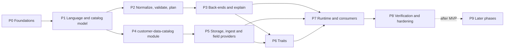

# Zeke AI — Rule Engine Implementation Plan

> Architecture and rationale: [rule-engine-architecture.md](rule-engine-architecture.md) (referenced below as **arch §n**).
> This plan lists **what to build, in which order, and which files are created or changed**.
> Scope: **MVP** = `account` and `contact` subjects, data from **connectors and the ingest API**, audiences evaluated **on a schedule and on demand**. CSV upload, customer-defined subject types and real-time audiences are **after the MVP** (Phase 9).

---

## MVP scope at a glance

| Item | MVP | After MVP |
|---|---|---|
| Rule language AST v2 (condition, group, not, relation, event, aggregate, ref, member_of) | Built | `sequence` node (funnels) |
| Data catalog module `customer-data-catalog` (datasets, fields, relationships, traits, versions, dependency index) | Built | Tenant-defined subject types |
| Subject types | `account`, `contact` (code-registered) | Customer-defined subjects |
| Data sources | Connectors (field mappings) + ingest API | CSV upload, warehouse sync, warehouse-native execution |
| Generic storage (`records`, `events`, rollups, `subject_traits`) | Built | Slot columns for hot fields (only if needed) |
| SQL back-end + in-memory back-end + conformance suite | Built | Warehouse dialect back-end |
| Traits | Scheduled + on-demand materialization, inline evaluation | Dirty-subject refresh within minutes |
| Audiences | Scheduled + on-demand materialization | Real-time incremental membership |
| Explain (trace, per-condition breakdown) | Built | — |
| `scope()` SQL fragment for RBAC data scopes | Built and tested in the engine | Enforced once identity ships data scopes (see "Cross-plan dependencies") |
| Null behaviour | Fixed: missing never matches (arch D7) | Optional tenant setting (Q-RE3) |

---

## How to read this plan

- **Interfaces come first.** Every phase follows the same order:
  1. types, contracts and ports
  2. pure logic (no Nest, no DB)
  3. application handlers
  4. adapters, persistence and wiring
- **Task IDs** look like `P3.2`: phase 3, task 2. Tasks within a phase can run in parallel unless the task says otherwise (**Depends on**).
- Each task has:
  - **Goal**: one line saying what the task achieves.
  - **Files**: each file with the action **New**, **Change** or **Delete**, and its purpose.
  - **Done when**: the acceptance check.
- **Path abbreviations:**
  - `E` = `libs/engines/rules/src` (pure engine, `@zeke/engine-rules`)
  - `ER` = `libs/engines/rules/src/runtime` (Nest runtime, `@zeke/engine-rules/runtime`)
  - `C` = `libs/modules/customer-data-catalog` (new module)
  - `D` = `libs/modules/customer-data`
  - `A` = `libs/modules/audiences`
  - `G` = `libs/modules/agents`
  - `P` = `libs/platform`
- Feature libraries follow the generator layout: `<module>/feature/src/{domain, application/{commands,queries,ports}, infrastructure/{persistence,adapters}, interface/{http,worker}, plugins}`.
- **Tests sit next to the code:** `*.spec.ts` = L0 unit tests, `*.int-spec.ts` = L1 tests with Testcontainers Postgres.

### Phase overview

| Phase | Outcome |
|---|---|
| P0 | The new module exists and is wired; the engine has its folder layout and runtime subpath; platform can run parameterized, time-limited raw SQL inside a tenant transaction; Testcontainers fixtures exist |
| P1 | AST v2, catalog model, ports and the operator registry exist as pure, unit-tested TypeScript. Other teams can code against them. |
| P2 | Any rule can be normalized, validated against a catalog snapshot (path-addressed issues) and turned into a logical plan |
| P3 | Plans compile to parameterized SQL and to in-memory closures; traces and breakdowns are produced; the legacy scaffold is removed |
| P4 | Tenants have a versioned catalog with admin API, snapshots, caching, events and a dependency index |
| P5 | Tenant data arrives from connectors and the ingest API, validated against the catalog and stored in the generic store; every MVP field is bound by a field provider |
| P6 | Traits are materialised on schedule and on demand, and system traits ship by default |
| P7 | The `RuleEngine` facade is live; audiences (build, preview, save, materialize), agent condition steps, policies and insights use it |
| P8 | Conformance, isolation, injection, privacy, performance and end-to-end suites are green; docs updated. **End of MVP.** |
| P9 | *After MVP:* CSV upload, customer-defined subject types, real-time audiences, funnels, warehouse back-end, decision tables |

### Cross-plan dependencies

| Needed from | What | Used by |
|---|---|---|
| Tenant & user plan | `TenantContext`, `TenantTransaction`, permission registry (`@RequirePermissions`), audit write path, API keys (ingest API auth) | P4.6, P5.3, P7.3 |
| Tenant & user plan | Tenant timezone in tenant settings (`TenantSettings<'general'>.timezone`) | P2.3 |
| Identity (after tenant/user v1) | RBAC data scopes are out of scope in the tenant/user v1. The engine's `scope()` is built and tested here (P7.1); wiring it into every account query happens when identity adds data scopes. | — |
| Integrations | Field mappings and `FieldMappingChanged` event; sync writing through `RecordIngestApi` | P4.6, P5.4 |
| Scoring | Projection of stage, segment, score, band, predictive risk into `account_profile`; `score_snapshots` for `changed_by` | P5.5, P5.7 |

---

## Phase 0 — Foundations

### P0.1 Generate the `customer-data-catalog` module

**Goal:** the new module exists with contracts and feature libs, its own Postgres schema, and is loaded by the apps that need it.

| File | Action | Purpose |
|---|---|---|
| `C/contracts/**`, `C/feature/**` | New | Run `nx g @zeke/tools:module customer-data-catalog` (no workflows lib). Produces `@zeke/customer-data-catalog-contracts` and `@zeke/customer-data-catalog` with tags `type:contracts` / `type:feature`. |
| `C/feature/src/infrastructure/persistence/schema.ts` | New (generated) | `DB_SCHEMA = 'customer_data_catalog'` |
| `C/README.md` | New | Responsibility, owned tables, events, ports (no task IDs) |
| `apps/migrator/src/main.ts` | Change | Add `'customer_data_catalog'` to `MODULE_SCHEMAS` |
| `apps/api/src/app.module.ts` | Change | Import `CustomerDataCatalogHttpModule` |
| `apps/worker/src/roles.ts` | Change | Add `CustomerDataCatalogWorkerModule` to the `sync` and `audiences` roles |
| `tsconfig.base.json` | Change (generated) | Path aliases for the two libs |

**Done when:** `nx run-many -t lint typecheck build` is green, `nx graph` shows no cycle, and the `api` app boots with `INFRA_PROFILE=local`.

### P0.2 Engine library layout and runtime subpath

**Goal:** the engine is split into a pure core (browser-safe) and a Nest runtime subpath, with lint rules that keep the core pure.

| File | Action | Purpose |
|---|---|---|
| `E/language/`, `E/catalog/`, `E/operators/`, `E/normalize/`, `E/validate/`, `E/plan/`, `E/backends/sql/`, `E/backends/memory/`, `E/explain/` | New (folders) | Target layout used by Phases 1–3 |
| `ER/index.ts` | New | Runtime barrel (filled in P7) |
| `tsconfig.base.json` | Change | Add `"@zeke/engine-rules/runtime": ["libs/engines/rules/src/runtime/index.ts"]` |
| `tools/eslint-presets/index.mjs` | Change | New `engineCoreRules` preset: in `src/**` except `src/runtime/**`, ban `@nestjs/*`, `@mikro-orm/*`, `@temporalio/*`, `node:*` and `@zeke/platform-persistence` |
| `libs/engines/rules/eslint.config.mjs` | Change | Spread `engineCoreRules` |
| `libs/engines/rules/project.json` | Change | Add explicit `test` and `test-int` targets (Jest, `*.spec.ts` / `*.int-spec.ts`) |

**Done when:** importing `@nestjs/common` from `E/language/*.ts` fails lint, and from `ER/*.ts` passes.

### P0.3 Raw SQL runner in platform-persistence

**Goal:** run engine-generated parameterized SQL inside the tenant transaction with a statement timeout, cost guard and streaming.

| File | Action | Purpose |
|---|---|---|
| `P/persistence/src/sql-runner.ts` | New | `SqlRunner` (Injectable): `query<T>(frag: { sql; params }, opts: { timeoutMs; maxCost? })` runs `set_config('statement_timeout', …, true)` inside `TenantTransaction`; if `maxCost` is set, runs `EXPLAIN (FORMAT JSON)` first and returns `DomainError('rules.too_expensive', 'rate_limited')` above the ceiling; `stream<T>(frag, { pageSize, keyColumn })` keyset-paginates (no server cursors, PgBouncer-safe) |
| `P/persistence/src/sql-runner.spec.ts` | New | Timeout and cost-guard behaviour with a fake `EntityManager` |
| `P/persistence/src/sql-runner.int-spec.ts` | New | Real Postgres: timeout cancels, RLS applies, cost guard rejects a cross join |
| `P/persistence/src/index.ts` | Change | Export `SqlRunner` |
| `P/persistence/src/persistence.module.ts` | Change | Provide `SqlRunner` |

**Done when:** int-spec proves a query cannot see another tenant's row even without a `tenant_id` predicate (RLS), and a 6 s `pg_sleep` with a 5 s timeout fails with `rules.timeout`.

### P0.4 Test infrastructure

**Goal:** shared fixtures for L1 tests and property-based tests. Reuse the tenant & user plan fixtures if they already exist.

| File | Action | Purpose |
|---|---|---|
| `package.json` | Change | Dev deps: `@testcontainers/postgresql`, `fast-check`; deps: `date-fns`, `@date-fns/tz` (tenant-timezone windows), `lru-cache` (plan/snapshot caches) |
| `P/testing/src/postgres.ts` | New | `startPostgres()` (PG 14 image), creates app role without `BYPASSRLS`, runs module migrations, returns a MikroORM instance; `withTenant(tenantId, fn)` helper |
| `P/testing/src/clock.ts` | New | `FixedClock` for deterministic `asOf` |
| `P/testing/src/index.ts` | Change | Export the fixtures; remove the matching `TODO(v1)` line |
| `jest.preset.js` | Change | `testMatch` for `*.int-spec.ts` only under the `test-int` target; longer timeout |

**Done when:** a sample int-spec in `P/persistence` starts Postgres, writes as tenant A and reads nothing as tenant B.

### P0.5 Rule engine configuration

**Goal:** limits and timeouts are configuration, validated at boot (arch §9.5).

| File | Action | Purpose |
|---|---|---|
| `ER/rules.config.ts` | New | zod `RulesConfigSchema` + `registerAs('rules', …)`: `maxNodes` 200, `maxDepth` 8, `maxNesting` 3, `maxRefDepth` 5, `maxInlineList` 1000, `maxValueSet` 100000, `maxAggregates` 10, `previewTimeoutMs` 5000, `materializeTimeoutMs` 120000, `previewMaxCost`, `planCacheSize`, `snapshotCacheSize` |
| `E/validate/limits.ts` | New | `RuleLimits` type + `DEFAULT_RULE_LIMITS` (pure; the runtime passes the configured values) |

**Done when:** invalid config (e.g. `maxDepth: 0`) stops the app at boot with a zod error.

---

## Phase 1 — Language and catalog model (pure)

### P1.1 Keys and identifiers

**Goal:** stable, branded keys for every catalog entry (arch D11).

| File | Action | Purpose |
|---|---|---|
| `E/catalog/keys.ts` | New | Branded `SubjectType`, `DatasetKey`, `FieldKey`, `RelationshipKey`, `TraitKey` (alias of `FieldKey`), `SavedRuleKey`, `AudienceKey`, `OperatorKey`, `ValueSetKey`; `KEY_PATTERN` (`^[a-z][a-z0-9_]{0,62}$` per segment, dot-separated); `parseFieldKey()` → `{ dataset, path[] }` |
| `E/catalog/keys.spec.ts` | New | Valid/invalid keys, reserved prefixes (`account.custom.*`, `*.trait.*`) |

**Done when:** keys reject uppercase, spaces, SQL metacharacters and > 63 chars per segment.

### P1.2 Catalog model and snapshot

**Goal:** the in-memory catalog model the engine validates and plans against (arch §7).

| File | Action | Purpose |
|---|---|---|
| `E/catalog/types.ts` | New | `SubjectTypeDef`, `DatasetDef` (`kind`, `origin`, `storage`, `status`), `FieldType`, `FieldDef` (type, semantic, options, `caseSensitive`, `filterable`, `privacy`, `suggest`, `binding`, `origin`, `status`), `RelationshipDef` (cardinality, join keys, through), `TraitDef` (method, source, window, materialization, `templateKey`), `OptionSource`, `FieldBindingRef` |
| `E/catalog/snapshot.ts` | New | Immutable `CatalogSnapshot` class: `version`, `tenantId`, maps by key, `field(key)`, `dataset(key)`, `relationship(key)`, `trait(key)`, `subject(type)`, `fieldsOf(dataset)`, `resolvePath(scope, fieldKey)` (follows `n:1`/`1:1` relationships, rejects `1:n`), `relationshipsFrom(dataset)` |
| `E/catalog/merge.ts` | New | `mergeCatalog(system, tenant)` → snapshot; tenant entries may not override system keys; deleted entries are kept for validation messages |
| `E/catalog/builders.ts` | New | Test/data builders (`dataset()`, `field()`, `rel()`, `trait()`) used by all engine specs |
| `E/catalog/*.spec.ts` | New | Path resolution, merge conflicts, `1:n` path rejection |

**Done when:** `resolvePath('account', 'account.plan.tier')` resolves through an `n:1` relationship and `account.tickets.priority` is rejected with "use a relation condition".

### P1.3 AST v2 and zod schemas

**Goal:** the rule language as types and runtime schemas (arch §9.1–§9.2).

| File | Action | Purpose |
|---|---|---|
| `E/language/ast.ts` | New | `Rule` (`schemaVersion: 2`, `subject`, `root`), `RuleNode` union (`group`, `not`, `condition`, `relation`, `event`, `aggregate`, `ref`, `member_of`), `Quantifier`, `TimeWindow`, `RelativeOffset`, `RuleValue` (`literal`, `relative_date`, `field` incl. `$outer.` prefix, `param`, `value_set`), `TraitMethod` |
| `E/language/schema.ts` | New | zod schemas mirroring `ast.ts` (discriminated unions), `parseRule(json)` → `Result<Rule, RuleIssue[]>` with JSON-pointer paths |
| `E/language/builders.ts` | New | `and`, `or`, `not`, `cond`, `has` (relation), `did` (event), `agg`, `ref`, `memberOf`, `lit`, `param`, `ago`, `fromNow`, `rolling`, `calendar` |
| `E/language/ast.spec.ts` | New | Round-trip: builder → JSON → `parseRule` → equal |
| `E/index.ts` | Change | Export the new language API |

**Done when:** every example in arch §9.6 parses; malformed JSON returns issues with correct paths (e.g. `/root/children/1/quantifier/count`).

### P1.4 Upgrader, canonical form and rule hash

**Goal:** v1 rules keep working; equivalent rules get the same hash (arch §10.2, §13.1).

| File | Action | Purpose |
|---|---|---|
| `E/language/upgrade.ts` | New | `upgradeRule(json)`: v1 → v2 (`entity` → `subject`, `event` entity rejected, field keys through `V1_FIELD_ALIASES`, operators renamed if needed); pure and idempotent |
| `E/language/canonical.ts` | New | `canonicalize(rule)` (sorted keys, normalised numbers, sorted commutative children) and `ruleHash(rule)` (SHA-256 of canonical JSON via a pure-JS hash so the core stays browser-safe) |
| `E/language/*.spec.ts` | New | Upgrade fixtures from the current `rules.spec.ts`; `and(a,b)` and `and(b,a)` hash equal |

**Done when:** the existing scaffold spec rules upgrade and validate unchanged in meaning.

### P1.5 Engine ports

**Goal:** the engine depends only on ports for catalog, bindings, references and value sets (arch §6.2).

| File | Action | Purpose |
|---|---|---|
| `E/catalog/ports.ts` | New | `CatalogProvider.snapshot(tenantId, version?)`; `RuleRefResolver.resolve(tenantId, key, version?)` → `Rule`; `ValueSetResolver.size(...)`/`exists(...)` |
| `E/catalog/field-provider.ts` | New | `FieldProvider` contract: `key`, `systemCatalog()` (datasets/fields/relationships/traits it owns), `bind(field, scope)` → `FieldBinding` |
| `E/catalog/binding.ts` | New | `FieldBinding` = `{ sql?: SqlBinding; memory?: MemoryBinding; history?: HistoryBinding }`. `SqlBinding` kinds: `column` (alias + allow-listed column), `jsonb` (container column + key bound as a parameter + cast), `trait` (trait key), `fragment` (provider-built `SqlFragment` with its own correlated subquery). `MemoryBinding` = path into `SubjectFacts` / payload |
| `E/catalog/ports.spec.ts` | New | Type-level tests with fakes |

**Done when:** an in-memory `FakeCatalogProvider` and `FakeFieldProvider` exist in `E/catalog/testing.ts` and are used by P2/P3 specs.

### P1.6 Operator registry v2

**Goal:** typed operators with paired SQL and in-memory implementations (arch §9.3).

| File | Action | Purpose |
|---|---|---|
| `E/operators/types.ts` | New | `OperatorDefinition { key, appliesTo: FieldType[], arity` (`none`, `one`, `list`, `range`, `duration`), ` valueType(fieldType), evaluate(l, r, ctx), sql(col, bind, r, ctx), backends, requiresHistory? }`; `ctx` carries `caseSensitive`, tenant timezone, `asOf` bounds |
| `E/operators/escape.ts` | New | `escapeLike(value)` for `%`, `_`, `\` |
| `E/operators/comparison.ts` | New | `is`, `is_not`, `in`, `not_in`, `lt`, `lte`, `gt`, `gte`, `between` (D7: every SQL form wrapped by codegen in `coalesce(…, false)`; `is_not` no longer uses `is distinct from`) |
| `E/operators/text.ts` | New | `contains`, `not_contains`, `starts_with`, `ends_with` (case-insensitive via `lower()` unless `caseSensitive`) |
| `E/operators/list.ts` | New | `contains_any`, `contains_all`, `contains_none`, `length_lt`, `length_gt` (jsonb any-key / all-keys existence operators, `jsonb_array_length`) |
| `E/operators/date.ts` | New | `within_last`, `not_within_last`, `within_next`, `before_last`, `after_next`, `in_calendar`, `anniversary_within_next` (bounds computed by the planner, P2.3) |
| `E/operators/presence.ts` | New | `is_empty`, `is_not_empty` (the only operators that match missing values) |
| `E/operators/history.ts` | New | `changed_by`, `changed_to` (only on fields whose binding has `history`) |
| `E/operators/registry.ts` | New | `OperatorRegistry` built on `@zeke/platform/plugin` `Registry`-like semantics but pure (no platform import): duplicate keys fail; `BUILTIN_OPERATORS` |
| `E/operators/*.spec.ts` | New | Truth tables per operator × type × null |

**Done when:** every operator has an in-memory spec including `null`/`undefined` inputs returning `false` (except presence operators).

---

## Phase 2 — Normalize, validate, plan (pure)

### P2.1 Normalizer

**Depends on:** P1.3, P1.4, P1.5.

**Goal:** canonical, reference-free rules (arch §10.2).

| File | Action | Purpose |
|---|---|---|
| `E/normalize/normalize.ts` | New | `normalize(rule, { refs, limits })`: upgrade → expand `ref` (depth limit, cycle detection with the resolution stack in the issue) → flatten same-op groups → remove `not(not(x))` → fold empty groups (`and[]`=true, `or[]`=false) → dedupe identical siblings → canonicalize |
| `E/normalize/normalize.spec.ts` | New | Cycle `A→B→A` reported with path and stack; depth 6 refs rejected with default limits |

**Done when:** normalisation is idempotent (`normalize(normalize(r)) == normalize(r)`) — asserted with fast-check.

### P2.2 Validator

**Depends on:** P1.2, P1.6, P2.1.

**Goal:** path-addressed issues for UI and NL (arch §10.3). Never throws for user errors.

| File | Action | Purpose |
|---|---|---|
| `E/validate/issues.ts` | New | `RuleIssue { path, code, message, severity }` (`error` or `warning`) and the issue code catalogue (see "Reference: validator issue codes") |
| `E/validate/validate.ts` | New | `validateRule(rule, snapshot, opts)` with `opts = { mode, params: ParamDecl[], lenient, limits, readableDatasets? }` where `mode` is `set`, `subject`, `payload` or `scope`. Walks scopes: root = subject dataset; `relation`/`event`/`aggregate` open the target dataset scope; `$outer.` field values resolve one scope up |
| `E/validate/coerce.ts` | New | Literal coercion to the field type (strict: error; lenient: coerce + warning — used by Ask Zeke) |
| `E/validate/capabilities.ts` | New | Back-end capability rules: `payload` → only event-dataset fields, no relation/aggregate/member_of/ref; `scope` → only subject fields and materialised traits |
| `E/validate/validate.spec.ts` | New | One spec per issue code |

**Done when:** each issue code has a failing and passing case, and validation of a 200-node rule takes < 5 ms.

### P2.3 Time windows and relative dates

**Depends on:** P1.3.

**Goal:** deterministic time bounds from `asOf` and tenant timezone (arch §9.4).

| File | Action | Purpose |
|---|---|---|
| `E/plan/time.ts` | New | `resolveWindow(window, { asOf, timezone })` → `{ from?: epochMs; to?: epochMs }`; `resolveRelativeDate(value, ctx)`; calendar units (week starts Monday, ISO), month arithmetic with clamping, DST-safe via `@date-fns/tz`; `date` fields → epoch days in tenant timezone |
| `E/plan/time.spec.ts` | New | DST transitions (Europe/Berlin, America/New_York), month ends, leap years, `rolling_between`, `ever` |

**Done when:** the same window at the same `asOf` gives identical bounds on machines in different OS time zones.

### P2.4 Planner

**Depends on:** P1.5, P2.2, P2.3.

**Goal:** a logical plan with resolved bindings and strategies (arch §10.4).

| File | Action | Purpose |
|---|---|---|
| `E/plan/plan.ts` | New | Plan node types: `Predicate`, `Quantified` (`exists`/`not_exists`/`count_cmp`/`all`), `WindowCount`, `TraitValue`, `InlineAggregate`, `Membership`, `Bool`; each node keeps its AST `path` (for trace/breakdown) |
| `E/plan/planner.ts` | New | `plan(rule, snapshot, providers, { mode, asOf, timezone, traitPolicy, traitFreshness })`: resolves `FieldBinding` per condition via providers, picks `event_rollup_daily` when the window is whole days and there is no property filter, chooses materialised vs inline trait, orders `AND` children by estimated cost, marks back-end per node |
| `E/plan/fact-requirements.ts` | New | `factRequirements(plan)` → the exact fields/traits/aggregates a subject evaluation needs (used by P3.4) |
| `E/plan/planner.spec.ts` | New | Strategy selection cases; plan snapshot tests |

**Done when:** for every arch §9.6 example the plan is stable (snapshot) and records the expected strategy per node.

---

## Phase 3 — Back-ends and explain (pure)

### P3.1 Safe SQL builder

**Goal:** impossible-by-construction SQL injection (arch §14).

| File | Action | Purpose |
|---|---|---|
| `E/backends/sql/fragment.ts` | New | `SqlFragment { text: string; params: unknown[] }`, `sql` tagged template that only accepts `Fragment`, `Ident` and bound values; `Ident` can only be created from an allow-list registered by providers (`ident.column(alias, name)`); `join()`, `paramOffset` handling |
| `E/backends/sql/fragment.spec.ts` | New | A user string passed anywhere ends up only in `params`; property test with fast-check asserts no generated text contains arbitrary user strings |

**Done when:** creating an `Ident` from a non-registered name throws at build time of the provider, not at query time.

### P3.2 SQL code generation

**Depends on:** P2.4, P3.1.

**Goal:** compile plans to parameterized Postgres SQL for `set`, `count`, `breakdown`, `subject`, `scope` modes (arch §10.5).

| File | Action | Purpose |
|---|---|---|
| `E/backends/sql/compile.ts` | New | `compileSql(plan, mode, opts)` → `SqlFragment`. Base: `select s.<pk> from <subject base> s where s.tenant_id = $1 and (<root>)`; keyset pagination (`and s.<pk> > $n order by s.<pk> limit $m`) for `set` |
| `E/backends/sql/predicate.ts` | New | Leaf codegen: `coalesce(<expr> <op> $n, false)`; jsonb casts per type (`(r.attrs->>$k)::numeric`, epoch numbers for date/timestamp); `lower()` for case-insensitive text; field-to-field incl. `$outer.` |
| `E/backends/sql/quantified.ts` | New | `exists` / `not exists`; `at_least n` → capped count; `at_most`/`exactly` → full count; `all` → `exists(...) and not exists(... and not where)`; generic store correlation on `tenant_id`, `dataset_key`, `account_id`/`contact_id` |
| `E/backends/sql/window.ts` | New | Event windows with bound `from`/`to` (partition pruning); rollup path over `event_rollup_daily` |
| `E/backends/sql/aggregate.ts` | New | Inline aggregates and trait-as-subquery (`count`, `count_distinct`, `sum`, `avg`, `min`, `max`, `first`, `last`, `most_frequent`, `exists`, `days_since_last`) |
| `E/backends/sql/breakdown.ts` | New | `count(*)` plus `count(*) filter (where <child_i>)` per top-level child (and per child of the first nested group) in one scan |
| `E/backends/sql/scope.ts` | New | `compileScope(plan, alias)` → fragment usable inside another module's account query |
| `E/backends/sql/*.spec.ts` | New | Golden SQL snapshots per node type and mode |

**Done when:** golden snapshots for all arch §9.6 examples are reviewed, and every literal appears only in `params`.

### P3.3 In-memory back-end

**Depends on:** P2.4.

**Goal:** closures over facts or payloads with identical semantics (arch §10.6).

| File | Action | Purpose |
|---|---|---|
| `E/backends/memory/compile.ts` | New | `compileMemory(plan)` → `(facts) => NodeResult` tree; short-circuit `and`/`or` but still record visited nodes for traces |
| `E/backends/memory/facts.ts` | New | `SubjectFacts` (field values, trait values, precomputed quantified/aggregate results keyed by plan node path) and `PayloadFacts` (event payload by field path) |
| `E/backends/memory/compile.spec.ts` | New | Same truth tables as the operator specs, through full rules |

**Done when:** payload rules with only event-dataset fields evaluate without any I/O.

### P3.4 Subject fact loading

**Depends on:** P3.2, P3.3.

**Goal:** single-subject evaluation loads exactly the needed facts in one query, reusing SQL semantics.

| File | Action | Purpose |
|---|---|---|
| `E/backends/sql/facts-query.ts` | New | `compileFactsQuery(factRequirements, subjectId)` → one `select` returning a column per field/trait and a boolean/number per quantified or aggregate node (`exists(...) as n_3`) |
| `E/backends/sql/facts-query.spec.ts` | New | Golden SQL |

**Done when:** a subject trace for the arch §9.6 "tenant custom data" example needs exactly one round trip.

### P3.5 Trace and breakdown

**Depends on:** P3.2, P3.3.

**Goal:** explainable results with privacy masking (arch §10.7, D12).

| File | Action | Purpose |
|---|---|---|
| `E/explain/trace.ts` | New | Build `RuleTrace` (`matched`, `catalogVersion`, `asOf`, per-node `result`/`observed`/`expected`/`missing`, `missingFields` on the decisive path) from in-memory results |
| `E/explain/breakdown.ts` | New | Map breakdown columns back to AST paths → `RuleBreakdown` |
| `E/explain/redact.ts` | New | Mask `observed`/`expected` for `redacted` fields; drop `hidden` |
| `E/explain/*.spec.ts` | New | Decisive-path logic (e.g. `or(true, missing)` → no missing fields reported) |

**Done when:** `auto_with_manual_fallback` can distinguish "No" from "No because data is missing" using `missingFields`.

### P3.6 Remove the legacy scaffold

**Depends on:** P3.2–P3.5.

**Goal:** a single public API.

| File | Action | Purpose |
|---|---|---|
| `E/ast.ts`, `E/registry.ts`, `E/evaluator.ts`, `E/sql-compiler.ts`, `E/validator.ts`, `E/operators.ts` | Delete | Replaced by the new folders |
| `E/rules.spec.ts` | Change | Rewritten against the new API (kept as a smoke test) |
| `E/index.ts` | Change | Export `language`, `catalog`, `operators`, `normalize`, `validate`, `plan`, `backends`, `explain` |
| `libs/engines/rules/README.md` | Change | Describe the new architecture and public API |

**Done when:** `grep` finds no imports of the deleted files and the workspace typechecks.

---

## Phase 4 — `customer-data-catalog` module

### P4.1 Contracts

**Goal:** other modules code against the catalog without depending on its feature lib.

| File | Action | Purpose |
|---|---|---|
| `C/contracts/src/dto.ts` | New | zod DTOs: `DatasetDto`, `FieldDto`, `RelationshipDto`, `TraitDto`, `CatalogViewDto` (builder metadata: groups, operators per type, suggestions), `UsageDto`; request DTOs for every admin command |
| `C/contracts/src/events.ts` | New | `CatalogChanged { tenantId, version, changes[] }`, `FieldDeprecated`, `FieldDeleted` (with dependants) |
| `C/contracts/src/ports.ts` | New | `CatalogAdminApi` (`registerMappedField`, `proposeFields`, `ensureDataset`), `RuleDependencyRegistry` (`record(owner, rule)`, `usages(entryKey)`, `clear(owner)`), re-export engine `CatalogProvider` token |
| `C/contracts/src/permissions.ts` | New | `datamodel:read`, `datamodel:manage`, `data:ingest` with default grants (owner/admin manage; member read) |
| `C/contracts/src/tokens.ts` | New | DI tokens `CATALOG_PROVIDER`, `CATALOG_ADMIN_API`, `RULE_DEPENDENCY_REGISTRY` |
| `C/contracts/src/index.ts` | Change | Barrel |

**Done when:** `@zeke/customer-data-contracts`, `@zeke/integrations-contracts` and `@zeke/audiences-contracts` can import these types without lint errors.

### P4.2 Domain

**Goal:** catalog invariants as pure code.

| File | Action | Purpose |
|---|---|---|
| `C/feature/src/domain/dataset.ts` | New | `Dataset` aggregate: key immutability, kind rules (`event` needs timestamp; `related`/`event` need a relationship to a subject), status transitions |
| `C/feature/src/domain/field.ts` | New | `Field` aggregate: allowed changes per arch §13.2 (label/description/group/privacy free; type change only via migration), enum option management, `suggest` only for low-cardinality types |
| `C/feature/src/domain/relationship.ts` | New | Cardinality and join-key type compatibility; `through` chains; no cycles in `n:1` path graph |
| `C/feature/src/domain/trait.ts` | New | Method/field/result-type compatibility; window required for event sources unless `ever`; template instantiation |
| `C/feature/src/domain/subject-policy.ts` | New | MVP rule: only system subject types (`account`, `contact`) — tenant-defined subjects rejected with `catalog.subject_types_not_enabled` (switched on in P9.2) |
| `C/feature/src/domain/*.spec.ts` | New | One spec per invariant |

**Done when:** domain specs cover every row of arch §13.2.

### P4.3 Application

**Depends on:** P4.1, P4.2.

**Goal:** commands and queries over ports.

| File | Action | Purpose |
|---|---|---|
| `C/feature/src/application/ports/catalog.repository.ts` | New | `CatalogRepository` (load tenant entries, save with optimistic `catalog_version`), `DependencyRepository` |
| `C/feature/src/application/ports/system-catalog.ts` | New | `SystemCatalogSource` (all provider-declared system entries) |
| `C/feature/src/application/commands/*.ts` | New | `CreateDataset`, `UpdateDatasetPresentation`, `DeprecateDataset`, `DeleteDataset`, `AddField`, `UpdateFieldPresentation`, `ChangeFieldPrivacy`, `DeprecateField`, `DeleteField` (blocked if used unless `force`; forced → `FieldDeleted` with dependants), `MigrateFieldType` (new key + backfill request), `CreateRelationship`, `CreateTrait`, `UpdateTrait`, `RegisterMappedField` (from integrations), `ProposeFields` (additive ingest → `pending_confirmation`), `ConfirmProposedField` |
| `C/feature/src/application/queries/*.ts` | New | `GetCatalogSnapshot`, `GetCatalogView` (builder metadata), `ListDatasets`, `GetFieldUsage` |
| `C/feature/src/application/**/*.spec.ts` | New | Handlers against in-memory repositories |

Every command increments `catalog_version`, writes the outbox event and audits (`datamodel.*`) in one transaction.

**Done when:** deleting a field used by a saved audience returns `conflict` with the list of dependants; `force` marks them broken.

### P4.4 System catalog and snapshot provider

**Depends on:** P1.5, P4.3.

**Goal:** merged system + tenant snapshots, cached and invalidated by version.

| File | Action | Purpose |
|---|---|---|
| `ER/field-provider.decorator.ts` | New | `@RuleFieldProvider()` class decorator (metadata key) |
| `C/feature/src/infrastructure/adapters/system-catalog.discovery.ts` | New | Uses Nest `DiscoveryService` to collect every `@RuleFieldProvider()`; builds the system catalog once at boot; duplicate keys fail boot |
| `C/feature/src/infrastructure/adapters/catalog-provider.ts` | New | `CatalogProvider` implementation: in-process LRU by `(tenantId, version)` + `Cache` port (Redis) for the current version number; `mergeCatalog(system, tenant)` |
| `C/feature/src/interface/worker/catalog-changed.consumer.ts` | New | Invalidates local caches on `CatalogChanged` (bus) |
| `C/feature/src/infrastructure/adapters/catalog-provider.spec.ts` | New | Cache hit/miss, version bump |

**Done when:** after `AddField`, the next `snapshot()` in another process returns the new version within one cache round trip.

### P4.5 Persistence

**Depends on:** P4.3.

**Goal:** catalog tables with RLS in schema `customer_data_catalog` (arch §8.3).

| File | Action | Purpose |
|---|---|---|
| `C/feature/src/infrastructure/persistence/entities/*.ts` | New | MikroORM `EntitySchema`s: `catalog_datasets`, `catalog_fields`, `catalog_relationships`, `catalog_traits`, `catalog_versions` (one row per tenant), `rule_dependencies` |
| `C/feature/src/infrastructure/persistence/migrations/Migration0001_catalog.ts` | New | Tables, PK `(tenant_id, key)`, `rule_dependencies` index `(tenant_id, entry_key)`, `tenantRlsPolicySql` for each table |
| `C/feature/src/infrastructure/persistence/catalog.repository.ts` | New | Optimistic versioning: `update catalog_versions set version = version + 1 where tenant_id = $1 and version = $2` |
| `C/feature/src/infrastructure/persistence/*.int-spec.ts` | New | Cross-tenant isolation (mandatory per new table), concurrent version bumps |

**Done when:** two concurrent `AddField` commands both succeed with consecutive versions or one retries; tenant B never sees tenant A's fields.

### P4.6 Interface

**Depends on:** P4.3–P4.5.

**Goal:** admin HTTP API and event consumers.

| File | Action | Purpose |
|---|---|---|
| `C/feature/src/interface/http/data-model.controller.ts` | New | `/data-model/datasets`, `/fields`, `/relationships`, `/traits`, `/usage/{key}`, `/proposed-fields`; `@RequirePermissions('datamodel:manage')` for writes, `datamodel:read` for reads; ProblemDetails for `Result` errors |
| `C/feature/src/interface/http/customer-data-catalog-http.module.ts` | Change | Register controllers |
| `C/feature/src/interface/worker/field-mapping-changed.consumer.ts` | New | Consumes integrations' `FieldMappingChanged` → `RegisterMappedField` (type from connector describe metadata) |
| `C/feature/src/interface/worker/customer-data-catalog-worker.module.ts` | Change | Register consumers |
| `C/feature/src/customer-data-catalog.module.ts` | Change | Core providers: `CATALOG_PROVIDER`, `CATALOG_ADMIN_API`, `RULE_DEPENDENCY_REGISTRY` |
| `C/feature/src/index.ts` | Change | Export only the three Nest modules |
| `apps/api/openapi/*` | Change (generated) | New endpoints in the OpenAPI spec |

**Done when:** an L1 HTTP test creates a dataset, a field and a relationship, and `GET /rules/catalog` (P7.3) shows them.

### P4.7 Dependency index

**Depends on:** P4.5, P2.1.

**Goal:** "what uses this field?" and safe deletes (arch §7.7).

| File | Action | Purpose |
|---|---|---|
| `C/feature/src/infrastructure/adapters/rule-dependency.registry.ts` | New | `record(owner, rule)` extracts dependencies via the engine (`dependencies(rule)` over the normalized rule: fields, datasets, relationships, traits, refs, audiences) and replaces the owner's rows in one statement |
| `C/feature/src/application/queries/get-field-usage.ts` | Change | Join usages with owner display names via owner ports (audiences, agents) |
| `C/feature/src/infrastructure/adapters/rule-dependency.registry.int-spec.ts` | New | Replace semantics, cross-tenant isolation |

**Done when:** saving an audience twice with different rules leaves only the second rule's dependencies.

---

## Phase 5 — Storage, ingest and field providers (`customer-data`)

### P5.1 Generic storage migrations

**Goal:** tables for any dataset (arch §8.3).

| File | Action | Purpose |
|---|---|---|
| `D/feature/src/infrastructure/persistence/migrations/Migration0002_generic_store.ts` | New | `records` (PK `(tenant_id, dataset_key, record_key)`, `account_id`, `contact_id`, `attrs jsonb`, `updated_at`); `events` partitioned by range on `occurred_at` (monthly), `event_id` unique per dataset where present; `event_rollup_daily`; `subject_traits` (typed value columns `v_num`, `v_text`, `v_bool`, `v_ts`, `v_list jsonb`, `computed_at`); `account_profile.custom jsonb` (and `contact_profile` if not present); indexes per arch §8.3 and §15; RLS on every table |
| `D/feature/src/infrastructure/persistence/partitions.ts` | New | `ensureEventPartitions(monthsAhead = 3)` and retention drop (default 13 months raw, Q-RE9) |
| `D/feature/src/interface/worker/partition-maintenance.ts` | New | Daily job (Temporal schedule in `sync` role) calling `ensureEventPartitions` |
| `D/feature/src/infrastructure/persistence/*.int-spec.ts` | New | Isolation per table; partition pruning visible in `EXPLAIN` |

**Done when:** inserting events for next month succeeds after the job runs, and `EXPLAIN` for a 30-day window scans at most two partitions.

### P5.2 Ingest validation and normalisation

**Depends on:** P4.1, P1.2.

**Goal:** schema-on-write (arch §8.4, D5).

| File | Action | Purpose |
|---|---|---|
| `D/feature/src/domain/ingest/schema-from-catalog.ts` | New | Builds a zod schema per dataset from the snapshot (types, required, enum options, max lengths, list sizes); cached by `(tenant, dataset, catalogVersion)` |
| `D/feature/src/domain/ingest/normalize-value.ts` | New | Strings trimmed + NFC; numbers within safe range; `date` → epoch days (tenant timezone); `timestamp` → epoch ms UTC; `money` → minor units + currency; lists de-duplicated where the field says so |
| `D/feature/src/application/ports/subject-reference.resolver.ts` | New | Resolve `account_id`/`contact_id` from external IDs (connector IDs, domains, emails) |
| `D/feature/src/domain/ingest/*.spec.ts` | New | Valid/invalid per type, error paths (`/records/3/attrs/arr`) |

**Done when:** a batch with one bad record returns per-record errors and stores the valid ones.

### P5.3 Ingest API

**Depends on:** P5.1, P5.2.

**Goal:** tenants push records and events (arch §7.6).

| File | Action | Purpose |
|---|---|---|
| `D/contracts/src/ingest.ts` | New | `RecordIngestApi` port + DTOs: `IngestRecordsRequest { mode, records[] }` (`mode` = `strict` or `additive`), `IngestEventsRequest`, `IngestResult { accepted, rejected[{ index, issues[] }] }`; `RecordsChanged` event |
| `D/feature/src/application/commands/ingest-records.ts` | New | Validate → normalise → resolve subjects → upsert (`on conflict (tenant_id, dataset_key, record_key) do update`) → outbox `RecordsChanged`; additive mode calls `CatalogAdminApi.proposeFields` for unknown keys (values stored but field not filterable until confirmed) |
| `D/feature/src/application/commands/ingest-events.ts` | New | Same for events; dedupe by `event_id`; rollup upsert (P5.6) in the same transaction |
| `D/feature/src/interface/http/ingest.controller.ts` | New | `POST /datasets/{key}/records`, `POST /datasets/{key}/events`; `@RequirePermissions('data:ingest')` (API keys / service accounts); max batch 1000 records / 5 MB; `RateLimiter` per tenant; `Idempotency-Key` header |
| `D/feature/src/**/*.spec.ts`, `*.int-spec.ts` | New | Idempotent re-send, partial failure, rate limit |

**Done when:** sending the same batch twice yields identical rows and a single `RecordsChanged` per distinct change.

### P5.4 Connector sync path

**Depends on:** P5.3, P4.6.

**Goal:** connector data and custom fields flow into the catalog and generic store.

| File | Action | Purpose |
|---|---|---|
| `libs/modules/integrations/contracts/src/events.ts` | New/Change | `FieldMappingChanged { tenantId, connectionId, mappings[{ source, targetFieldKey, type, label }] }` |
| `libs/modules/integrations/feature/src/application/commands/save-field-mapping.ts` | New | Persist mapping + publish `FieldMappingChanged` |
| `libs/modules/integrations/feature/src/infrastructure/adapters/sync-writer.ts` | New | Sync batches write canonical entities and custom attributes through `RecordIngestApi` (no direct table access) |
| `libs/modules/integrations/contracts/src/connector.ts` | Change | Optional `describeFields()` in the manifest/capability so mapped fields get a type |

**Done when:** mapping `Tier__c → account.custom.tier` makes the field appear in the catalog and a subsequent sync fills `account_profile.custom.tier`.

### P5.5 `customer-data` field provider

**Depends on:** P1.5, P5.1.

**Goal:** bindings for every MVP account/contact field, custom field and generic dataset (arch D6).

| File | Action | Purpose |
|---|---|---|
| `D/feature/src/plugins/customer-data.field-provider.ts` | New | `@RuleFieldProvider()`: system subject types `account` (base `customer_data.account_profile`) and `contact`; system datasets (`tickets`, `opportunities`, `subscriptions`, `meetings`, `survey_responses`, `product_events`) and their relationships; system fields for the wireframe (segment, lifecycle stage, health score, band, predictive risk, owner, ARR, renewal date, last login/meeting timestamps, NPS); `bind()` for: typed columns, `custom` jsonb keys, generic `records`/`events` attrs, subject reference joins |
| `D/feature/src/plugins/idents.ts` | New | Allow-listed identifiers (`Ident`) for the tables and columns above |
| `D/feature/src/plugins/customer-data.field-provider.spec.ts` | New | Every system field binds for `sql` and `memory` |

**Done when:** the catalog view for a fresh tenant lists all wireframe Audience Creator fields (arch §9.6).

### P5.6 Event rollups

**Depends on:** P5.1.

**Goal:** fast count-in-window without scanning raw events (arch §15).

| File | Action | Purpose |
|---|---|---|
| `D/feature/src/infrastructure/persistence/rollup.ts` | New | `upsertRollup(events)` (`insert … on conflict do update set cnt = cnt + excluded.cnt`) in the ingest transaction; days in tenant timezone |
| `D/feature/src/application/commands/rebuild-rollups.ts` | New | Rebuild for a dataset/date range (after backfills or timezone change) |
| `D/feature/src/infrastructure/persistence/rollup.int-spec.ts` | New | Rollup counts equal raw counts for random data (fast-check) |

**Done when:** for every window the rollup path and the raw path return the same subjects.

### P5.7 Field providers in other modules

**Depends on:** P1.5.

**Goal:** module-owned fields bound by their owners.

| File | Action | Purpose |
|---|---|---|
| `libs/modules/scoring/feature/src/plugins/scoring.field-provider.ts` | New | `history` bindings over `scoring.score_snapshots` for `changed_by`/`changed_to` on health score, band, stage, segment, predictive risk; `score_status` field |
| `libs/modules/identity/feature/src/plugins/identity.field-provider.ts` | New | Owner options (users of the tenant) for `account.owner_id`; `account.team.*` via `account_team_members` (`relation` over a `1:n` system relationship) |
| `A/feature/src/plugins/audiences.field-provider.ts` | New | `member_of` binding (`exists` over `audiences.audience_members`) |
| `G/feature/src/plugins/agents.field-provider.ts` | New | `account.agents.active_run` relation (`agents.agent_runs` where status active) — used by enrollment policies |

**Done when:** each provider passes the provider conformance spec (P8.1) and its SQL references only its own schema.

---

## Phase 6 — Traits

### P6.1 Trait compiler

**Depends on:** P3.2, P5.5.

**Goal:** set-based refresh SQL from a `TraitDef` (arch §7.5).

| File | Action | Purpose |
|---|---|---|
| `E/backends/sql/trait-refresh.ts` | New | `compileTraitRefresh(trait, snapshot, { asOf, subjectPage })` → `insert into customer_data.subject_traits (...) select s.id, <agg> from <subject> s ... on conflict (tenant_id, subject_type, trait_key, subject_id) do update set …, computed_at = $asOf` |
| `E/backends/sql/trait-refresh.spec.ts` | New | Golden SQL per method |

**Done when:** each `TraitMethod` has golden SQL and an L1 test comparing the stored value with the inline aggregate.

### P6.2 Trait refresh workflow

**Depends on:** P6.1.

**Goal:** scheduled and on-demand materialization (arch §12.2).

| File | Action | Purpose |
|---|---|---|
| `D/workflows/**` | New | Workflows lib for `customer-data` (`@zeke/customer-data-workflows`, tag `type:workflow`) via `nx g @zeke/tools:lib` |
| `D/workflows/src/trait-refresh.workflow.ts` | New | `traitRefreshWorkflow({ tenantId, traitKeys?, reason })`: list due traits → per trait, per subject page → activity; `continueAsNew` on long runs |
| `D/contracts/src/workflows.ts` | New | Workflow input/output types, `TRAITS_TASK_QUEUE = 'audiences'` |
| `D/feature/src/interface/worker/trait-refresh.activities.ts` | New | `@Activity()` `listDueTraits`, `refreshTraitPage`, `publishTraitsRefreshed` |
| `D/feature/src/application/commands/schedule-trait-refresh.ts` | New | Creates/updates a Temporal Schedule per tenant (`traits:{tenantId}`, overlap `SKIP`) on tenant provisioning |
| `D/feature/src/interface/http/traits.controller.ts` | New | `POST /traits/refresh` (on demand, rate-limited per tenant) |
| `apps/worker/src/workflows.ts` | Change | Re-export the new workflows lib |

**Done when:** a Temporal `TestWorkflowEnvironment` test refreshes three traits for 10k subjects in pages and publishes one `TraitsRefreshed`.

### P6.3 System traits and templates

**Depends on:** P6.2.

**Goal:** default traits behind the wireframe fields.

| File | Action | Purpose |
|---|---|---|
| `D/feature/src/plugins/system-traits.ts` | New | `account.trait.days_since_last_login`, `days_since_last_meeting`, `open_tickets`, `logins_30d`, `nps_latest`; contact equivalents where meaningful |
| `C/feature/src/application/commands/create-trait-from-template.ts` | New | Instantiate 30/90/365-day variants from a template (arch §7.5) |

**Done when:** a new tenant's catalog contains the system traits and the first scheduled run fills them.

---

## Phase 7 — Runtime and consumers

### P7.1 `RuleEngine` facade

**Depends on:** P0.3, P0.5, P3.*, P4.4.

**Goal:** one service for every evaluation mode (arch §11).

| File | Action | Purpose |
|---|---|---|
| `ER/rule-engine.ts` | New | `RuleEngine`: `validate`, `dependencies`, `count`, `sample`, `select` (stream), `test`, `matchPayload`, `scope`, `catalog`; asserts `opts.tenantId === TenantContext.tenantId`; resolves timezone from tenant settings; applies mode timeouts and the preview cost ceiling via `SqlRunner` |
| `ER/plan-cache.ts` | New | LRU keyed by `(ruleHash, catalogVersion, mode)`; params and time bounds bound per call |
| `ER/rules.module.ts` | New | `RulesModule.forRoot()` providing `RuleEngine`, `OperatorRegistry`, config, provider discovery |
| `ER/observability.ts` | New | Spans `rules.validate|plan|execute` with `mode`, `nodeCount`, `depth`, `backend`, `cacheHit`, `catalogVersion`; metrics; slow-rule log (literals stripped) |
| `ER/rule-engine.int-spec.ts` | New | Every mode end to end on Testcontainers Postgres |
| `ER/index.ts` | Change | Export runtime API |

**Done when:** all modes pass L1 tests and a preview over 50k accounts returns within the 2 s target on the CI perf profile (P8.3).

### P7.2 Rule builder HTTP API

**Depends on:** P7.1.

**Goal:** generic endpoints the Audience Creator and the agent builder share.

| File | Action | Purpose |
|---|---|---|
| `C/feature/src/interface/http/rules.controller.ts` | New | `GET /rules/catalog?subject=` (fields, groups, operators per type, suggestions; redacted/hidden handled), `POST /rules/validate` (`lenient` flag for Ask Zeke), `POST /rules/preview` (count + breakdown + sample, `datamodel:read`) |
| `C/feature/src/application/queries/field-suggestions.ts` | New | Top-N distinct values for `suggest` fields (≤ 100 distinct), cached per catalog version and refreshed daily |

**Done when:** the wireframe's Audience Creator interactions (add condition, change operator, see count, see sample) are possible through these endpoints alone.

### P7.3 Audiences integration

**Depends on:** P7.1, P7.2.

**Goal:** live/static audiences built on the engine, materialized on schedule and on demand (arch §12.1, §12.3).

| File | Action | Purpose |
|---|---|---|
| `A/contracts/src/index.ts` | Change | `AudienceDto` (rule, mode `live`/`static`, subject), `AudienceMemberEntered/Exited`, `AudienceResolver` port (`resolve(audienceKey, { asOf })` → stream), workflow types |
| `A/feature/src/domain/audience.ts` | New | Versioned audience; static = frozen member list at save |
| `A/feature/src/application/commands/save-audience.ts` | New | `validate` → store version + `catalogVersion` → `RuleDependencyRegistry.record` → trigger materialization |
| `A/feature/src/infrastructure/adapters/rule-ref.resolver.ts` | New | `RuleRefResolver` implementation (saved audiences as `ref` targets) |
| `A/workflows/src/audience-materialization.workflow.ts` | New | `select()` stream → diff with `audience_members` → batch insert/delete → outbox `AudienceMemberEntered/Exited`; triggered by Temporal Schedule (per audience or per tenant) and on demand (save, "Refresh", schedule-trigger resolution) |
| `A/feature/src/interface/http/audiences.controller.ts` | New | CRUD, `POST /audiences/{key}/refresh`, `GET /audiences/{key}/members` |
| `A/feature/src/infrastructure/persistence/migrations/*` | New | `audiences`, `audience_versions`, `audience_members` with RLS |

**Done when:** editing an audience rule changes membership after on-demand refresh, emits correct enter/exit events, and a referenced (`ref`) audience cannot be made cyclic.

### P7.4 Agents integration

**Depends on:** P7.1.

**Goal:** condition steps and policies use the engine (arch §12.4).

| File | Action | Purpose |
|---|---|---|
| `G/contracts/src/condition-step.ts` | New/Change | `ConditionStepConfig` `auto` / `auto_with_manual_fallback` hold a v2 `Rule`; `run.*` param declarations |
| `G/feature/src/plugins/steps/condition.step.ts` | New | Activity: `test(rule, accountId, { params })` → edge `yes`/`no`, or `needs_human` when `missingFields` is non-empty in fallback mode; store `RuleTrace` in `run_step_log` |
| `G/feature/src/application/commands/publish-agent-version.ts` | Change | Validate every rule in the graph, record `catalogVersion` and dependencies |
| `G/feature/src/application/policies/rule-enrollment-policy.ts` | New | Enrollment/launch policies that accept a rule (`auto_within_limits` by rule, conflicts) evaluated with `test`/`select` |

**Done when:** an agent with a condition on a custom field branches correctly, and with the field missing in fallback mode creates a decision work item.

### P7.5 Insights, schedule triggers and scopes

**Depends on:** P7.1, P7.3.

**Goal:** remaining MVP consumers.

| File | Action | Purpose |
|---|---|---|
| `libs/modules/insights/feature/src/application/insight-types.ts` | New/Change | Insight types with a `rule` evaluated by `select` in `insightGenerationWorkflow` |
| `G/feature/src/plugins/triggers/schedule.trigger.ts` | Change | Tick resolves the attached audience through `AudienceResolver` (on-demand materialization) |
| `libs/modules/integrations/feature/src/application/capability-scope.ts` | New | Capability-binding `scope` rules evaluated with `test` |
| `ER/rule-engine.ts` | — | `scope()` covered by tests here; enforcement wiring is done with identity's data-scope work |

**Done when:** an insight type defined as a rule lists the same accounts as an equivalent audience.

### P7.6 Ask Zeke hooks

**Depends on:** P7.2.

**Goal:** NL → rule can be validated and grounded without new engine code (assistant scope pending backend Q11).

| File | Action | Purpose |
|---|---|---|
| `C/feature/src/application/queries/catalog-grounding.ts` | New | Compact catalog export (labels, descriptions, types, options; no records) for LLM prompts |
| `libs/modules/assistant/contracts/src/index.ts` | Change | `NlRuleParser` returns a candidate `Rule` v2 |

**Done when:** a candidate rule with `"60"` for a number field validates in lenient mode with a coercion warning.

---

## Phase 8 — Verification and hardening

### P8.1 Conformance suites

**Goal:** both back-ends agree; providers behave (arch §10.8).

| File | Action | Purpose |
|---|---|---|
| `libs/engines/rules/test/conformance/generators.ts` | New | fast-check arbitraries for catalogs, records, events, rules (bounded size), windows, nulls |
| `libs/engines/rules/test/conformance/backends.int-spec.ts` | New | For random inputs: SQL `select` set == in-memory evaluation per subject (facts loaded via P3.4) |
| `libs/engines/rules/test/conformance/provider.suite.ts` | New | Reusable suite every `FieldProvider` runs: binds all declared fields, SQL mentions only its own schema, memory and SQL agree |
| `*/plugins/*.field-provider.int-spec.ts` | New | Run the provider suite for each provider |

**Done when:** 1,000 generated cases per CI run pass, and failures shrink to minimal reproductions.

### P8.2 Isolation, injection and privacy tests

| File | Action | Purpose |
|---|---|---|
| `ER/security/isolation.int-spec.ts` | New | Rules for tenant A never return tenant B subjects, even with B's dataset keys or IDs used as literals |
| `ER/security/injection.spec.ts` | New | Hostile strings in every value position, jsonb keys and dataset keys appear only in `params` |
| `ER/security/privacy.int-spec.ts` | New | Redacted fields are filterable but masked in traces, samples and breakdowns; hidden fields fail validation |
| `ER/security/limits.int-spec.ts` | New | Limits, timeouts and cost ceiling return the documented error codes |

**Done when:** all four suites run in CI and are required checks.

### P8.3 Performance

| File | Action | Purpose |
|---|---|---|
| `tests/load/rules/seed.ts` | New | Seed one tenant: 50k accounts, 500k contacts, 10M events over 13 months, 20 custom fields, 5 custom datasets |
| `tests/load/rules/preview.k6.js` | New | Preview count p95 ≤ 2 s; single-subject `test` p95 ≤ 50 ms |
| `tests/load/rules/materialize.int-spec.ts` | New | 100 live audiences materialized within the nightly window budget |
| `docs/rule-engine/runbook-index-promotion.md` | New | How to promote a hot jsonb key to an expression index (slow-rule log → index) |

**Done when:** targets in arch §2.3 are met or the gaps are recorded against Q-RE5.

### P8.4 End-to-end scenarios

| File | Action | Purpose |
|---|---|---|
| `tests/e2e/rules/connector-to-audience.e2e.ts` | New | Map a CRM custom field → sync → field in catalog → audience on it → scheduled materialization → `AudienceMemberEntered` |
| `tests/e2e/rules/ingest-to-agent.e2e.ts` | New | Ingest events → trait refresh → agent condition on the trait → correct branch; missing data → `needs_human` |
| `tests/e2e/rules/catalog-change.e2e.ts` | New | Rename label (no effect), deprecate (warning), forced delete (audience marked broken, owner notified) |

**Done when:** the three scenarios run in the `e2e` docker-compose profile.

### P8.5 Documentation

| File | Action | Purpose |
|---|---|---|
| `libs/engines/rules/README.md`, `C/README.md`, `D/README.md`, `A/README.md` | Change | Behaviour, responsibilities, limits, actual limitations (no task IDs) |
| `docs/rule-engine/rule-engine-architecture.md` | Change | Mark implemented sections, record any deviations |
| `docs/adr/00xx-rule-engine-*.md` | New | ADRs for D1, D5, D7 (catalog, schema-on-write, null semantics) |

**Done when:** a new engineer can add an operator and a field provider using only the READMEs. **End of MVP.**

---

## Phase 9 — After MVP

Each item is independent; order by product priority.

### P9.1 CSV upload

| File | Action | Purpose |
|---|---|---|
| `D/feature/src/interface/http/csv-upload.controller.ts` | New | Upload to `ObjectStorage` (`blob://imports/{id}`), stage, preview columns |
| `D/feature/src/application/commands/import-csv.ts` | New | Column typing wizard result → `ProposeFields`/`AddField` → batch through `RecordIngestApi` (same validation as the API) |
| `D/workflows/src/csv-import.workflow.ts` | New | Chunked, resumable import with progress |

### P9.2 Customer-defined subject types

| File | Action | Purpose |
|---|---|---|
| `C/feature/src/domain/subject-policy.ts` | Change | Allow tenant `SubjectTypeDef` over a generic dataset (feature flag per tenant) |
| `D/feature/src/plugins/customer-data.field-provider.ts` | Change | Subject base binding over `records` filtered by `dataset_key`; subject reference resolution at ingest |
| `A/**` | Change | Audiences keyed by subject type; builder subject picker |
| `G/**` | — | Agents stay account/contact-only until generalised (arch §7.1) |

### P9.3 Real-time incremental audiences and dirty-subject traits

| File | Action | Purpose |
|---|---|---|
| `D/feature/src/interface/worker/records-changed.consumer.ts` | New | Mark subjects dirty for traits depending on the dataset |
| `A/feature/src/interface/worker/incremental-membership.consumer.ts` | New | Re-evaluate dependent live audiences for changed subjects (`subject_id = any($ids)`) using the dependency index |
| `E/plan/incremental.ts` | New | Decide per audience whether it is incremental-eligible |

### P9.4 Further language and back-end features

| Item | Where |
|---|---|
| `sequence` node (funnels, "then did / did not") | `E/language`, `E/plan`, `E/backends/sql/sequence.ts` (batch-only) |
| Percentile operators | `E/operators/percentile.ts` (window functions) |
| Formula fields (typed expression AST) | `E/language/expression.ts`, compiled to SQL + JS bindings |
| Decision tables for policies | `E/decision/*` on top of rule evaluation |
| Warehouse-native back-end | `E/backends/warehouse/*` behind a `DataSource` port; Snowflake adapter in `libs/infra` |
| Null-behaviour tenant setting (Q-RE3) | `E/operators/*`, conformance matrix extended |
| Slot columns for hot custom fields | `D` migrations + provider binding change; no rule changes |

---

## Reference: validator issue codes

| Code | Severity | Meaning |
|---|---|---|
| `rules.parse_error` | error | JSON does not match the AST schema |
| `rules.unsupported_version` | error | `schemaVersion` cannot be upgraded |
| `rules.unknown_subject` | error | Subject type not in the catalog (or not enabled in MVP) |
| `rules.unknown_field` / `unknown_dataset` / `unknown_relationship` / `unknown_trait` | error | Key not in the snapshot |
| `rules.deleted_entry` | error | Key exists but is deleted |
| `rules.deprecated_entry` | warning | Key is deprecated |
| `rules.field_out_of_scope` | error | Field does not belong to the current scope |
| `rules.relation_requires_quantifier` | error | `1:n` relationship used in a plain condition/path |
| `rules.operator_not_applicable` | error | Operator not valid for the field type |
| `rules.arity_mismatch` | error | Value missing, extra or wrong shape |
| `rules.value_type_mismatch` / `value_coerced` | error / warning | Literal type wrong (strict) or coerced (lenient) |
| `rules.unknown_param` / `unknown_value_set` | error | Not declared by the consumer / not found |
| `rules.field_hidden` | error | Field privacy is `hidden` |
| `rules.dataset_not_readable` | error | User may not read the dataset (schema-ready, Q-RE7) |
| `rules.history_not_supported` | error | `changed_by`/`changed_to` on a field without history |
| `rules.ref_cycle` / `ref_too_deep` | error | Saved-rule references form a cycle / exceed depth |
| `rules.limit_exceeded` | error | Nodes, depth, nesting, list size or aggregates over the limit (details carry which) |
| `rules.backend_unsupported` | error | Node not allowed in the requested mode (`payload`, `scope`) |
| `rules.timeout` / `rules.too_expensive` | runtime error | Statement timeout / preview cost ceiling |

## Reference: default limits

| Limit | Default | Config key |
|---|---|---|
| Nodes per rule (after `ref` expansion) | 200 | `rules.maxNodes` |
| Depth | 8 | `rules.maxDepth` |
| Relation/event nesting | 3 | `rules.maxNesting` |
| `ref` chain depth | 5 | `rules.maxRefDepth` |
| Inline list values | 1,000 | `rules.maxInlineList` |
| Value set size | 100,000 | `rules.maxValueSet` |
| Inline aggregates per rule | 10 | `rules.maxAggregates` |
| Preview / materialization timeout | 5 s / 120 s | `rules.previewTimeoutMs` / `rules.materializeTimeoutMs` |
| Ingest batch | 1,000 records or 5 MB | `customerData.ingest.maxBatch*` |
| Raw event retention | 13 months | `customerData.events.retentionMonths` (Q-RE9) |

## Risks and mitigations

| Risk | Mitigation |
|---|---|
| jsonb filters slow on large tenants | Rollups, materialised traits, promoted expression indexes (P8.3 runbook), slot columns later (P9.4) |
| SQL and in-memory semantics drift | Conformance suite is a required CI check (P8.1); every operator ships both implementations |
| Catalog changes break live audiences/agents | Stable keys, dependency index, blocked deletes, `broken` state with owner notification (P4.3, P4.7) |
| Cross-module SQL couples schemas | Field providers own their SQL and run the provider suite that rejects foreign schemas (P5.7, P8.1) |
| Timezone bugs in windows | Single `resolveWindow` with DST specs (P2.3); tenant timezone required at provisioning |
| Large uploaded lists in rules | `value_set` storage with size limits instead of inline literals |
