# Zeke AI — Tenant & User Architecture (v0.3)

> Companion to [backend-architecture.md](backend-architecture.md) (§5.3 Tenancy, §5.4 RLS, §5.8 Security, §6 modules, §13.6 Regional cells).
> The step-by-step build is in [tenant-user-implementation-plan.md](tenant-user-implementation-plan.md).

---

## 1. Summary

Zeke is a multi-tenant SaaS product. A **company signs up and becomes a tenant**. It then **adds users**: by invitation, through its own SSO, or by SCIM provisioning from its identity provider. Each user gets one or more **roles** in that tenant. The model lets one person belong to several tenants and switch between them. **For the MVP this is switched off by a feature flag, so each user belongs to exactly one tenant** (§3.6). This is the same model that Slack, Atlassian, Notion, Auth0 Organizations and WorkOS use.

The design comes down to five statements:

1. **The identity provider proves who you are; Zeke decides what you can do.** Zeke's application never stores passwords or MFA secrets. Authentication is delegated to an identity provider (IdP) behind ports. **Cognito** (managed) is implemented for the MVP. **Keycloak** (self-hosted) is designed in from day one and is added later as an infrastructure adapter only, with no change to the user APIs (§3.4). Authorization stays inside Zeke, unchanged whichever IdP is used.
2. **Tokens carry identity only.** The tenant, the roles and the permissions are resolved **on the server for every request**. Removing a user or changing a role therefore takes effect immediately.
3. **One global login, regional data.** A single global IdP user store (Cognito user pool or Keycloak realm) holds login identities. Every tenant's data, including its users' profiles and memberships, stays in the tenant's home-region cell.
4. **Tenant isolation is enforced in layers.** Guards deny by default, the ORM applies a tenant filter, and Postgres RLS applies on every tenant-owned table.
5. **Every secret Zeke issues is shown once and stored only as a keyed hash.** This covers invitation links, API keys, SCIM tokens and domain-verification tokens.

---

## 2. Scope

### 2.1 In scope (v1)

| Area | What is included |
|---|---|
| Identity providers | **MVP: Cognito.** Keycloak is designed for and added after the MVP as an infrastructure adapter only. Both sit behind the same ports, selected per deployment profile, and must pass one shared conformance test suite. See §3.2–§3.5. |
| Tenant lifecycle | Self-serve signup and ops-provisioned tenants, home region chosen at signup, suspend/reactivate, scheduled deletion with a grace period, purge |
| Tenant profile & policy | Display name, slug, and a security policy: MFA required, SSO enforced, invite domain allow-list, support access on/off, API keys on/off, maximum session age |
| Domains | Domain claim with DNS TXT verification. A verified domain belongs to exactly one tenant worldwide. |
| Users | Global login identity (IdP) plus a per-cell user profile. A user can belong to **one tenant (MVP)** or to many, controlled by the deployment-wide `multiTenantUsers` feature flag (§3.6). |
| Memberships | Invite, accept, suspend, reactivate, remove, leave. Each membership has a status and a source (invite, SSO, SCIM, provisioning). |
| Roles & permissions | Built-in roles `owner`, `admin`, `member`, `viewer`, stored as data. Every module contributes its own permissions. Custom roles are schema-ready but switched off. |
| Ownership | Transfer ownership. A tenant always keeps at least one owner. |
| Tenant SSO | SAML 2.0 and OIDC federation per tenant, login discovery by email domain, just-in-time (JIT) membership, SSO enforcement |
| SCIM 2.0 | `/Users` and `/Groups`, group-to-role mapping, deprovisioning |
| Machine access | Service accounts and API keys with scoped permissions, expiry, rotation and revocation |
| Support access | Zeke staff can open audited, time-boxed, read-only support sessions, but only for tenants that allow it |
| MFA policy | Enforced per tenant. The MFA itself is performed by the IdP. |
| Audit | Every identity and tenant change is written to the tenant's audit log |

### 2.2 Out of scope (v1)

- Plans, entitlements and seat limits. The `tenancy` module keeps room for them.
- The UI for custom roles. The schema exists, behind a feature flag.
- Data scopes, e.g. "CSM sees only SMB accounts" (rule-AST based, [backend-architecture.md §5.8](backend-architecture.md)).
- GDPR self-service account deletion and moving a tenant to another region (open question Q13).
- Frontend token storage / BFF design. The API accepts only bearer tokens.
- Write-mode support sessions. Only read-only support sessions are in v1.
- **Keycloak suite.** It is designed for (§3.5), but built after the MVP. Until then the `self_hosted` profile refuses to boot with a clear `TODO(self-hosted)` message.
- **Multi-tenant users switched on.** Both behaviours are built and tested, but the flag stays off for the MVP (§3.6). The tenant switcher UI is not needed for the MVP.

---

## 3. Key decisions

### 3.1 Decision log

| # | Decision | Why | Consequence |
|---|---|---|---|
| D1 | Authentication is delegated to an IdP behind ports. **Cognito (managed) is implemented for the MVP. Keycloak (self-hosted) follows as an adapter-only addition.** See §3.2–§3.5. | Password storage, MFA, recovery and brute-force protection are high-risk and already solved. Zeke must eventually run both as cloud SaaS and as a self-hosted install. | Zeke's application has no password, MFA or reset code. Features that need IdP support are gated by declared capabilities (§3.5). |
| D2 | One **global** IdP user store (Cognito user pool or Keycloak realm), with **per-cell** user profiles | A person who belongs to tenants in two regions keeps a single login | Login email and MFA data live in one place. Cells store only the pseudonymous IdP issuer + subject, plus a profile. The global directory stores subject → tenant IDs and no personal data. |
| D3 | Access tokens carry identity only; authorization is resolved on the server for each request, with a short cache | Avoids stale roles in tokens (a gap observed in LeetSecure) and enables immediate revocation | Each request does a membership lookup, which is cached per membership version and invalidated on change |
| D4 | Global user + per-tenant **membership**. How many tenants a user may join is a **feature flag**, single for the MVP. | Agencies and consultants belong to several tenants, but the MVP keeps one tenant per user for simplicity | The data model and API are multi-tenant from day one. The flag only switches the membership-cardinality policy (§3.6), so turning it on later needs no migration and no API change. |
| D5 | Built-in roles stored as data; their permissions come from code | Permission upgrades ship with the code. Custom roles can be added later without a redesign. | A role row exists per tenant. Built-in permission sets are defined by the modules. |
| D6 | Every module declares its own permissions in a **permission registry** | `identity` must not know about every feature | Adding a feature means declaring its permissions and their default grants for each built-in role |
| D7 | SSO identities are **never auto-linked** to existing accounts | Auto-linking by email is a classic account-takeover path | A federated login is its own identity. It joins the tenant through JIT, and only for verified domains. |
| D8 | Secrets Zeke issues are stored as **keyed hashes** (HMAC with a KMS-held key) | A database leak then leaks no usable secret | Secrets are shown once and cannot be recovered, only rotated |
| D9 | Control-plane is the **global directory**: slug, region, verified domains, subject→tenant index | Login discovery and the tenant switcher must work before the tenant's region is known | The directory holds routing metadata only. Cells push membership changes to it through the outbox. |
| D10 | Support access is a **tenant-consented, read-only, time-boxed session** | Support must not mean silent super-power | Every session is visible to tenant admins, can be revoked, and is audited in both places |
| D11 | IdP integration is generic: Ports & Adapters, an **IdP suite factory**, a shared OIDC verifier, per-provider claim mappers, a **capability descriptor**, and one conformance suite (§3.5) | Two IdPs now and more later (e.g. Entra External ID for Azure) must not leak into business code | Adding an IdP means building one adapter suite that passes the conformance suite. Nothing outside `libs/infra` changes. |
| D12 | **Phased delivery.** The MVP ships Cognito and single-tenant users. Keycloak and multi-tenant users are enabled later. | Smaller MVP scope without boxing in the design | All extension points (IdP ports, conformance suite, cardinality policy) are built in the MVP. The later work is an adapter and a flag flip, not a redesign. |

### 3.2 Identity provider options considered

Options B and C below are **self-managed authentication**, which the team has used before. A and D move authentication into a dedicated IdP. Everything in §7–§14 (tenants, memberships, roles, invitations, API keys, SCIM, RLS, audit) is built by Zeke **in all four options**. Only the authentication layer differs.

**Option A — Managed IdP (Amazon Cognito; same category: Entra External ID, Auth0, WorkOS)**

| Advantages | Disadvantages |
|---|---|
| No credential code: password hashing, lockout, recovery and email verification are built in | Per-MAU cost: Essentials plan or higher is needed for access-token customisation |
| MFA (TOTP, SMS, email OTP) and passkeys built in | Lock-in: **password hashes cannot be exported**, so leaving means lazy migration or forced password resets |
| Enterprise SAML/OIDC federation built in, so Zeke never parses SAML | Limited claims by default; MFA, email and federation claims need a pre-token-generation Lambda |
| The provider holds compliance reports (SOC 2, ISO) for the credential layer | MFA policy is per pool, not per tenant, so Zeke enforces it per tenant |
| Operated, scaled and patched by AWS | Admin API quotas; no free local emulator; login UI customisation is limited |
| Fastest to production | Not usable for self-hosted installs |

**Option B — Fully self-managed authentication (built into Zeke)**

| Advantages | Disadvantages |
|---|---|
| Full control over UX, flows and data | Zeke owns the riskiest code: hashing, lockout, recovery, MFA, passkeys, token signing and rotation |
| No per-MAU fee and no vendor lock-in | **Enterprise SAML service provider must be built**, an area with a long history of signature-wrapping bugs |
| Same code in cloud and self-hosted | Larger compliance scope and penetration-test surface |
| Familiar to the team | Ongoing security maintenance and on-call for the login path |

**Option C — Hybrid: self-managed credentials + SSO broker (e.g. SAML Jackson, or a hosted SSO service)**

| Advantages | Disadvantages |
|---|---|
| The broker turns customer SAML into OIDC, so no SAML parsing in Zeke | Still owns passwords, MFA, recovery and token issuance (most of B's risk) |
| Lower lock-in than A | Two systems to integrate and operate |
| Lower cost than A at large MAU | Hosted brokers charge per SSO connection |

**Option D — Self-hosted open-source IdP (Keycloak; same category: Zitadel, Ory, Authentik)**

| Advantages | Disadvantages |
|---|---|
| Full OIDC provider: login, MFA (TOTP, WebAuthn/passkeys), recovery, SAML/OIDC brokering, admin API | Someone must operate it: HA, database, upgrades, CVE patching, backups |
| No per-MAU fee | Theme-based login UI customisation |
| **No lock-in**: realm export includes password hashes | Clustering and upgrades need care |
| Claims are configured with protocol mappers, no Lambda needed | Its own security hardening (admin console exposure, realm settings) |
| Runs anywhere, so it fits **self-hosted installs** and air-gapped customers | |
| Customers' data residency is satisfied inside their own environment | |

### 3.3 Comparison

| Criterion | A. Managed (Cognito) | B. Self-managed | C. Hybrid + broker | D. Self-hosted (Keycloak) |
|---|---|---|---|---|
| Build effort for authentication | Low | **High** | Medium–high | Low |
| Security risk owned by Zeke | Low | **High** | Medium | Low (config + operations) |
| Operational burden | None | Medium | Medium | Medium–high |
| Cost model | Per MAU | Engineering + infrastructure | Infrastructure (+ per connection if hosted) | Infrastructure |
| Enterprise SSO (SAML/OIDC) | Built in | Must build | Via broker | Built in |
| MFA and passkeys | Built in | Must build | Must build | Built in |
| Vendor lock-in | Medium (no hash export) | None | Low | None |
| Fits AWS cloud profile | **Best** | Yes | Yes | Yes |
| Fits self-hosted profile | No | Yes | Partly | **Best** |
| Compliance scope for Zeke | Smallest | Largest | Large | Small (the operator owns the infrastructure) |

### 3.4 Conclusion: design for A and D, build A first

Zeke designs for **both a managed IdP (A) and a self-hosted IdP (D)** behind the same ports. **The MVP implements only A (Cognito).** D (Keycloak) is added afterwards as a new adapter suite, and the user-facing APIs do not change.

**Delivery phases**

| | MVP | After MVP |
|---|---|---|
| IdP ports, suite factory, capability descriptor | Built | — |
| Shared OIDC verifier + negative tests | Built | Reused as is |
| Conformance suite | Built. Runs against the fake suite and a Cognito dev pool. | Also runs against Keycloak |
| Cognito suite | Built | — |
| Keycloak suite, realm templates, docker-compose and Helm | Stub (`TODO(self-hosted)`) | Built in `libs/infra/self-hosted` |

**Deployment profiles**

| Deployment profile | Default IdP | Can be overridden to |
|---|---|---|
| `aws` (cloud SaaS) | Cognito, Essentials plan (**MVP**) | Keycloak, once it exists |
| `self_hosted` (tenant-operated, Q15) | Keycloak (**after MVP**). Until then the profile refuses to boot with a clear message. | Any OIDC IdP that the generic adapter supports |
| `local` (developers) | Dev-static suite (MVP). Keycloak in docker-compose once the Keycloak suite exists. | A Cognito dev user pool |
| `azure` (planned) | Entra External ID as a third suite, added later | — |

**Why not B or C?** They keep the riskiest part (credentials, MFA, token issuance) inside Zeke. D gives the same control and portability as B, with that work already done and battle-tested.

**Consequences:**

- **One suite to maintain in the MVP, two later.** The conformance suite exists from the MVP, so Keycloak only has to pass it.
- **Cognito-only shortcuts are not allowed in the MVP.** See "Rules that keep the implementation generic" below; they are what keeps adding Keycloak an adapter-only change.
- **Features are capability-gated.** A feature that needs something only one IdP offers must check the capability and degrade explicitly. Code never checks the provider name.
- **Operating Keycloak** will fall on the customer for self-hosted installs, and on Zeke only where Keycloak is chosen in the cloud.
- **Users are keyed by issuer + subject**, not subject alone. Switching IdP for a deployment is then a controlled migration and does not corrupt identities.

### 3.5 IdP abstraction design

**Patterns used, and why each fits:**

| Pattern | Applied to | Why it suits this scenario |
|---|---|---|
| **Ports & Adapters (hexagonal)** | Three IdP ports: token verification, user administration (disable, enable, global sign-out), federation administration (per-tenant SAML/OIDC connections) | Business modules and `@zeke/platform/security` depend only on ports; lint rules already forbid cloud SDKs outside `libs/infra` |
| **Abstract Factory — "IdP suite"** | One provider choice creates the matching verifier, user admin, federation admin and capability descriptor | Prevents mixing parts of different IdPs (e.g. a Cognito verifier with a Keycloak admin). One configuration switch per deployment. |
| **Strategy via the existing adapter catalog** | The profile-based adapter catalog selects the suite at boot, exactly as it does for the bus, vault and KMS | No new selection mechanism; unused provider SDKs are never loaded |
| **Template Method — shared OIDC verifier** | Discovery, signing-key cache and rotation, algorithm allow-list, issuer/audience/expiry/token-type checks are written once. Each provider adds only its specific checks. | The most security-critical code is written and tested once |
| **Anti-corruption layer — claim mapper** | Each provider's claims are mapped to the neutral `VerifiedPrincipal` (issuer, subject, email, email verified, auth time, MFA, federation) | Provider claim names (`cognito:*`, Keycloak mapper names) never leak past the adapter |
| **Capability descriptor** | Each suite declares what it supports: MFA claim, federation admin, passkeys, global sign-out, user export, login hint | Features ask "is X supported?", never "is this Cognito?". The app refuses to boot if an enabled feature needs a missing capability. |
| **Contract (conformance) tests** | One test suite runs against every adapter: Keycloak in Testcontainers, Cognito against a dev user pool | Guarantees both IdPs behave the same from Zeke's point of view |

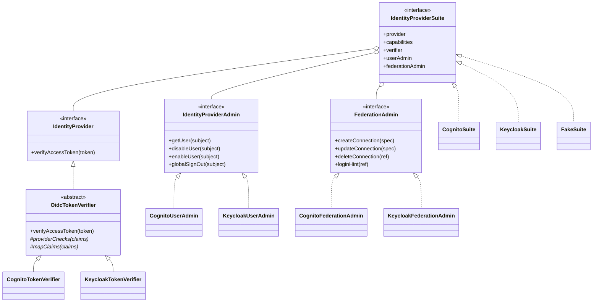

**How a suite is selected at boot:**

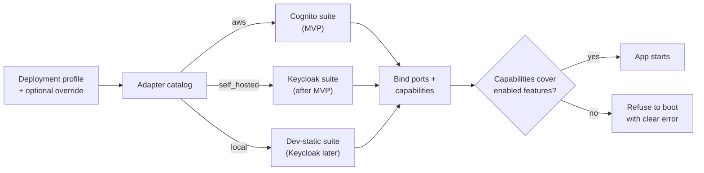

**How each IdP meets Zeke's needs:**

| Zeke needs | Cognito (Essentials) | Keycloak |
|---|---|---|
| Verify access tokens | User pool signing keys (JWKS) | Realm signing keys (JWKS) |
| Verified email, MFA and federation source in the access token | Pre-token-generation trigger (access-token customisation) | Protocol mappers (incl. `acr` for step-up) |
| Per-tenant SAML/OIDC connections | Identity providers on the user pool, with domain identifiers | Identity brokering, one broker entry per tenant connection |
| Send a user to the right SSO connection | Authorize request with the identity-provider hint | Authorize request with the IdP hint |
| Disable a user, sign out everywhere | Admin APIs | Admin REST API |
| MFA methods | TOTP, SMS, email OTP, passkeys | TOTP, WebAuthn/passkeys (others via extensions) |
| Separate staff identities | Separate staff user pool | Separate staff realm |
| Export users with passwords | No | Yes (realm export) |
| Login UI | Managed login with a branding editor | Themes |
| Operated by | AWS | Zeke (cloud, if chosen) or the customer (self-hosted) |

*The Keycloak column describes the post-MVP adapter. The MVP builds only the Cognito column.*

**Rules that keep the implementation generic:**

1. Only `libs/infra/*` knows provider names, SDKs and claim formats. Business code sees the ports, `VerifiedPrincipal` and the capability descriptor.
2. The shared OIDC verifier owns every token check. Provider adapters may add checks, but may not remove any.
3. Zeke stores only the IdP **issuer + subject** and an opaque **connection reference**, never provider-specific IDs or ARNs.
4. Login discovery returns a neutral **login hint** produced by the suite. The frontend uses standard OIDC Authorization Code + PKCE against the configured issuer, so it needs no provider-specific code.
5. Tenant settings that need a capability are validated when they are saved. For example, "MFA required" is rejected if the suite cannot report MFA.
6. A new IdP is "done" only when it passes the shared conformance suite.
7. Roles never come from IdP groups (e.g. Cognito groups). Authorization data lives only in Zeke.
8. The frontend uses a standard OIDC client library against the issuer. It does not use provider SDK flows (e.g. Cognito-specific sign-in APIs), so the web app needs no change when the IdP changes.
9. SSO connection APIs take neutral input (SAML metadata, or OIDC issuer + client), never provider-specific settings.

**What adding Keycloak after the MVP touches**

| Area | Changes? | What |
|---|---|---|
| `libs/infra/self-hosted` | **Yes** | Keycloak suite: verifier (extends the shared OIDC base), claim mapper, user admin, federation admin, capabilities, realm templates |
| Adapter catalog and configuration | **Yes** | Mark the Keycloak suite `implemented`, add its config keys |
| `deploy/` | **Yes** | Keycloak in docker-compose and the Helm chart |
| Conformance suite | Run only | Add a Keycloak runner (Testcontainers) |
| `libs/modules/identity`, `libs/modules/tenancy` | No | They depend on ports and `VerifiedPrincipal` only |
| `@zeke/platform/security` (guards, authenticators) | No | Provider-agnostic |
| HTTP API (`/v1/...`, SCIM) and DTOs | No | Neutral contracts |
| Database schema | No | Users keyed by issuer + subject; SSO connections hold an opaque reference |
| Web app | Configuration only | New issuer URL and client ID |

### 3.6 Multi-tenant users feature flag

A deployment-wide flag, `multiTenantUsers`, decides whether one user may belong to more than one tenant. **It is off for the MVP.** Both behaviours are built and tested. The control-plane and every cell must use the same value; a cell refuses to start if its setting differs from the control-plane's.

| Behaviour | Flag off (MVP: single-tenant users) | Flag on (multi-tenant users) |
|---|---|---|
| Memberships per user | At most **one** membership that is `invited`, `active` or `suspended` | Any number |
| Pending invitation records | A user may receive several, but can accept only while they have no membership | Any number, any can be accepted |
| Self-serve signup (create a workspace) | Refused if the user already has a membership | Allowed |
| Accept an invitation, SSO JIT, SCIM activation | Refused if the user already has a membership. The invitee sees "leave your current workspace first". | Allowed |
| Leave or be removed | Frees the user to join another tenant | — |
| `GET /me/tenants` | Returns at most one tenant | Returns all |
| Active tenant on requests | Optional: resolved from the user's only membership | Required when the user has more than one membership, optional when exactly one |
| Tenant switcher in the web app | Not shown | Shown |

**What the flag does not change:** the data model (membership stays a user↔tenant link), the HTTP API shapes, the authorization pipeline and RLS. That is why turning the flag on later needs no migration and no API change.

**How it is enforced.** A `MembershipCardinalityPolicy` (Strategy pattern) has two implementations:

- **Single-tenant.** Before a membership becomes `invited` or `active`, the cell reserves the user's one membership in the control-plane. The reservation is an atomic check-and-insert keyed by IdP issuer + subject. It is global because a user's memberships could otherwise sit in different regional cells. Removing a membership releases the reservation.
- **Multi-tenant.** No reservation. The subject→tenant index is updated asynchronously through the outbox, as described in D9.

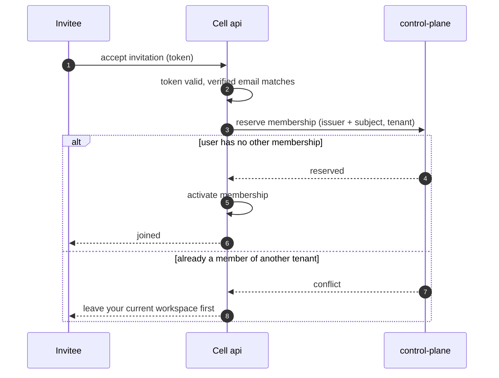

**Switching the flag**

- **Off → on:** safe at any time.
- **On → off:** refused while any user has more than one membership. The control-plane checks this before the change is applied.

**Privacy.** The inviting admin is never told that the invitee belongs to another tenant. Only the invitee sees the conflict.

---

## 4. Concepts

| Term | Meaning |
|---|---|
| **Tenant** | A customer company (workspace). It owns all business data and has a home region. |
| **User** | A person, identified by the IdP issuer + subject. Has one global login and one profile in each cell where they have a membership. |
| **Membership** | The link between a user and a tenant. Carries the status, the roles and how the user joined. |
| **Role** | A named set of permissions inside a tenant, e.g. `admin`. |
| **Permission** | `action:subject`, e.g. `members:invite`, `agents:launch`. |
| **Principal** | Whoever is calling: a user, a service account (API key), a SCIM client, or a staff support session. |
| **Active tenant** | The tenant a request acts on. It is chosen by the client per request and checked against the caller's membership. In single-tenant mode it is implied by the user's only membership. |
| **Cell** | One full deployment of Zeke in one region ([backend-architecture.md §13.6](backend-architecture.md)). |
| **Control-plane** | A global service that holds routing metadata only (directory, signup, login discovery, staff tooling). |
| **Verified domain** | An email domain the tenant has proven it owns. Required for SSO discovery, JIT and SSO enforcement. |
| **IdP suite** | The set of adapters for one identity provider (token verifier, user admin, federation admin, capabilities). Cognito has one in the MVP; Keycloak gets one after the MVP. |
| **Membership mode** | The `multiTenantUsers` feature flag: single-tenant users (MVP) or multi-tenant users (§3.6). |

---

## 5. System context

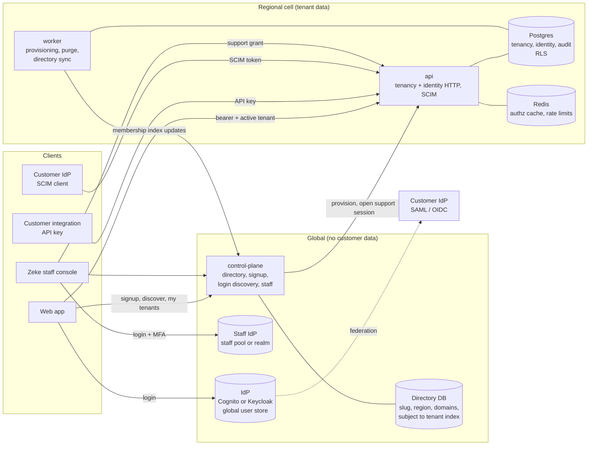

**Who calls what**

- **Web app** — Signs in with the IdP using standard OIDC, so the same code works for Cognito now and Keycloak later. Asks the control-plane which tenants the user belongs to and where they live (exactly one in single-tenant mode). Then calls that tenant's cell API with the bearer token and, in multi-tenant mode, the chosen tenant.
- **Customer integrations** — Call the cell API with an API key. The key is bound to one tenant.
- **Customer IdP** — Federates logins through the IdP (SSO) and pushes users and groups to the cell over SCIM.
- **Staff** — Sign in to a separate staff user store with mandatory MFA and use the control-plane. They reach tenant data only through a support grant issued by the tenant's cell.

**Self-hosted topology.** A self-hosted install usually runs one cell, with the control-plane and Keycloak in the same environment. The global/cell split stays logically the same, but every component runs inside the customer's network. Zeke staff support access is normally switched off there.

---

## 6. Where data lives

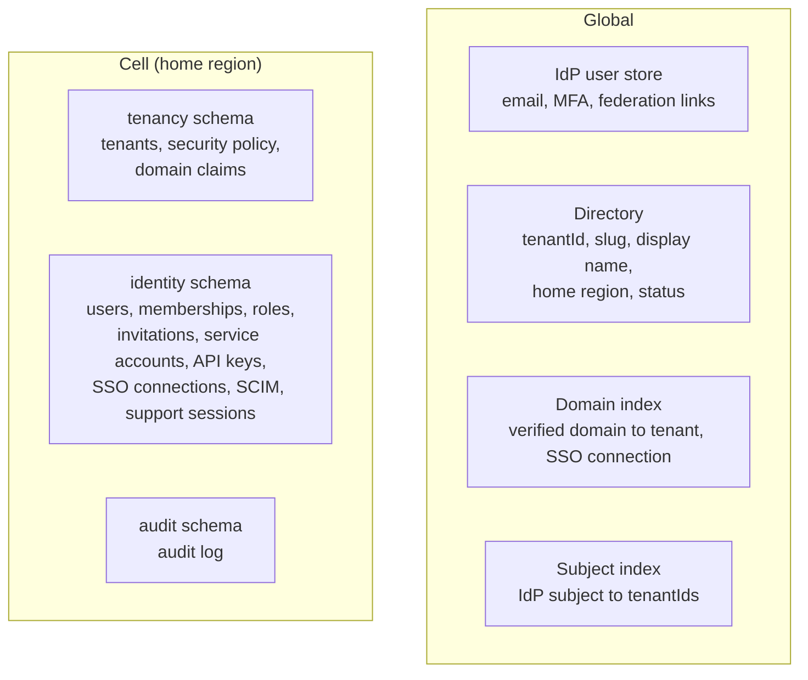

| Data | Location | Contains personal data? | Notes |
|---|---|---|---|
| Login identity (email, MFA factors, federation link) | Global IdP user store (Cognito pool or Keycloak realm) | Yes | Accepted trade-off (D2). Its region is chosen once per deployment. In self-hosted installs it stays inside the customer's environment. |
| Directory entry, domain index | Global | No (company-level routing metadata) | Needed before the home region is known |
| Subject → tenant index | Global | No (pseudonymous IDs) | Fed by cells through the outbox |
| User profile, memberships, roles, invitations | Cell | Yes | Never leaves the region |
| Service accounts, API keys, SCIM credentials | Cell | No (hashed secrets) | |
| Audit log | Cell | Yes | Tenant-scoped, append-only |

---

## 7. Module responsibilities

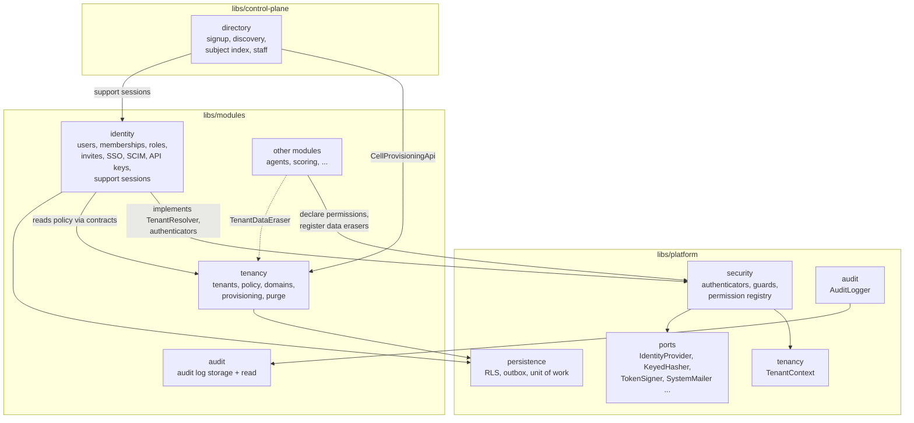

| Component | Owns | Does **not** own |
|---|---|---|
| `@zeke/platform/security` | The authentication chain, the deny-by-default guard, the permission registry, `@RequirePermissions`, region guard, and the `TenantContext` set-up. Defines the `TenantResolver` port. | Any user or role data. It depends on ports that `identity` implements. |
| `tenancy` module | Tenant aggregate and lifecycle, security policy, domain claims, the provisioning and purge workflows, and the data-eraser registry | Users, roles, login |
| `identity` module | User profiles, memberships, roles, permission resolution, invitations, service accounts and API keys, SSO connections, SCIM, support sessions | Passwords and MFA (the IdP owns these), tenant lifecycle, any IdP-specific code |
| `audit` module | Storing and reading the audit log | Writing audit events (any module does that through the platform `AuditLogger`) |
| control-plane `directory` | Global slug and domain uniqueness, signup orchestration, login discovery, the subject→tenant index, staff console APIs | Any tenant data beyond routing metadata |
| Other modules | Declaring their permissions and default grants, and registering a data eraser for tenant purge | Identity logic |
| `libs/infra` IdP suites | Cognito suite (`infra/aws`), Keycloak suite (`infra/self-hosted`), shared OIDC verifier (`infra/common`) | Business rules |

**Dependency rule:** other modules use only `@zeke/tenancy-contracts` and `@zeke/identity-contracts`, never the feature libraries ([backend-architecture.md §4.7](backend-architecture.md)).

---

## 8. Domain model

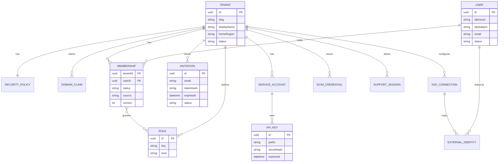

**Domain rules**

| Rule | Where it is enforced |
|---|---|
| A tenant always has at least one active owner | Membership and ownership commands (`LastOwnerInvariant`) |
| You cannot change your own roles | `RoleAssignmentPolicy` |
| You can only grant permissions you hold yourself. Only owners can grant or remove `owner`. Admins cannot modify owners. | `RoleAssignmentPolicy` |
| An invitation is single-use, expires after 7 days, and can only be accepted by a user whose **verified** email matches | `InvitationAcceptancePolicy` |
| If the tenant restricts invite domains, invitations outside them are rejected | `InvitationAcceptancePolicy` |
| An API key's permissions must be a subset of its creator's permissions at creation time | `ApiKeyScopePolicy` |
| A verified domain belongs to only one tenant globally | Control-plane domain index (unique) |
| Tenant slugs are unique globally, normalized, and checked against a reserved list | Control-plane directory + `Slug` value object |

---

## 9. Roles & permissions

### 9.1 Built-in roles

| Permission | owner | admin | member | viewer |
|---|:-:|:-:|:-:|:-:|
| `tenant:read` | ✓ | ✓ | ✓ | ✓ |
| `tenant:update` | ✓ | ✓ | | |
| `tenant:delete` | ✓ | | | |
| `ownership:transfer` | ✓ | | | |
| `security_policy:manage` | ✓ | ✓ | | |
| `domains:manage` | ✓ | ✓ | | |
| `members:read` | ✓ | ✓ | ✓ | ✓ |
| `members:invite` / `members:update_role` / `members:suspend` / `members:remove` | ✓ | ✓ (not on owners) | | |
| `roles:read` | ✓ | ✓ | ✓ | ✓ |
| `roles:manage` (custom roles, disabled in v1) | ✓ | | | |
| `sso:manage` / `scim:manage` / `api_keys:manage` | ✓ | ✓ | | |
| `support_access:manage` | ✓ | | | |
| `audit:read` | ✓ | ✓ | | |
| Product permissions, e.g. `agents:launch` | ✓ | ✓ | per module | read-only ones |

### 9.2 Permission registry

- Each module declares its permissions in its contracts. A declaration has: key, description, whether it **mutates** data, and the default grant for each built-in role.
- At boot, the registry is validated: no duplicate keys, and every permission used by a guard is declared.
- **Mutating** matters for read-only support sessions: they automatically lose every mutating permission.

---

## 10. Request authentication & authorization

### 10.1 Principal types

| Principal | Credential | How the tenant is chosen | Permissions |
|---|---|---|---|
| User | IdP access token (bearer) | Client sends the active tenant per request; optional when the user has exactly one membership (always the case in single-tenant mode). Checked against memberships. | Union of the membership's roles |
| Service account | API key | Bound to the key's tenant | The key's scoped permissions |
| SCIM client | SCIM bearer token | Bound to the credential's tenant | SCIM endpoints only |
| Staff support session | Support grant signed by the cell | Bound to the session's tenant | Non-mutating permissions only, optionally narrowed to a target user's view |

### 10.2 Request pipeline

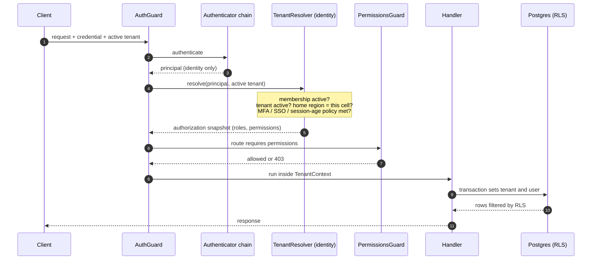

**Rules of the pipeline**

- **Deny by default.** A route must be explicitly marked public; otherwise it requires a principal.
- **No tenant, no tenant data.** A tenant-scoped route without a resolvable active tenant is rejected before the handler runs.
- **Cross-tenant IDs return 404, not 403**, so a caller can't learn that another tenant's resources exist.
- **Snapshot caching.** Cache entries are keyed by tenant, user and membership version, and have a short TTL. Every membership, role or policy change bumps the version, so the next request sees the change.
- **Revoking a user's sessions** sets a revocation timestamp. Tokens issued before it are rejected even if they have not expired.

---

## 11. Key flows

### 11.1 Self-serve signup

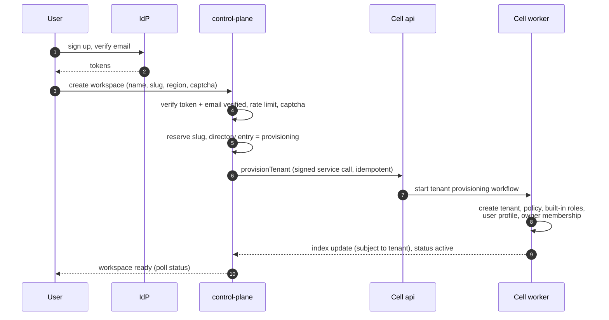

- **Ops provisioning** follows the same path, started by staff. The owner is sent an **invitation** instead of being created directly.
- If provisioning fails, the saga marks the directory entry `failed` and releases the slug.
- **Single-tenant mode:** the control-plane refuses signup if the user already has a membership. The owner's membership reservation is made in the same step as the slug reservation (§3.6).

### 11.2 Login and tenant switch

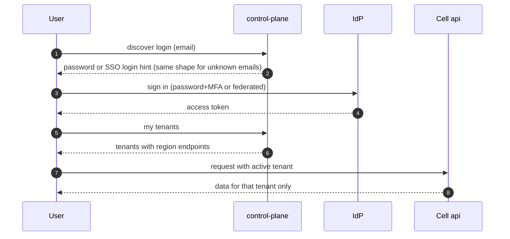

### 11.3 Invitation

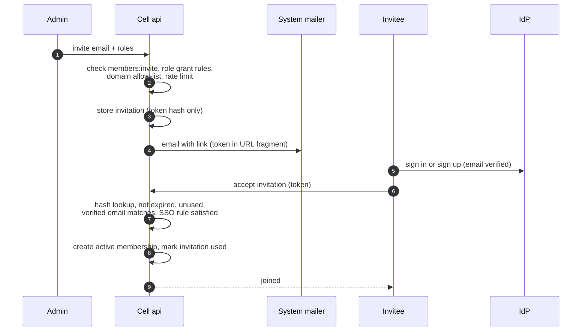

- **Single-tenant mode:** before the membership is created, the cell reserves the user's single membership in the control-plane. If the user already belongs to another tenant, acceptance fails (see the diagram in §3.6).

### 11.4 SSO and just-in-time membership

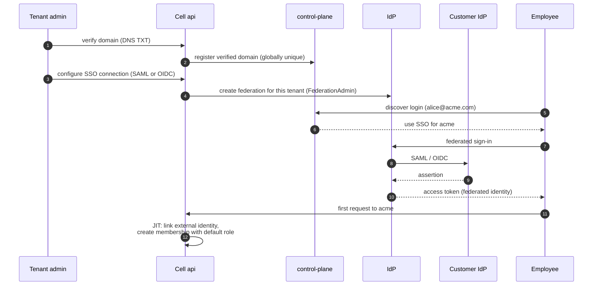

- JIT runs only for **verified** domains and only when the connection has JIT enabled.
- When **SSO is enforced**, the tenant rejects non-federated logins for that tenant. The same person can still use a password login for other tenants.

### 11.5 SCIM provisioning

- The tenant admin generates a SCIM token, which is shown once.
- The customer IdP calls `/scim/v2/Users` and `/scim/v2/Groups` on the tenant's cell.
- **Create:** pre-creates a membership that becomes active at the user's first SSO login.
- **`active=false` or delete:** suspends or removes the membership. The next request from that user is denied.
- **Groups:** mapped to roles by the tenant admin. An unmapped group grants nothing.

### 11.6 Support access (staff impersonation)

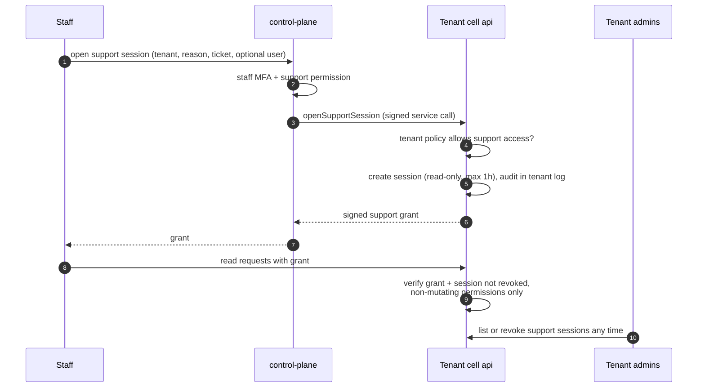

### 11.7 Removing a member

1. An admin removes the member. The membership becomes `removed` and its version is bumped.
2. The cached authorization snapshot is invalidated in the same request.
3. The next request from that user to this tenant returns 403, even with a still-valid token.
4. The worker updates the global subject index, so the tenant disappears from the user's switcher.
5. If the user has no active memberships anywhere and was deprovisioned by SCIM, the IdP global sign-out is triggered.

### 11.8 Tenant deletion

1. The owner requests deletion. The tenant moves to `pending_deletion` with a 30-day grace period; the owner can cancel during that time.
2. When the grace period ends, the purge workflow runs every registered **data eraser** (one per module), deletes identity and tenancy data, and keeps a minimal audit tombstone.
3. The directory entry becomes `deleted`. The slug and verified domains are quarantined before they can be reused.

---

## 12. Lifecycles

### 12.1 Tenant

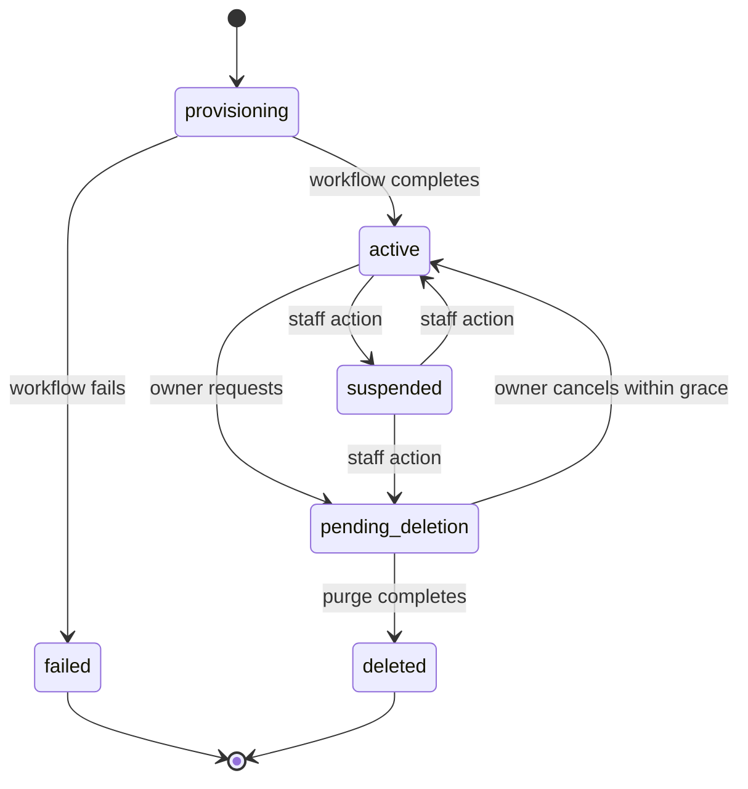

| Status | API behaviour |
|---|---|
| `provisioning` | Not reachable |
| `active` | Normal |
| `suspended` | All tenant requests denied except reading the tenant |
| `pending_deletion` | Read-only for owners (to cancel or export). Denied for everyone else. |
| `deleted` | Not reachable |

### 12.2 Membership

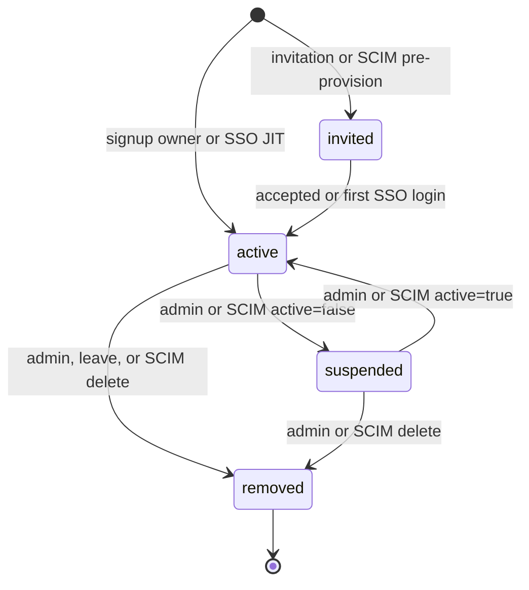

### 12.3 Invitation

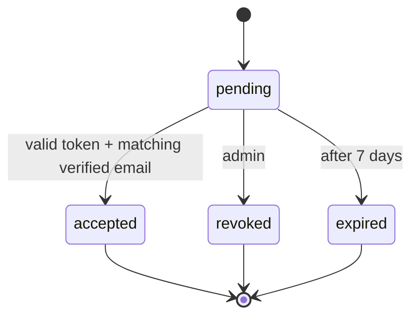

---

## 13. Security model

### 13.1 Guarantees

1. **No passwords or MFA secrets in Zeke's application database.** The IdP owns credentials (D1). For Keycloak they live in Keycloak's own database, which is isolated from the application database.
2. **Tenant isolation in three layers:** application guard (tenant resolved from membership), ORM tenant filter, and Postgres RLS with `FORCE ROW LEVEL SECURITY`. The application database role cannot bypass RLS.
3. **Authorization is always current.** Role changes, suspensions and removals apply on the next request.
4. **Only identity crosses the edge.** A client can never assert its own tenant role, because roles are never read from a token or a header.
5. **Issued secrets are unrecoverable.** Invitation, API key, SCIM and domain tokens are stored only as HMACs keyed by a KMS-held key, and compared in constant time.
6. **Lookups before the tenant is known are narrow.** Finding an API key, a SCIM credential or an invitation by its hash goes through dedicated database functions that return only the fields needed for authentication.
7. **Regional containment.** A request whose tenant's home region differs from the current cell is rejected.
8. **Support access is consented, visible, bounded and audited.**
9. **Every security-relevant change is audited** with the actor, on-behalf-of, IP, user agent and request ID.

### 13.2 Isolation layers

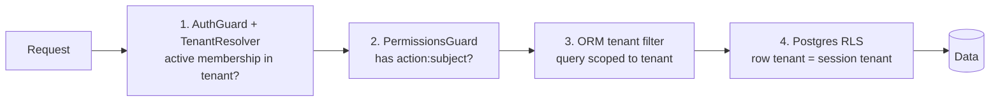

### 13.3 Threats and controls

| Threat | Control |
|---|---|
| Stolen or forged access token | Signature checked against the IdP's published keys, a strict algorithm allow-list, and checks on issuer, client ID and token type. Short token lifetime, plus a server-side session-revocation timestamp. |
| Privilege escalation by a tenant admin | Grant-subset rule, no self role changes, owner-only owner management, last-owner invariant |
| Cross-tenant access (IDOR) | Tenant resolved from membership, never from the URL alone. The ORM filter and RLS both apply. 404 for foreign IDs. Mandatory isolation test for every table. |
| Account takeover through SSO | No automatic linking. JIT only for verified domains. Domains verified by DNS and unique globally. |
| Invitation hijack | Token in the URL fragment (not sent to servers or referers), hashed at rest, single-use, expiring, bound to the verified email |
| Brute force and enumeration at signup or login | The IdP handles lockout. Control-plane uses CAPTCHA and rate limits. Login discovery gives the same response for unknown users. |
| Leaked API key | Scoped permissions, expiry, rotation with overlap, immediate revocation, last-used tracking, a recognisable prefix for secret scanning |
| Leaked SCIM token | Bound to one tenant, rotatable, SCIM endpoints only, rate limited |
| Abuse by a malicious insider (staff) | Separate staff user store (pool or realm) with MFA, tenant consent, read-only access, 1-hour maximum, reason and ticket required, visible to and revocable by the tenant, double audit |
| Server-side request forgery (SSRF) through SSO metadata URLs | https only, private and link-local ranges blocked, or metadata uploaded instead of fetched |
| Injection | Validated request DTOs, parameterised SQL, allow-listed SCIM filter grammar |
| Secrets in logs | Authorization headers, tokens and keys redacted. Audit records never contain secrets. |
| CSRF | The API accepts only bearer credentials (no cookie authentication), and CORS allows exact origins only |
| IdP adapters behaving differently | Shared OIDC verifier for all token checks, claim mappers per provider, one conformance suite that must pass for every suite, capability-gated features |
| Exposed IdP admin surface (Keycloak) | Admin console not exposed publicly, separate admin realm or credentials, the admin API is called only by Zeke's service account with least privilege, Keycloak patched on a release cadence |
| Joining two tenants at once in single-tenant mode (race) | Atomic, global membership reservation in the control-plane, keyed by issuer + subject |
| Learning that a user belongs to another tenant | The conflict is shown only to the invitee, never to the inviting admin |

### 13.4 Audit events

| Area | Events |
|---|---|
| Tenant | `tenant.provisioned`, `tenant.updated`, `tenant.security_policy_changed`, `tenant.suspended`, `tenant.reactivated`, `tenant.deletion_scheduled`, `tenant.deletion_cancelled`, `tenant.purged` |
| Domains | `domain.claimed`, `domain.verified`, `domain.removed` |
| Members | `member.invited`, `invitation.revoked`, `invitation.accepted`, `member.roles_changed`, `member.suspended`, `member.reactivated`, `member.removed`, `member.left`, `ownership.transferred` |
| Machine access | `service_account.created`, `api_key.created`, `api_key.rotated`, `api_key.revoked` |
| SSO / SCIM | `sso.connection_configured`, `sso.connection_removed`, `sso.jit_provisioned`, `scim.credential_rotated`, `scim.user_*`, `scim.group_mapping_changed` |
| Support | `support_session.opened`, `support_session.revoked`, `support_session.expired` |
| Auth | `auth.denied` (sampled), `auth.sessions_revoked` |

---

## 14. Extension points for other modules

| Need | How |
|---|---|
| Protect an endpoint | Declare the permission in your contracts, then use `@RequirePermissions('x:y')` on the route |
| Know who is calling | Read `TenantContext` (tenant, actor, impersonation flag) |
| Show user names or pick assignees | `UserDirectory` / `AssigneeResolver` from `@zeke/identity-contracts` |
| Read a tenant policy or setting | `TenantSecurityPolicyQuery` / `TenantQuery` from `@zeke/tenancy-contracts` |
| React to membership changes | Subscribe to `MembershipRemoved`, `RoleChanged`, etc. |
| Support tenant deletion | Register a `TenantDataEraser` for your schema |

---

## 15. Dependencies, risks and open items

| Item | Notes |
|---|---|
| Cognito claims for MFA, verified email and federation | Access-token customisation (pre-token-generation trigger) requires the **Essentials** plan or higher (confirmed in AWS docs). Budget for the per-MAU cost. |
| Keycloak operations (after MVP) | HA, database, upgrades and CVE patching. Customers carry this in self-hosted installs. If Keycloak is chosen in the cloud, Zeke carries it. Pin and test versions in the conformance suite. |
| Cognito-specific shortcuts creeping into the MVP | This would make adding Keycloak expensive. Mitigations: lint (no AWS SDK outside `libs/infra`), the claim mapper, the rules in §3.5, and the conformance suite running against the fake suite from day one. |
| Membership mode consistency | The control-plane and every cell must use the same `multiTenantUsers` value. A cell refuses to start on a mismatch. |
| Membership reservation availability | In single-tenant mode, invitation acceptance, signup and JIT depend on a synchronous control-plane call. Reservations are idempotent and retried. If the control-plane is down, joins fail closed with a retryable error. |
| Feature parity between IdPs | Some capabilities differ (e.g. SMS/email OTP in Keycloak needs extensions). Gate them by capability; never assume a feature exists everywhere. |
| Switching IdP for an existing deployment | Users are keyed by issuer + subject, so a switch is a planned migration: lazy re-link at first login. Cognito cannot export password hashes. |
| Global user store location | Choose it once per deployment. In the cloud it holds login emails for every tenant (D2). |
| Name clash | `TenancyModule` exists both in `@zeke/platform/tenancy` (the context) and in `@zeke/tenancy` (the business module). Rename the platform one to `TenantContextModule`. |
| Audit write path | The platform `AuditLogger` and its interceptor are still `TODO(v1)`. They are built as part of this work. |
| Custom roles | Schema-ready. The UI and API come later behind a feature flag. |
| Write-mode support sessions | Future work. It would need per-session owner approval. |

---

## 16. References

- **Internal:** [backend-architecture.md](backend-architecture.md) §5.3, §5.4, §5.8, §6, §13.6, §16.2 (Q7, Q8 and Q32 are answered by this document).
- **LeetSecure (`services/user_management`, `libs/auth`)**
  - Reused ideas: global user plus per-tenant membership, invitation flow, per-tenant external identity mapping, hashed SCIM token, gateway security headers.
  - Gaps fixed here: roles cached in the JWT, plaintext invitation tokens, no RLS, no MFA, no API keys, missing audit on ownership and SSO changes.
- **Industry patterns:** Slack and Atlassian (domain verification, SSO enforcement), Auth0 Organizations and WorkOS (organization membership, SCIM directory sync), GitHub and Stripe (prefixed, hashed, scoped API keys).
- **IdP references:** Amazon Cognito user pool feature plans (Lite, Essentials, Plus); Keycloak server administration guide (identity brokering, protocol mappers, step-up authentication, realm export).
