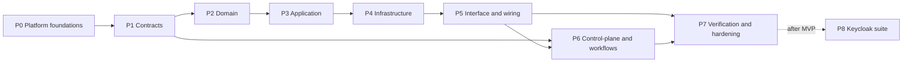

# Zeke AI — Tenant & User Implementation Plan

> Architecture and rationale: [tenant-user-architecture.md](tenant-user-architecture.md).
> This plan lists **what to build, in which order, and which files are created or changed**.
> IdP strategy: **the MVP implements Cognito only.** Keycloak is added after the MVP (Phase 8) as an adapter-only change, behind the same ports (architecture §3.4–§3.5). No code outside `libs/infra` may name an IdP.
> Membership mode: **the MVP runs with single-tenant users**, controlled by the `multiTenantUsers` feature flag (architecture §3.6). Both modes are built and tested.

---

## MVP scope at a glance

| Item | MVP | After MVP |
|---|---|---|
| IdP ports, suite factory, shared OIDC verifier, conformance suite | Built | Reused |
| Cognito suite | Built | — |
| Keycloak suite | Stub only | Phase 8 |
| `multiTenantUsers` flag | Built, **off** | Switched on per deployment |
| Single-tenant cardinality policy + control-plane reservation | Built | Used only while the flag is off |
| Tenant switcher (web app) | Not needed | Needed when the flag is on |

---

## How to read this plan

- **Interfaces come first.** Every phase follows the same order:
  1. contracts and ports (abstract classes or interfaces)
  2. pure domain logic
  3. application handlers
  4. adapters and wiring
- **Task IDs** look like `P2.3`: phase 2, task 3. Tasks within a phase can run in parallel unless the task says otherwise.
- Each task has:
  - **Goal**: one line saying what the task achieves.
  - **Files**: each file with the action **New** or **Change**, and its purpose.
  - **Done when**: the acceptance check.
- **Paths.** Feature libraries follow the generator layout:
  - `libs/modules/<m>/feature/src/{domain, application/{commands,queries,ports}, infrastructure/{persistence,adapters}, interface/{http,worker}}`
  - Abbreviations used below:
    - `T` = `libs/modules/tenancy`
    - `I` = `libs/modules/identity`
    - `P` = `libs/platform`
- **Tests sit next to the code:**
  - `*.spec.ts` = L0 unit tests
  - `*.int-spec.ts` = L1 tests with Testcontainers

### Phase overview



| Phase | Outcome |
|---|---|
| P0 | The platform can authenticate a principal, resolve a tenant through a port, check permissions, set RLS context and write audit events |
| P1 | Public contracts of `tenancy`, `identity` and the control-plane are defined. Other teams can code against them. |
| P2 | All business rules exist as pure, unit-tested code |
| P3 | Use cases (commands and queries) work against in-memory ports |
| P4 | Postgres schemas with RLS, the shared OIDC base, the Cognito IdP suite, and the other AWS/common adapters are in place |
| P5 | HTTP, SCIM, internal and worker endpoints are live in `api` and `worker` |
| P6 | Signup, login discovery, the tenant switcher, staff support and the provisioning/purge workflows work end to end |
| P7 | Isolation, security and end-to-end suites are green in both membership modes, and the docs are updated. **End of MVP.** |
| P8 | *After MVP:* the Keycloak suite is added in `libs/infra/self-hosted` with no change to modules or APIs |

---

## Phase 0 — Platform foundations

### P0.1 Identity ports and the IdP suite

**Goal:** provider-neutral IdP ports, grouped into one suite (Abstract Factory) with a capability descriptor.

| File | Action | Purpose |
|---|---|---|
| `P/ports/src/identity.ts` | Change | `VerifiedPrincipal` → `issuer`, `subject`, `clientId`, `email`, `emailVerified`, `authTime`, `mfaVerified`, `federation?` (opaque connection reference), `tokenId`. **Remove** `tenantId`, `homeRegion` and `roles`. |
| `P/ports/src/identity-admin.ts` | New | `IdentityProviderAdmin` port (`getUser`, `disableUser`, `enableUser`, `globalSignOut`) and `FederationAdmin` port (`createConnection`, `updateConnection`, `deleteConnection`, `setDomainIdentifiers`, `loginHint(ref)` → neutral authorize parameters) |
| `P/ports/src/identity-suite.ts` | New | `IdentityProviderSuite` (`provider`, `capabilities`, `verifier`, `userAdmin`, `federationAdmin`) and `IdpCapabilities` (`mfaClaim`, `emailVerifiedClaim`, `federationClaim`, `federationAdmin`, `globalSignOut`, `passkeys`, `userExport`) |
| `P/ports/src/tokens.ts` | Change | Add `IDENTITY_PROVIDER_ADMIN`, `FEDERATION_ADMIN`, `IDP_CAPABILITIES`, plus the staff equivalents. Add a `staffIdentity` infra service. |
| `P/core/src/infra/index.ts` | Change | When the `identity` / `staffIdentity` descriptor returns a suite, bind each suite member to its port token. A single provider choice therefore yields a matched set; mixed providers are impossible. |
| `P/ports/src/index.ts` | Change | Export the new files |
| `libs/infra/common/src/in-memory/dev-identity.ts` | Change | Becomes a dev-static **suite** (minimal capabilities). Dev tokens become `dev:<subject>[:mfa]`. |
| `libs/infra/aws/src/pending/index.ts`, `libs/infra/self-hosted/src/stubs/index.ts` | Change | Update the Cognito and Keycloak stubs to the suite shape |

**Done when:** `nx run-many -t typecheck` is green, no code reads `principal.tenantId` or `principal.roles`, and no file outside `libs/infra` imports a provider name.

### P0.2 Crypto, human verification and rate-limit ports

**Goal:** define abstractions for hashing issued secrets, signing grants and checking CAPTCHA.

| File | Action | Purpose |
|---|---|---|
| `P/ports/src/crypto.ts` | New | `KeyedHasher` (`hash(purpose, value)`, `verify(purpose, value, hash)`, constant-time) and `TokenSigner` (`sign(claims, ttl)`, `verify(token)`; asymmetric, KMS-backed) |
| `P/ports/src/human-verification.ts` | New | `HumanVerification.verify(token, ip)` for CAPTCHA |
| `P/ports/src/tokens.ts` | Change | Add `KEYED_HASHER`, `TOKEN_SIGNER`, `HUMAN_VERIFICATION` |
| `P/ports/src/cache.ts` | Change | Change the `RateLimiter` doc comment to say generic namespaced keys (e.g. `rl:invite:<tenant>`) |

**Done when:** the ports compile and in-memory fakes exist (P0.8).

### P0.3 TenantContext actor model

**Goal:** the context can represent users, service accounts, SCIM clients, staff and impersonation.

| File | Action | Purpose |
|---|---|---|
| `P/core/src/tenancy/index.ts` | Change | `actor.type` gains `service_account`, `staff` and `scim`. Add `actor.userId?` and `impersonation?` (`supportSessionId`, `staffId`, `mode`). Update the serialize/deserialize guards. Rename the Nest module to `TenantContextModule`, removing the clash with `@zeke/tenancy`. |
| `apps/api/src/app.module.ts`, `apps/worker/src/worker-app.module.ts` | Change | Use the new module name |

**Done when:** existing tests pass, and a new spec covers a context round trip that includes impersonation.

### P0.4 Security abstractions (interfaces only)

**Goal:** the authentication and authorization pipeline exists as contracts that `identity` will implement.

| File | Action | Purpose |
|---|---|---|
| `P/core/src/security/principal.ts` | New | `AuthenticatedPrincipal` union: `user`, `service_account`, `scim_client`, `staff_support` |
| `P/core/src/security/authenticator.ts` | New | Abstract `Authenticator` (`canHandle(req)`, `authenticate(req)`) and an `AUTHENTICATORS` multi-provider token |
| `P/core/src/security/tenant-resolver.ts` | New | Abstract `TenantResolver.resolve(principal, requestedTenantId)` → `Result<AuthorizationSnapshot>`, plus the `AuthorizationSnapshot` type (tenant, home region, role keys, permissions, membership version) |
| `P/core/src/security/permissions.ts` | New | `Permission` type, `PermissionDefinition` (key, description, `mutating`, `defaultGrants`), `PermissionRegistry`, `@RequirePermissions`. Moved from `index.ts`. |
| `P/core/src/security/decorators.ts` | New | `@Public()`, `@AllowWithoutTenant()` (e.g. accept invitation, my memberships), `@CurrentPrincipal()` |
| `P/core/src/security/index.ts` | Change | Barrel export. Remove the TODO. |

**Done when:** the abstractions compile and are covered by short spec tests (registry: duplicate key fails, unknown permission fails).

### P0.5 Security guards and interceptor

**Goal:** a working deny-by-default pipeline over the abstractions. *Depends on P0.4.*

| File | Action | Purpose |
|---|---|---|
| `P/core/src/security/authenticator-chain.ts` | New | Picks the first authenticator that can handle the request. If none can, the request is `unauthenticated`. |
| `P/core/src/security/auth.guard.ts` | New | Global guard: honours `@Public`, authenticates, calls `TenantResolver`, attaches the snapshot to the request |
| `P/core/src/security/permissions.guard.ts` | New | Checks `@RequirePermissions` against the snapshot. Strips mutating permissions for read-only support sessions. |
| `P/core/src/security/region.guard.ts` | New | Rejects requests where the snapshot's home region ≠ the cell region |
| `P/core/src/security/tenant-context.interceptor.ts` | New | Wraps the handler in `TenantContextAccessor.run(...)` |
| `P/core/src/security/security.config.ts` | New | Zod config: `CELL_REGION`, the tenant header name, CORS origins |
| `P/core/src/security/security.module.ts` | New | `SecurityModule.forRoot()` registers the guards and interceptor globally, plus the permission registry initializer |
| `P/core/src/security/idp-capability.check.ts` | New | Boot check: enabled features (per-tenant MFA, SSO, passkeys) must be covered by the bound suite's `IdpCapabilities`. Otherwise the app refuses to start with a clear error. |

**Done when:** L0 specs pass for these cases:
- a public route is allowed
- no credential → 401
- unknown tenant → 404
- missing permission → 403
- a read-only support session is blocked on a mutating permission
- region mismatch → 403

### P0.6 Audit write path

**Goal:** finish the `TODO(v1)` so any module can write audit events.

| File | Action | Purpose |
|---|---|---|
| `P/core/src/audit/index.ts` | Change | Extend `AuditEvent` with `actorType`, `onBehalfOf`, `ip`, `userAgent`, `requestId` |
| `P/core/src/audit/audit.interceptor.ts` | New | Records `@Audited` handlers: success or failure, with the actor taken from `TenantContext` |
| `P/persistence/src/outbox-audit-logger.ts` | New | An `AuditLogger` that writes an `audit.recorded` event to the outbox in the current transaction |

**Done when:** a spec proves the audit event is staged in the same transaction as the change.

### P0.7 Persistence helpers

**Goal:** RLS and the identity-aware transaction context.

| File | Action | Purpose |
|---|---|---|
| `P/persistence/src/tenant-transaction.ts` | Change | Also `set_config('app.user_id')` and `set_config('app.actor_type')`. `tenantRlsPolicySql(schema, table, column = 'tenant_id')`. |
| `P/persistence/src/rls-sql.ts` | New | `usersVisibilityPolicySql()` (self or shared membership), `securityDefinerLookupSql()` helper, `grantAppRoleSql()` |
| `P/persistence/src/unit-of-work.ts` | New | Abstract `UnitOfWork.run(fn)` that application handlers depend on. The default implementation delegates to `TenantTransaction`. |
| `P/persistence/src/base-repository.ts` | New | `BaseRepository<T>`: tenant-scoped get, find, save and delete only |
| `P/persistence/src/index.ts` | Change | Export the new helpers |

**Done when:** an L1 spec shows that a table with the generated policy hides rows from another tenant, and that queries fail when no tenant is set.

### P0.8 Testing fakes

**Goal:** every new port has an in-memory fake, so P2–P3 need no infrastructure.

| File | Action | Purpose |
|---|---|---|
| `P/testing/src/security-fakes.ts` | New | `FakeIdentityProviderSuite` (configurable capabilities), `FakeKeyedHasher`, `FakeTokenSigner`, `FakeHumanVerification` |
| `P/testing/src/principal-builders.ts` | New | Builders for users, service accounts and staff principals, and for authorization snapshots |
| `P/testing/src/index.ts` | Change | Export them |

### P0.9 HTTP hardening

**Goal:** a safe default HTTP surface.

| File | Action | Purpose |
|---|---|---|
| `P/core/src/http/http-hardening.ts` | New | `applyHttpHardening(app, config)`: helmet headers, exact-origin CORS, JSON body limit, `x-powered-by` off |
| `P/core/src/observability/*` (logger setup) | Change | pino `redact` for `authorization`, `x-api-key`, `*.token`, `*.secret` |
| `apps/api/src/main.ts` | Change | Call `applyHttpHardening` |

---

## Phase 1 — Contracts

### P1.1 `@zeke/tenancy-contracts`

**Goal:** the public types, ports and events of the tenancy module.

| File | Action | Purpose |
|---|---|---|
| `T/contracts/src/tenant.ts` | New | `TenantStatus`, `TenantSlug`, `TenantSummary` |
| `T/contracts/src/security-policy.ts` | New | `TenantSecurityPolicy` type and its defaults |
| `T/contracts/src/domains.ts` | New | `DomainClaimStatus`, `VerifiedDomain` |
| `T/contracts/src/ports.ts` | New | Abstract `TenantQuery` and `TenantSecurityPolicyQuery` |
| `T/contracts/src/tenant-data-eraser.ts` | New | `TenantDataEraser` interface and registration decorator (each module purges its schema) |
| `T/contracts/src/permissions.ts` | New | Tenancy `PermissionDefinition`s (`tenant:*`, `security_policy:manage`, `domains:manage`) |
| `T/contracts/src/events.ts` | New | `TenantProvisioned`, `TenantSuspended`, `TenantReactivated`, `TenantDeletionScheduled`, `TenantDeleted`, `TenantSecurityPolicyChanged`, `DomainVerified` |
| `T/contracts/src/index.ts` | Change | Barrel export |

### P1.2 `@zeke/identity-contracts`

**Goal:** the public types, ports and events of the identity module.

| File | Action | Purpose |
|---|---|---|
| `I/contracts/src/ids.ts` | New | `RoleId`, `InvitationId`, `ServiceAccountId`, `ApiKeyId`, `SsoConnectionId`, `ScimCredentialId`, `SupportSessionId` |
| `I/contracts/src/roles.ts` | New | `BUILT_IN_ROLES`, `RoleKind` (`built_in`, `custom`) |
| `I/contracts/src/membership.ts` | New | `MembershipStatus`, `MembershipSource`, `MemberSummary` |
| `I/contracts/src/membership-mode.ts` | New | `MembershipMode` (`single` \| `multi`) and the `multiTenantUsers` flag definition, shared by cells and the control-plane |
| `I/contracts/src/permissions.ts` | New | Identity `PermissionDefinition`s (`members:*`, `roles:*`, `ownership:transfer`, `sso:manage`, `scim:manage`, `api_keys:manage`, `support_access:manage`, `audit:read`) |
| `I/contracts/src/ports.ts` | New | Abstract `UserDirectory`, `AssigneeResolver`, `MembershipQuery` |
| `I/contracts/src/events.ts` | New | `UserInvited`, `InvitationAccepted`, `MembershipActivated`, `MembershipSuspended`, `MembershipRemoved`, `RoleChanged`, `OwnershipTransferred`, `ApiKeyCreated`, `ApiKeyRevoked`, `SsoConnectionChanged`, `SupportSessionOpened`, `SupportSessionClosed` |
| `I/contracts/src/index.ts` | Change | Barrel export |

### P1.3 `@zeke/control-plane-contracts` (new library)

**Goal:** the contract between the global control-plane and the cells.

Generate the library:

```
nx g @zeke/tools:lib --directory=libs/control-plane/contracts --name=control-plane-contracts --importPath=@zeke/control-plane-contracts --tags=type:contracts,scope:control-plane --pure
```

| File | Action | Purpose |
|---|---|---|
| `libs/control-plane/contracts/src/cell-provisioning-api.ts` | New | `CellProvisioningApi`: `provisionTenant(input)` (idempotent by tenantId), `getProvisioningStatus`, `openSupportSession(input)` |
| `libs/control-plane/contracts/src/directory-index-sync.ts` | New | `DirectoryIndexSync`: upsert or remove a subject↔tenant link, tenant status changes, domain registration. Pseudonymous IDs only. |
| `libs/control-plane/contracts/src/directory-query.ts` | New | `DirectoryQuery`: tenants for a subject, route for a tenant, SSO hint for a domain |
| `libs/control-plane/contracts/src/membership-reservation.ts` | New | `MembershipReservationApi`: `reserve(issuer, subject, tenantId)` (idempotent; conflict if another tenant holds it), `release(...)`, `getMode()` for the cell's startup mismatch check |
| `libs/control-plane/contracts/src/support-grant.ts` | New | Claims carried by a support grant (session, tenant, staff, mode, optional target user, expiry) |
| `libs/control-plane/contracts/src/index.ts` | Change | Barrel export |

**Done when (P1):** all three libraries pass lint (the boundary rules allow only kernel and contracts imports) and typecheck.

---

## Phase 2 — Domain (pure TypeScript, no Nest)

### P2.1 Tenancy domain

| File | Action | Purpose |
|---|---|---|
| `T/feature/src/domain/tenant.ts` | New | `Tenant` aggregate: state machine (§12.1 of the architecture doc), profile updates, deletion schedule and cancel |
| `T/feature/src/domain/slug.ts` | New | `Slug` value object: lower-case, `[a-z0-9-]`, 3–40 characters, reserved-word check |
| `T/feature/src/domain/reserved-slugs.ts` | New | The reserved-word list (`admin`, `api`, `www`, `support`, …) |
| `T/feature/src/domain/security-policy.ts` | New | Policy value object with validation (e.g. SSO cannot be enforced without an active connection) |
| `T/feature/src/domain/domain-claim.ts` | New | Domain claim: TXT challenge, verify, expire, remove |
| `T/feature/src/domain/tenancy-errors.ts` | New | `DomainError` factories with `tenancy.*` codes |
| `T/feature/src/domain/*.spec.ts` | New | Unit tests for every transition and rule |

### P2.2 Identity aggregates

| File | Action | Purpose |
|---|---|---|
| `I/feature/src/domain/email.ts` | New | `Email` value object (normalize, extract domain) |
| `I/feature/src/domain/user.ts` | New | `User`: subject, email, status, `sessionsRevokedAt` |
| `I/feature/src/domain/membership.ts` | New | `Membership`: state machine (§12.2), roles, source, version bump on every change |
| `I/feature/src/domain/role.ts` | New | `Role`: built-in or custom, with an immutable key for built-ins |
| `I/feature/src/domain/invitation.ts` | New | `Invitation`: state machine (§12.3), expiry, attempt counter |
| `I/feature/src/domain/service-account.ts` | New | `ServiceAccount` |
| `I/feature/src/domain/api-key.ts` | New | `ApiKey`: prefix, hash, scoped permissions, expiry, revoke, last used |
| `I/feature/src/domain/sso-connection.ts` | New | `SsoConnection`: protocol, status, JIT flag, default role, domains |
| `I/feature/src/domain/scim.ts` | New | `ScimCredential`, `ScimGroupMapping`, `ExternalIdentity` |
| `I/feature/src/domain/support-session.ts` | New | `SupportSession`: mode, target user, expiry (1 hour maximum), revoke |
| `I/feature/src/domain/identity-errors.ts` | New | `DomainError` factories with `identity.*` codes |

### P2.3 Identity policies

| File | Action | Purpose |
|---|---|---|
| `I/feature/src/domain/policies/role-assignment.policy.ts` | New | No self change. Grants must be a subset of the actor's permissions. Owner-only owner management. Admins cannot touch owners. |
| `I/feature/src/domain/policies/last-owner.invariant.ts` | New | Blocks removing, suspending or demoting the last active owner |
| `I/feature/src/domain/policies/invitation-acceptance.policy.ts` | New | Verified email matches, the invitation is valid, the domain allow-list passes, and SSO is satisfied if the tenant enforces it |
| `I/feature/src/domain/policies/api-key-scope.policy.ts` | New | A key's scope must be a subset of its creator's permissions |
| `I/feature/src/domain/policies/access.policy.ts` | New | Per request: MFA required, SSO enforced, maximum session age, session-revocation timestamp |
| `I/feature/src/domain/policies/support-access.policy.ts` | New | Tenant consent check, and effective permissions = non-mutating ∩ (target user's permissions, if a target is set) |
| `I/feature/src/domain/policies/built-in-role-catalog.ts` | New | Builds the permission set of each built-in role from the permission registry definitions |
| `I/feature/src/domain/policies/membership-cardinality.policy.ts` | New | Strategy interface plus `SingleTenantCardinality` (needs a reservation before `invited`/`active`) and `MultiTenantCardinality` (no reservation) |
| `I/feature/src/domain/**/*.spec.ts` | New | A table-driven test for every rule |

**Done when (P2):** domain specs are green, and the domain folders import nothing except the kernel and contracts (lint enforces this).

---

## Phase 3 — Application (ports, then use cases)

### P3.1 Tenancy application ports

| File | Action | Purpose |
|---|---|---|
| `T/feature/src/application/ports/tenant.repository.ts` | New | Abstract `TenantRepository` |
| `T/feature/src/application/ports/domain-claim.repository.ts` | New | Abstract `DomainClaimRepository` |
| `T/feature/src/application/ports/dns-txt-verifier.ts` | New | Abstract `DnsTxtVerifier.hasRecord(domain, value)` |
| `T/feature/src/application/ports/directory-gateway.ts` | New | Abstract gateway for pushing domain and status changes to the control-plane (through the outbox) |

### P3.2 Tenancy use cases

| File | Action | Purpose |
|---|---|---|
| `T/feature/src/application/commands/provision-tenant.command.ts` | New | Creates the tenant, the default policy and the built-in role rows. Calls identity through contracts to create the owner or the invitation. Idempotent. |
| `T/feature/src/application/commands/update-tenant-profile.command.ts` | New | Display name |
| `T/feature/src/application/commands/update-security-policy.command.ts` | New | Policy change, then a `TenantSecurityPolicyChanged` event. Rejects settings the IdP cannot support, e.g. `mfaRequired` when `IdpCapabilities.mfaClaim` is false. |
| `T/feature/src/application/commands/start-domain-verification.command.ts` | New | Issues the TXT challenge (the token is stored hashed) |
| `T/feature/src/application/commands/check-domain-verification.command.ts` | New | DNS check, verify, register globally |
| `T/feature/src/application/commands/suspend-tenant.command.ts` | New | Staff only: suspend and reactivate |
| `T/feature/src/application/commands/schedule-tenant-deletion.command.ts` | New | Schedule and cancel deletion |
| `T/feature/src/application/commands/purge-tenant.command.ts` | New | Runs the registered `TenantDataEraser`s (called by the workflow) |
| `T/feature/src/application/queries/get-tenant.query.ts` | New | The current tenant |
| `T/feature/src/application/queries/list-domains.query.ts` | New | Domain claims |
| `T/feature/src/application/tenant-query.service.ts` | New | Implements `TenantQuery` and `TenantSecurityPolicyQuery` from the contracts |

### P3.3 Identity application ports

| File | Action | Purpose |
|---|---|---|
| `I/feature/src/application/ports/user.repository.ts` | New | Abstract `UserRepository` |
| `I/feature/src/application/ports/membership.repository.ts` | New | Abstract `MembershipRepository` (with roles) |
| `I/feature/src/application/ports/role.repository.ts` | New | Abstract `RoleRepository` |
| `I/feature/src/application/ports/invitation.repository.ts` | New | Abstract `InvitationRepository` |
| `I/feature/src/application/ports/machine-access.repository.ts` | New | Abstract repositories for service accounts and API keys |
| `I/feature/src/application/ports/sso-scim.repository.ts` | New | Abstract repositories for SSO connections, SCIM credentials, group mappings and external identities |
| `I/feature/src/application/ports/support-session.repository.ts` | New | Abstract `SupportSessionRepository` |
| `I/feature/src/application/ports/pre-tenant-auth-lookup.ts` | New | Abstract lookups by hash or subject that run before the tenant is known |
| `I/feature/src/application/ports/authorization-cache.ts` | New | Abstract `get`, `set` and `invalidate` of snapshots |
| `I/feature/src/application/ports/invite-mailer.ts` | New | Abstract `InviteMailer.sendInvitation(...)` |
| `I/feature/src/application/ports/secret-token-generator.ts` | New | Abstract generator of random secrets and prefixed keys |
| `I/feature/src/application/ports/membership-reservation.ts` | New | Abstract `MembershipReservation` (`reserve`, `release`), used only by the single-tenant policy |

### P3.4 Membership and invitation use cases

| File | Action | Purpose |
|---|---|---|
| `I/feature/src/application/commands/ensure-user-profile.command.ts` | New | Creates or refreshes the cell user profile from the principal |
| `I/feature/src/application/commands/create-owner-membership.command.ts` | New | Used by provisioning. Applies the cardinality policy. |
| `I/feature/src/application/commands/invite-members.command.ts` | New | Bulk invite, with rate limits and a pending-invitation cap |
| `I/feature/src/application/commands/resend-invitation.command.ts` | New | Issues a new token; the old one becomes invalid |
| `I/feature/src/application/commands/revoke-invitation.command.ts` | New | Revoke |
| `I/feature/src/application/commands/accept-invitation.command.ts` | New | Hash lookup, acceptance policy, cardinality policy (reserve in single-tenant mode), activate membership. A conflict is reported only to the invitee. |
| `I/feature/src/application/commands/change-member-roles.command.ts` | New | Role assignment policy and last-owner check |
| `I/feature/src/application/commands/suspend-member.command.ts` | New | Suspend and reactivate |
| `I/feature/src/application/commands/remove-member.command.ts` | New | Remove (by an admin) and leave (by the member). Releases the reservation in single-tenant mode. |
| `I/feature/src/application/commands/transfer-ownership.command.ts` | New | Atomic: grant owner to the target, then optionally demote self |
| `I/feature/src/application/commands/revoke-user-sessions.command.ts` | New | Sets `sessionsRevokedAt` and calls the IdP global sign-out |

### P3.5 Machine access use cases

| File | Action | Purpose |
|---|---|---|
| `I/feature/src/application/commands/create-service-account.command.ts` | New | Service account with roles |
| `I/feature/src/application/commands/create-api-key.command.ts` | New | Returns the secret **once** and stores the hash |
| `I/feature/src/application/commands/rotate-api-key.command.ts` | New | New key, with the old one valid until a set time |
| `I/feature/src/application/commands/revoke-api-key.command.ts` | New | Immediate revoke |

### P3.6 SSO and SCIM use cases

| File | Action | Purpose |
|---|---|---|
| `I/feature/src/application/commands/configure-sso-connection.command.ts` | New | Validates metadata (SSRF-safe), stores secrets through `CredentialVault`, creates the federation through `FederationAdmin` |
| `I/feature/src/application/commands/remove-sso-connection.command.ts` | New | Removes the federation. Rejected while SSO is enforced. |
| `I/feature/src/application/commands/jit-provision.command.ts` | New | First federated request: verified domain plus JIT enabled → external identity and membership (cardinality policy applies) |
| `I/feature/src/application/commands/rotate-scim-credential.command.ts` | New | New SCIM token, shown once |
| `I/feature/src/application/commands/scim-users.commands.ts` | New | SCIM create, replace, patch and delete user, mapped to membership commands |
| `I/feature/src/application/commands/scim-groups.commands.ts` | New | Group create, update and delete, plus applying group→role mappings |

### P3.7 Support session use cases

| File | Action | Purpose |
|---|---|---|
| `I/feature/src/application/commands/open-support-session.command.ts` | New | Checks the tenant's consent, creates the session, signs the grant through `TokenSigner` |
| `I/feature/src/application/commands/revoke-support-session.command.ts` | New | Revoked by a tenant admin or by staff |

### P3.8 Queries and authorization

| File | Action | Purpose |
|---|---|---|
| `I/feature/src/application/queries/list-members.query.ts` | New | Cursor-paged, filterable by status and role |
| `I/feature/src/application/queries/get-member.query.ts` | New | A single member |
| `I/feature/src/application/queries/list-invitations.query.ts` | New | Pending, accepted and expired invitations |
| `I/feature/src/application/queries/list-roles.query.ts` | New | Roles with their effective permissions |
| `I/feature/src/application/queries/get-my-memberships.query.ts` | New | The caller's memberships in this cell |
| `I/feature/src/application/queries/list-machine-access.query.ts` | New | Service accounts and keys (without secrets) |
| `I/feature/src/application/queries/list-sso-connections.query.ts` | New | SSO connections |
| `I/feature/src/application/queries/list-support-sessions.query.ts` | New | Active and past support sessions |
| `I/feature/src/application/authorization/resolve-authorization.service.ts` | New | **Implements the platform `TenantResolver`**: membership, tenant status, region and access policy → snapshot, cached. When no active tenant is sent and the user has exactly one membership, that tenant is used. |
| `I/feature/src/application/authorization/user-directory.service.ts` | New | Implements `UserDirectory`, `AssigneeResolver` and `MembershipQuery` |

**Done when (P3):** every command and query has an L0 spec that runs against the fakes from P0.8 and in-memory repositories.

---

## Phase 4 — Infrastructure

### P4.1 Tenancy persistence

| File | Action | Purpose |
|---|---|---|
| `T/feature/src/infrastructure/persistence/tenancy.schemas.ts` | New | MikroORM `EntitySchema`s: `tenants`, `tenant_security_policies`, `domain_claims` |
| `T/feature/src/infrastructure/persistence/mikro-tenant.repository.ts` | New | Implements `TenantRepository` |
| `T/feature/src/infrastructure/persistence/mikro-domain-claim.repository.ts` | New | Implements `DomainClaimRepository` |
| `T/feature/src/infrastructure/persistence/migrations/Migration0001Tenancy.ts` | New | Tables, indexes and RLS (`tenants` uses the `id` column) |

### P4.2 Identity persistence

| File | Action | Purpose |
|---|---|---|
| `I/feature/src/infrastructure/persistence/identity.schemas.ts` | New | `EntitySchema`s for `users`, `memberships`, `membership_roles`, `roles`, `role_permissions`, `invitations`, `service_accounts`, `api_keys`, `sso_connections`, `scim_credentials`, `scim_group_mappings`, `external_identities`, `support_sessions` |
| `I/feature/src/infrastructure/persistence/mikro-*.repository.ts` | New | One implementation per port from P3.3 |
| `I/feature/src/infrastructure/persistence/pg-pre-tenant-auth-lookup.ts` | New | Calls the SECURITY DEFINER functions |
| `I/feature/src/infrastructure/persistence/migrations/Migration0001Identity.ts` | New | Tables, `tenant_id`-leading keys, RLS on every tenant table, the users-visibility policy |
| `I/feature/src/infrastructure/persistence/migrations/Migration0002AuthLookups.ts` | New | `resolve_user_by_subject`, `lookup_api_key`, `lookup_scim_credential`, `lookup_invitation`, with minimal columns and `EXECUTE` granted to the app role |

### P4.3 Identity and tenancy adapters

| File | Action | Purpose |
|---|---|---|
| `I/feature/src/infrastructure/adapters/cache-authorization-cache.ts` | New | `AuthorizationCache` over the platform `Cache` port. Keys include the membership version. |
| `I/feature/src/infrastructure/adapters/system-invite-mailer.ts` | New | `InviteMailer` over `SystemMailer` |
| `I/feature/src/infrastructure/adapters/templates/invitation-email.ts` | New | HTML and text body (escaped; the link carries the token in the fragment) |
| `I/feature/src/infrastructure/adapters/crypto-secret-token-generator.ts` | New | 256-bit secrets via `node:crypto`. Key format `zk_<env>_<prefix>_<secret>`. |
| `T/feature/src/infrastructure/adapters/node-dns-txt-verifier.ts` | New | `DnsTxtVerifier` using `node:dns/promises`, with a timeout |
| `T/feature/src/infrastructure/adapters/outbox-directory-gateway.ts` | New | Writes directory updates to the outbox |
| `I/feature/src/identity.config.ts` | New | Zod config: `MULTI_TENANT_USERS` (boolean, default `false`). Selects the cardinality strategy at boot. |
| `I/feature/src/infrastructure/adapters/control-plane-membership-reservation.ts` | New | `MembershipReservation` over the control-plane API (signed service call, idempotent, retried, fails closed) |
| `I/feature/src/infrastructure/adapters/membership-mode.check.ts` | New | Startup check: the cell's flag must equal the control-plane's `getMode()` |

### P4.4 Shared OIDC base (Template Method + anti-corruption layer)

**Goal:** every token check is written once and reused by all IdP suites.

| File | Action | Purpose |
|---|---|---|
| `libs/infra/common/src/oidc/oidc-token-verifier.ts` | New | Abstract base: issuer discovery, JWKS fetch/cache/rotation, algorithm allow-list (RS256/ES256, never `none`/HS), `iss`/`aud` or `client_id`/`exp`/`nbf` with skew/token-type checks. Abstract hooks: `providerChecks(claims)`, `mapClaims(claims)`. |
| `libs/infra/common/src/oidc/claim-mapper.ts` | New | `ClaimMapper` interface: provider claims → `VerifiedPrincipal` |
| `libs/infra/common/src/oidc/oidc.config.ts` | New | Zod config shared by suites: issuer URL, allowed client IDs, clock skew |
| `libs/infra/common/src/oidc-generic/index.ts` | Change | Becomes a **generic OIDC suite** (verifier only, minimal capabilities) for any standards-compliant IdP |
| `libs/infra/common/src/oidc/oidc-token-verifier.spec.ts` | New | Negative tests run once for all providers: `alg=none`, HS256, wrong issuer or client, ID token instead of access token, expired, unknown `kid`, key rotation |

### P4.5 Cognito suite (managed IdP, option A)

| File | Action | Purpose |
|---|---|---|
| `libs/infra/aws/src/cognito/cognito-token-verifier.ts` | New | Extends `OidcTokenVerifier`: Cognito issuer format and `token_use=access` check |
| `libs/infra/aws/src/cognito/cognito-claim-mapper.ts` | New | Maps Cognito and pre-token-generation claims to `VerifiedPrincipal` |
| `libs/infra/aws/src/cognito/cognito-user-admin.ts` | New | `IdentityProviderAdmin` (admin get, disable, enable, global sign-out) |
| `libs/infra/aws/src/cognito/cognito-federation-admin.ts` | New | `FederationAdmin`: create, update and delete user-pool identity providers, domain identifiers, `loginHint` → identity-provider authorize parameter |
| `libs/infra/aws/src/cognito/cognito-suite.ts` | New | Builds the suite and declares capabilities (Essentials plan) |
| `libs/infra/aws/src/cognito/cognito.config.ts` | New | Zod config: user pool ID, region, allowed client IDs, staff pool |
| `libs/infra/aws/src/cognito/pre-token-generation/handler.ts` | New | Lambda that adds verified email, MFA and federation claims to access tokens (deployed by Terraform) |
| `deploy/terraform/aws/*` (identity module) | Change | User pool on the Essentials plan, app clients, Lambda trigger, staff pool |

### P4.6 Other AWS adapters

| File | Action | Purpose |
|---|---|---|
| `libs/infra/aws/src/ses/ses-system-mailer.ts` | New | `SystemMailer` over SES v2 |
| `libs/infra/aws/src/kms/kms-keyed-hasher.ts` | New | `KeyedHasher` using KMS HMAC keys (`GenerateMac`/`VerifyMac`) |
| `libs/infra/aws/src/kms/kms-token-signer.ts` | New | `TokenSigner` using a KMS asymmetric key (sign and verify, with a local public-key cache) |
| `libs/infra/aws/src/pending/index.ts` | Change | Remove the Cognito and SES stubs |
| `libs/infra/aws/src/descriptors.ts` | Change | Register the Cognito suite, SES and KMS adapters as `implemented` |

### P4.7 Common crypto adapters

| File | Action | Purpose |
|---|---|---|
| `libs/infra/common/src/human-verification/turnstile-verifier.ts` | New | `HumanVerification` using Cloudflare Turnstile (or another provider) |
| `libs/infra/common/src/in-memory/adapters.ts` | Change | Add in-memory `KeyedHasher`, `TokenSigner`, `HumanVerification` (always passes), for the `local` profile |
| `libs/infra/common/src/descriptors.ts` | Change | Register them |

### P4.8 Migrator and database roles

| File | Action | Purpose |
|---|---|---|
| `apps/migrator/src/main.ts` | Change | Run the tenancy, identity and audit migrations in order |
| `apps/migrator/src/db-roles.ts` | New | Creates `zeke_app` (no `BYPASSRLS`) and `zeke_migrator`, and applies grants |
| `deploy/local/docker-compose.yml` | Change | Local Postgres uses the app role for `api` and `worker` |

**Done when (P4):** L1 suites pass against Postgres in Testcontainers (see P7.1), the shared OIDC negative tests pass, and the IdP conformance suite passes for the **fake suite and Cognito** (P7.2).

---

## Phase 5 — Interface and wiring

### P5.1 Authenticators (identity implements the platform ports)

| File | Action | Purpose |
|---|---|---|
| `I/feature/src/interface/http/auth/bearer-token.authenticator.ts` | New | `Authorization: Bearer <jwt>` → bound `IdentityProvider` port → user principal (provider-agnostic) |
| `I/feature/src/interface/http/auth/api-key.authenticator.ts` | New | `Authorization: Bearer zk_...` → lookup by prefix → hash verify → service-account principal |
| `I/feature/src/interface/http/auth/scim-token.authenticator.ts` | New | `/scim/v2/*` only → SCIM principal |
| `I/feature/src/interface/http/auth/support-grant.authenticator.ts` | New | Support grant → signature check, session not revoked → staff principal |

### P5.2 Tenancy HTTP

| File | Action | Purpose |
|---|---|---|
| `T/feature/src/interface/http/tenant.controller.ts` | New | `GET/PATCH /v1/tenant`, `POST/DELETE /v1/tenant/deletion` |
| `T/feature/src/interface/http/security-policy.controller.ts` | New | `GET/PUT /v1/tenant/security-policy` |
| `T/feature/src/interface/http/domains.controller.ts` | New | `GET/POST /v1/tenant/domains`, `POST /v1/tenant/domains/:id/verify`, `DELETE ...` |
| `T/feature/src/interface/http/internal/provisioning.controller.ts` | New | `POST /internal/tenants` (service-token only) |
| `T/feature/src/interface/http/dto/*.dto.ts` | New | Zod request and response schemas |
| `T/feature/src/interface/http/tenancy-http.module.ts` | Change | Register the controllers |
| `T/feature/src/tenancy.module.ts` | Change | Providers: repositories, handlers, `TenantQuery` |

### P5.3 Identity HTTP

| File | Action | Purpose |
|---|---|---|
| `I/feature/src/interface/http/members.controller.ts` | New | `GET /v1/members`, `GET/PATCH/DELETE /v1/members/:userId`, suspend, reactivate, `POST /v1/members/me/leave` |
| `I/feature/src/interface/http/invitations.controller.ts` | New | `GET/POST /v1/invitations`, resend, revoke |
| `I/feature/src/interface/http/invitation-accept.controller.ts` | New | `POST /v1/invitations/accept` (`@AllowWithoutTenant`) |
| `I/feature/src/interface/http/ownership.controller.ts` | New | `POST /v1/ownership/transfer` |
| `I/feature/src/interface/http/roles.controller.ts` | New | `GET /v1/roles` |
| `I/feature/src/interface/http/me.controller.ts` | New | `GET /v1/me`, `GET /v1/me/memberships`, `POST /v1/me/sessions/revoke` |
| `I/feature/src/interface/http/service-accounts.controller.ts` | New | Service account CRUD, plus key create, rotate and revoke |
| `I/feature/src/interface/http/sso-connections.controller.ts` | New | SSO connection CRUD |
| `I/feature/src/interface/http/scim-credentials.controller.ts` | New | Rotate and revoke SCIM tokens, group→role mappings |
| `I/feature/src/interface/http/support-sessions.controller.ts` | New | Tenant view: list and revoke support sessions |
| `I/feature/src/interface/http/internal/support.controller.ts` | New | `POST /internal/support-sessions` (service-token only) |
| `I/feature/src/interface/http/dto/*.dto.ts` | New | Zod schemas (secrets appear in responses only once) |
| `I/feature/src/interface/http/identity-http.module.ts` | Change | Register the controllers and authenticators |
| `I/feature/src/identity.module.ts` | Change | Providers. Binds `TenantResolver` → `ResolveAuthorizationService`. |

### P5.4 SCIM 2.0

| File | Action | Purpose |
|---|---|---|
| `I/feature/src/interface/scim/scim-users.controller.ts` | New | `/scim/v2/Users`: GET, POST, PUT, PATCH, DELETE |
| `I/feature/src/interface/scim/scim-groups.controller.ts` | New | `/scim/v2/Groups` |
| `I/feature/src/interface/scim/scim-filter.parser.ts` | New | Allow-listed grammar (`userName eq`, `externalId eq`, `displayName eq`) |
| `I/feature/src/interface/scim/scim.mapper.ts` | New | Maps between SCIM resources and domain objects |
| `I/feature/src/interface/scim/scim-error.filter.ts` | New | Errors in SCIM format, `application/scim+json` |

### P5.5 Worker side

| File | Action | Purpose |
|---|---|---|
| `I/feature/src/interface/worker/directory-index-sync.consumer.ts` | New | Membership events → control-plane `DirectoryIndexSync` (signed service call) |
| `I/feature/src/interface/worker/authorization-cache.consumer.ts` | New | Invalidates cache entries on role or policy events (as a safety net) |
| `I/feature/src/interface/worker/invitation-expiry.schedule.ts` | New | Daily: marks expired invitations |
| `I/feature/src/interface/worker/identity-worker.module.ts` | Change | Register them |
| `T/feature/src/interface/worker/tenancy.activities.ts` | New | Temporal activities for provisioning and purge |
| `T/feature/src/interface/worker/tenancy-worker.module.ts` | Change | Register the activities |

### P5.6 Audit storage

| File | Action | Purpose |
|---|---|---|
| `libs/modules/audit/feature/src/infrastructure/persistence/audit-log.schema.ts` | New | Append-only `audit.audit_log` (RLS) |
| `libs/modules/audit/feature/src/infrastructure/persistence/migrations/Migration0001Audit.ts` | New | Table, RLS, no UPDATE or DELETE grant for the app role |
| `libs/modules/audit/feature/src/interface/worker/audit-recorded.consumer.ts` | New | `audit.recorded` → insert (idempotent through the inbox) |
| `libs/modules/audit/feature/src/interface/http/audit-log.controller.ts` | New | `GET /v1/audit-log` (`audit:read`) |

### P5.7 App wiring

| File | Action | Purpose |
|---|---|---|
| `apps/api/src/app.module.ts` | Change | Import `SecurityModule.forRoot()`, register the tenancy, identity and audit entities in `PersistenceModule`, add `identity` (suite), `keyedHasher`, `tokenSigner`, `humanVerification` to the infra services, load the identity config (`MULTI_TENANT_USERS`) |
| `apps/worker/src/roles.ts` | Change | Add a `tenancy` worker role (provisioning and purge) and register identity consumers under the `relay`/`sync` role |
| `apps/worker/src/worker-app.module.ts` | Change | Load `TenancyWorkerModule`, `IdentityWorkerModule` and `AuditWorkerModule` |

**Done when (P5):** with `INFRA_PROFILE=local` (dev-static suite) and `MULTI_TENANT_USERS=false`, a signed-in user can list members, invite, accept and remove, and the audit log shows each step. Accepting a second tenant's invitation is refused until the user leaves the first.

---

## Phase 6 — Control-plane and workflows

### P6.1 Directory library

Generate it:

```
nx g @zeke/tools:lib --directory=libs/control-plane/directory --name=control-plane-directory --importPath=@zeke/control-plane-directory --tags=type:feature,scope:control-plane --eslintPreset=featureLayerRules
```

| File | Action | Purpose |
|---|---|---|
| `libs/control-plane/directory/src/domain/directory-entry.ts` | New | Tenant routing entry and its status |
| `libs/control-plane/directory/src/domain/domain-index-entry.ts` | New | Verified domain → tenant (globally unique) |
| `libs/control-plane/directory/src/application/ports/*.ts` | New | Directory repositories, `CellClient` (implements `CellProvisioningApi`), cell registry |
| `libs/control-plane/directory/src/application/commands/signup.command.ts` | New | Validate the token and verified email, CAPTCHA, rate limit. In single-tenant mode, refuse if the user already has a membership. Reserve the slug (and the owner's membership), call the cell. |
| `libs/control-plane/directory/src/application/commands/membership-reservation.commands.ts` | New | `reserve` and `release`: atomic check-and-insert keyed by issuer + subject (row lock), idempotent per tenant. `getMode()` returns the deployment's `multiTenantUsers` value. |
| `libs/control-plane/directory/src/application/commands/change-membership-mode.command.ts` | New | Off → on always allowed. On → off refused while any subject has more than one membership. |
| `libs/control-plane/directory/src/application/commands/staff-provision-tenant.command.ts` | New | Ops path (the owner receives an invitation) |
| `libs/control-plane/directory/src/application/commands/apply-index-sync.command.ts` | New | Applies cell → directory updates idempotently |
| `libs/control-plane/directory/src/application/queries/discover-login.query.ts` | New | Email domain → SSO hint (the response does not reveal whether a user exists) |
| `libs/control-plane/directory/src/application/queries/my-tenants.query.ts` | New | Subject → tenants with their region endpoints |
| `libs/control-plane/directory/src/infrastructure/persistence/*.ts` | New | `directory` schema: `tenant_directory`, `domain_index`, `subject_tenant_index`, `membership_reservations` (primary key issuer + subject), plus a migration |
| `libs/control-plane/directory/src/infrastructure/adapters/http-cell-client.ts` | New | Signed service calls to the cell's `/internal/*` |
| `libs/control-plane/directory/src/interface/http/*.controller.ts` | New | `POST /signup`, `GET /signup/:id/status`, `POST /login/discover`, `GET /me/tenants`, `POST /internal/directory-sync`, `POST /internal/memberships/reserve`, `POST /internal/memberships/release`, `GET /internal/membership-mode` |
| `libs/control-plane/directory/src/directory.module.ts` | New | Nest module |

### P6.2 Staff console API

| File | Action | Purpose |
|---|---|---|
| `libs/control-plane/directory/src/interface/http/staff/staff-auth.authenticator.ts` | New | Verifies staff tokens through the `staffIdentity` suite (Cognito staff pool or Keycloak staff realm). MFA required. |
| `libs/control-plane/directory/src/domain/staff-permissions.ts` | New | Staff roles: `support`, `ops`, `security` |
| `libs/control-plane/directory/src/interface/http/staff/staff-tenants.controller.ts` | New | Provision, suspend, reactivate |
| `libs/control-plane/directory/src/interface/http/staff/staff-support.controller.ts` | New | Open a support session (reason and ticket required); returns the grant |

### P6.3 Control-plane app

| File | Action | Purpose |
|---|---|---|
| `apps/control-plane/src/app.module.ts` | New | Config, observability, security, persistence (directory schema), `DirectoryModule` |
| `apps/control-plane/src/cells.config.ts` | New | Enabled cells: region → internal base URL and public API URL |
| `apps/control-plane/src/main.ts` | Change | Use `AppModule`, HTTP hardening. Replace the stub controller. |

### P6.4 Tenancy workflows

Generate the library:

```
nx g @zeke/tools:lib --directory=libs/modules/tenancy/workflows --name=tenancy-workflows --importPath=@zeke/tenancy-workflows --tags=type:workflow,scope:tenancy --pure --eslintPreset=workflowSandboxRules
```

| File | Action | Purpose |
|---|---|---|
| `T/workflows/src/activities.ts` | New | Activity interface types (sandbox-safe) |
| `T/workflows/src/tenant-provisioning.workflow.ts` | New | Saga: create tenant → roles → owner or invitation → directory index → mark active. Compensates on failure. |
| `T/workflows/src/tenant-purge.workflow.ts` | New | Waits out the grace period, then runs the erasers, the tombstone and the directory delete |
| `T/workflows/src/index.ts` | New | Exports |
| `apps/worker/src/workflows.ts` | Change | Include the tenancy workflows in the bundle |

**Done when (P6):** signup on the control-plane leads to an active tenant in the local cell, and `GET /me/tenants` lists it.

---

## Phase 7 — Verification and hardening

### P7.1 Isolation tests (L1)

| File | Action | Purpose |
|---|---|---|
| `T/feature/src/infrastructure/persistence/tenancy.rls.int-spec.ts` | New | Tenant A cannot read or write tenant B. Queries fail with no tenant set. |
| `I/feature/src/infrastructure/persistence/identity.rls.int-spec.ts` | New | The same for every identity table, plus user visibility only via shared membership |
| `I/feature/src/infrastructure/persistence/auth-lookups.int-spec.ts` | New | SECURITY DEFINER functions return only the allowed columns, and the app role cannot select those tables directly without a tenant |

### P7.2 Authentication and IdP conformance tests

| File | Action | Purpose |
|---|---|---|
| `P/testing/src/conformance/identity-provider.conformance.ts` | New | **One shared suite** every IdP suite must pass: valid token → principal, issuer and subject stable, `emailVerified` and `mfaVerified` correct, federation reference set for brokered logins, disable → next verification or admin lookup fails, global sign-out, federation connection create/delete, `loginHint` round trip. Capability-gated cases are skipped only when the suite declares the capability absent. |
| `P/testing/src/conformance/fake-suite.conformance.spec.ts` | New | Runs the shared suite against the fake suite on every CI run, so the contract is exercised from day one |
| `libs/infra/aws/src/cognito/cognito.conformance.int-spec.ts` | New | Runs the shared suite against a dedicated dev user pool (opt-in via environment variables; nightly CI) |
| `I/feature/src/interface/http/auth/authenticators.spec.ts` | New | Malformed, revoked and expired API key. SCIM token on a non-SCIM route. Forged or expired support grant. |
| `libs/control-plane/directory/src/application/commands/membership-reservation.int-spec.ts` | New | Two concurrent reservations for the same subject: exactly one wins. Release then reserve for another tenant succeeds. |

### P7.3 End-to-end scenarios

| File | Action | Purpose |
|---|---|---|
| `tests/e2e/tenant-user/signup-and-invite.e2e-spec.ts` | New | Signup → invite → accept → switch tenant |
| `tests/e2e/tenant-user/revocation.e2e-spec.ts` | New | Role change and removal apply on the next request |
| `tests/e2e/tenant-user/escalation.e2e-spec.ts` | New | Admin cannot grant or remove owner. Last owner is protected. No self-promotion. |
| `tests/e2e/tenant-user/sso-scim.e2e-spec.ts` | New | Domain verify → SSO JIT; SCIM deactivate → 403 |
| `tests/e2e/tenant-user/support-access.e2e-spec.ts` | New | Consent off → denied. Read-only enforced. Tenant revoke works. |
| `tests/e2e/tenant-user/api-keys.e2e-spec.ts` | New | Scoped key, rotation overlap, revoke |
| `tests/e2e/tenant-user/single-tenant-mode.e2e-spec.ts` | New | Flag off: second signup refused, second invitation acceptance refused (the inviter learns nothing), leave then join another tenant works, requests work without an active-tenant header |
| `tests/e2e/tenant-user/multi-tenant-mode.e2e-spec.ts` | New | Flag on: join two tenants, switch the active tenant, the header is required with two memberships, turning the flag off is refused |

The e2e suites run against the **dev-static** suite in docker-compose by default. The same suites can be pointed at a Cognito dev pool.

### P7.4 Documentation

| File | Action | Purpose |
|---|---|---|
| `docs/backend-architecture.md` | Change | Link the tenant and user docs from §5.8 and §6. Move Q7, Q8 and Q32 to "Answered". Update the §13.1 IdP row to "Cognito (MVP) + Keycloak (after MVP, adapter only)". |
| `libs/modules/tenancy/README.md`, `libs/modules/identity/README.md` | Change | Short module overview, public contracts, how to declare permissions |

**Done when (P7):** `nx run-many -t lint,typecheck,test` and the e2e profile are green in both membership modes, and no `TODO(v1)` remains in the identity or security paths. **This completes the MVP.**

---

## Phase 8 — After MVP: Keycloak suite (adapter-only)

**Goal:** add Keycloak as a second IdP suite. Only `libs/infra`, configuration and `deploy/` change.

### P8.1 Keycloak suite

| File | Action | Purpose |
|---|---|---|
| `libs/infra/self-hosted/src/keycloak/keycloak-token-verifier.ts` | New | Extends the shared `OidcTokenVerifier` (P4.4): realm issuer and `azp` check |
| `libs/infra/self-hosted/src/keycloak/keycloak-claim-mapper.ts` | New | Maps protocol-mapper claims (`email_verified`, `acr`, broker connection) to `VerifiedPrincipal` |
| `libs/infra/self-hosted/src/keycloak/keycloak-admin-client.ts` | New | Thin Admin REST client (client-credentials service account, least privilege, timeouts) |
| `libs/infra/self-hosted/src/keycloak/keycloak-user-admin.ts` | New | `IdentityProviderAdmin`: disable, enable, log out all sessions |
| `libs/infra/self-hosted/src/keycloak/keycloak-federation-admin.ts` | New | `FederationAdmin`: identity-broker instances per tenant connection, mappers, `loginHint` → IdP-hint authorize parameter |
| `libs/infra/self-hosted/src/keycloak/keycloak-suite.ts` | New | Builds the suite and declares capabilities |
| `libs/infra/self-hosted/src/keycloak/keycloak.config.ts` | New | Zod config: base URL, realm, staff realm, admin client credentials reference |
| `libs/infra/self-hosted/src/keycloak/realm/zeke-realm.json` | New | Realm template: web client (PKCE), API audience, protocol mappers, MFA flows, password policy, brute-force detection |
| `libs/infra/self-hosted/src/keycloak/realm/zeke-staff-realm.json` | New | Staff realm template (MFA required) |
| `libs/infra/self-hosted/src/stubs/index.ts`, `libs/infra/self-hosted/src/descriptors.ts` | Change | Remove the Keycloak stub and register the suite as `implemented` |

### P8.2 Self-hosted crypto and deployment

| File | Action | Purpose |
|---|---|---|
| `libs/infra/self-hosted/src/vault-transit/*` | Change | `KeyedHasher` and `TokenSigner` over Vault Transit (HMAC and sign), so self-hosted installs have the same crypto ports |
| `deploy/local/docker-compose.yml` | Change | Add Keycloak with realm import, so local development can use real OIDC |
| `deploy/helm/zeke/*` | Change | Optional Keycloak dependency for self-hosted installs |

### P8.3 Conformance

| File | Action | Purpose |
|---|---|---|
| `libs/infra/self-hosted/src/keycloak/keycloak.conformance.int-spec.ts` | New | Runs the shared conformance suite (P7.2) against Keycloak in Testcontainers, with the realm imported from the template. Runs in CI. |

**Done when (P8):**

- The conformance suite and the e2e suites pass with `INFRA_IDENTITY_PROVIDER=keycloak`.
- `git diff` for this phase touches **no files** under `libs/modules/**`, `libs/platform/core/src/security/**` or `apps/api/**`, apart from configuration.

---

## Reference: default limits

| Item | Default |
|---|---|
| Invitation expiry | 7 days |
| Pending invitations per tenant | 500 |
| Invites per admin | 50 per hour |
| Signup per IP / per subject | 5 per hour / 3 per day |
| Login discovery per IP | 30 per minute |
| Authorization snapshot cache TTL | 60 s (plus version key) |
| Support session maximum | 1 hour, read-only |
| Tenant deletion grace period | 30 days |
| API key default expiry | 365 days (configurable, maximum 2 years) |
| Slug and domain quarantine after deletion | 90 days |
